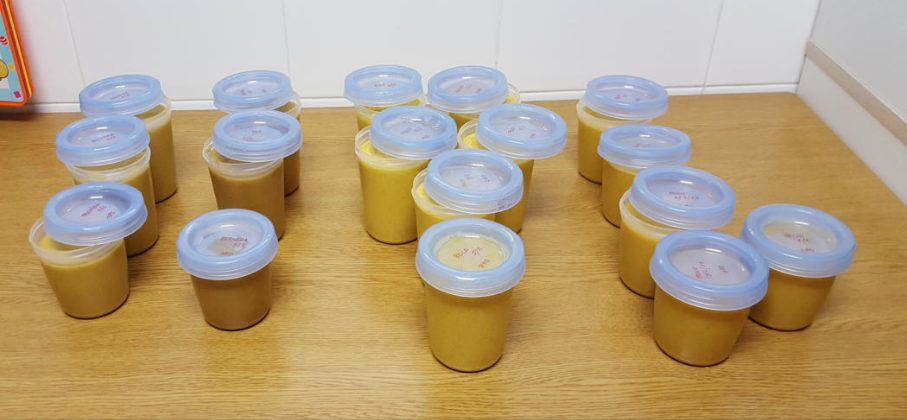

Unos años antes de 'estar embarazados', tuvimos una demostración de funcionalidad de la Thermomix por parte de una amiga que había empezado a dedicarse al tema.

Inicialmente nos echaba para atrás el desembolso, aunque veíamos ventajas en algunas de las cosas que nos ofrecía.

Al poco tiempo de uso ya nos resultó muy útil, por un lado podíamos probar platos nuevos con la facilidad de que las recetas salían bien, como otros que nos facilitaba, por ejemplo hacer lentejas, donde prácticamente era meter todo dentro y poder aprovechar mientras para realizar otras tareas.

Cuando años más tarde vino el bebé y pasó a alimentación no limitada a la leche, nos facilitó la preparación de:

- cremas (calabaza, ternera, cordero)
- sopas
- papillas de frutas
- etc

y una vez preparadas, las guardábamos en [recipientes para congelar](https://www.amazon.es/dp/B00M6POLUM?tag=redken-21) donde etiquetadas por contenido y fecha, pudiendo así ir alternando comidas fácilmente, cocinando de una vez, bastantes raciones.

La principal ventaja fue que por un lado, podíamos seguir haciendo comida sana, mientras que ahorrábamos tiempo en prepararla y al empezar a organizarnos para cocinar en mayor cantidad y congelar, siempre teníamos un fondo de despensa, para que si por cualquier motivo, había una de esas noches que al dia siguiente no te hacen ser persona, siempre tuvieras garantizada la comida, del bebé y de los padres.

Ciertamente, nos ha ayudado mucho también en menús navideños donde con poco esfuerzo preparábamos sopas, platos principales y postres como en el día a día con platos al vapor (con el accesorio Varoma), al papillón, etc como numerosos purés y cremas (que seguimos haciendo).

La verdad, es que la tenemos más que amortizada con el uso y a diferencia de las ['babycook'](https://www.amazon.es/dp/B07T98TWS8?tag=redken-21), nos ha servido para nosotros y para el bebé, desde recién nacido, donde nos permitía recuperar horas de sueño mientras la comida se hacía sola, a preparar sus platos y papillas de frutas antes de que pasara a los alimentos sólidos (no triturados).

