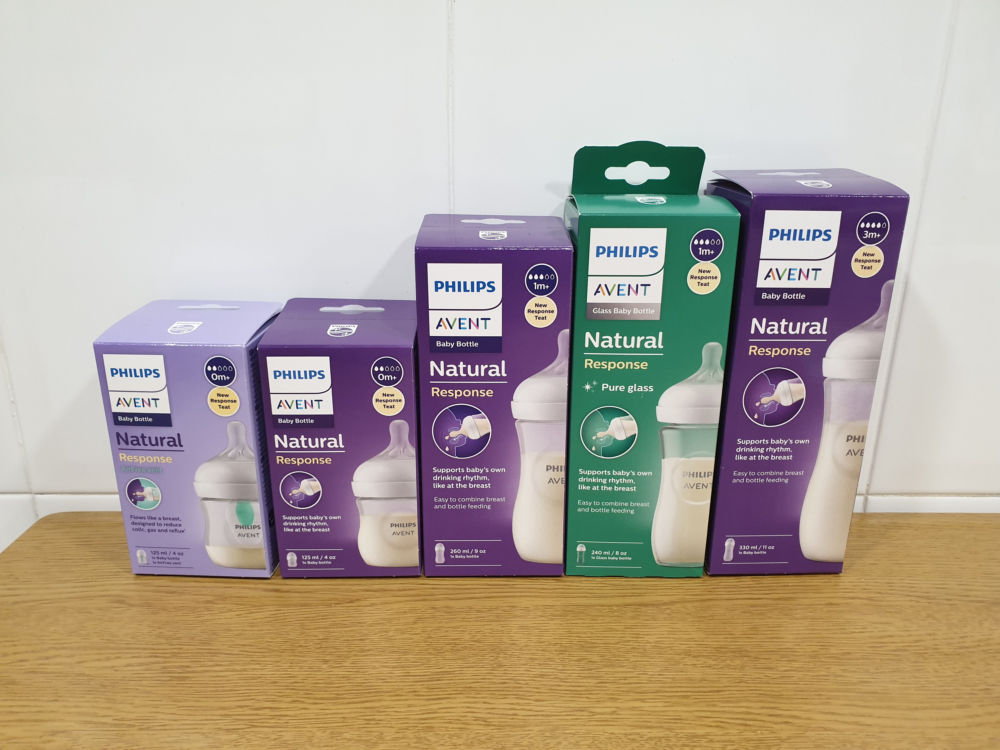
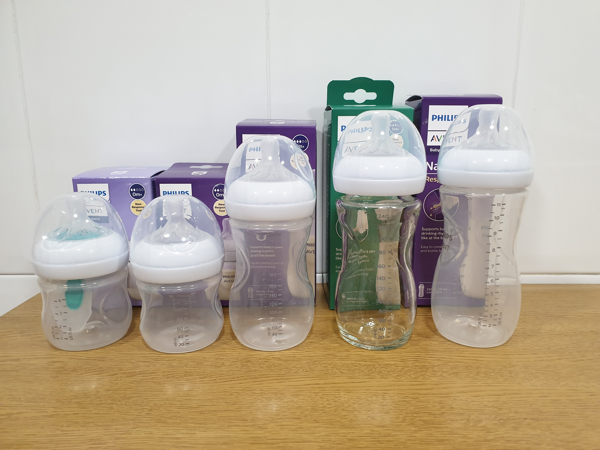
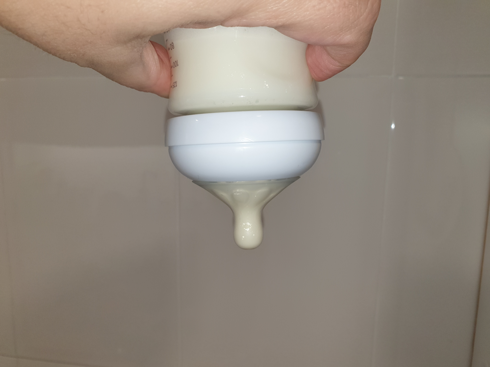
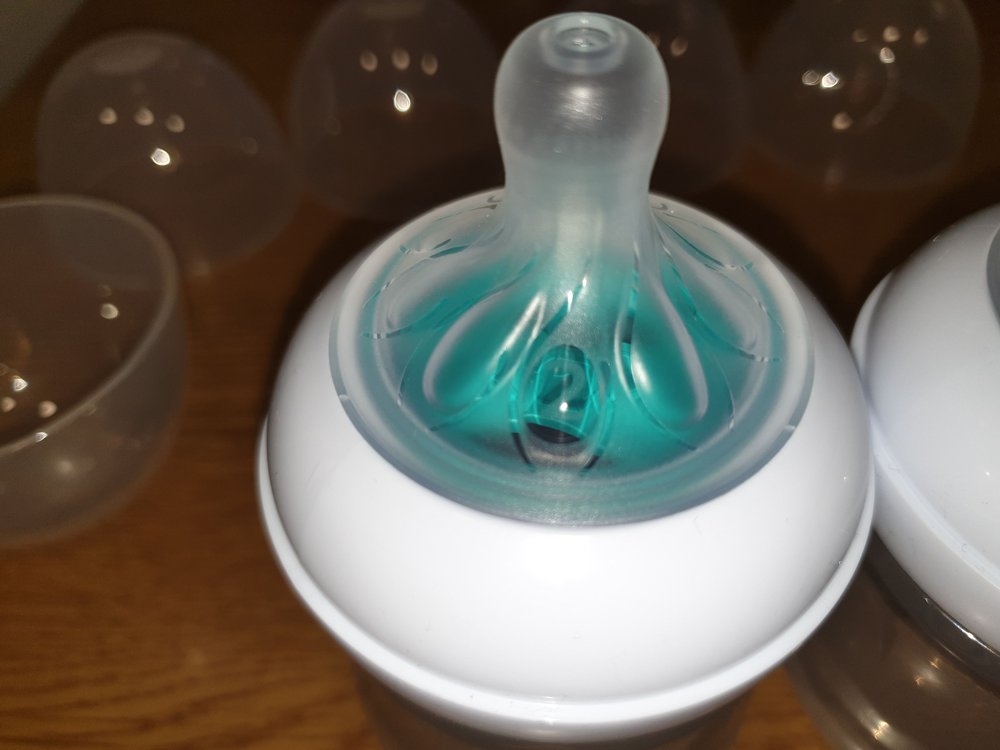
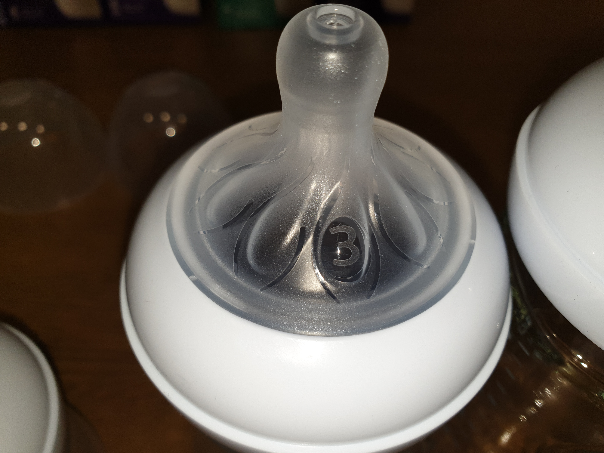
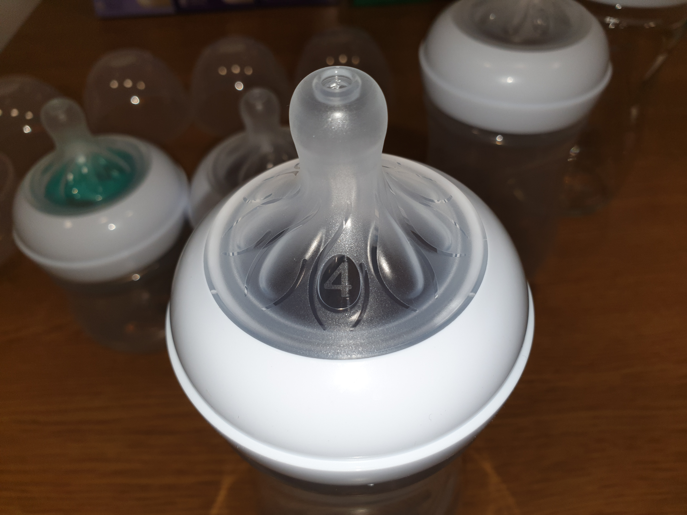
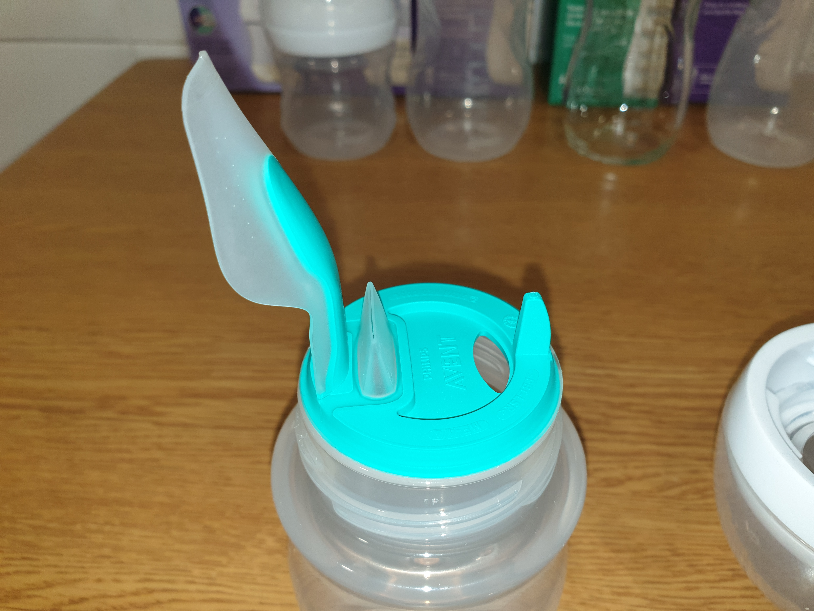


El conjunto de biberones evaluado durante esta prueba ha sido recibido como parte de una prueba de producto y Philips no tiene ninguna influencia editorial en esta valoración.


Los biberones evaluados son:

- [Biberón Avent Natural AirFree vent](https://www.amazon.es/dp/B079H2ZGPJ?tag=redken-21)
- [Biberón Avent Natural 125 ml](https://www.amazon.es/dp/B07F97WMNL?tag=redken-21)
- [Biberón Avent Natural 260 ml](https://www.amazon.es/dp/B07F98PKK6?tag=redken-21)
- [Biberón Avent Natural 240 Cristal](https://www.amazon.es/dp/B07DT97RKW?tag=redken-21)
- [Biberón Avent Natural 330 ml](https://www.amazon.es/dp/B07F93X1YV?tag=redken-21)

## Características comunes

Todos los biberones evaluados disponen de la tetina Natural, que a diferencia de otras, no deja caer el líquido del biberón si no existe una labor de succión activa.

Como ya explicábamos en el artículo sobre [biberones](), existen ciertas tetinas, que obligan al bebé a succionar en lugar de simplemente abrir la boca y esperar a que caiga el líquido, por lo que aunque usen el biberón, no se desacostumbran del funcionamiento del pecho donde deben también realizar un trabajo.

Una de las formas de comprobarlos es llenar el biberón y ponerlo boca abajo, si no sale líquido por sí solo, el bebé tendrá que trabajar, la situación ideal en caso de que debamos combinarlos con la [lactancia]() materna.

## Las tetinas

Las tetinas, tienen distinto tamaño dependiendo del momento evolutivo del niño, permitiendo mayor o menor flujo de leche.

En los biberones recibidos venían 3 tamaños:

## AirFree vent

Este accesorio facilita el flujo de aire al beber, para así reducir los [cólicos]().

El accesorio en sí, se puede desacoplar y colocar en otros biberones, aunque generalmente el problema de los [cólicos]() suele ocurrir cuando el bebé es más pequeño y su cuerpo es todavía inmaduro.

## Biberón de plástico o Cristal

Los biberones se van deteriorando con el tiempo, al igual que las tetinas, por lo que es conveniente ir cambiándolos cada cierto tiempo.

En el caso de los biberones de cristal, la duración es mucho mayor ya que no amarillean, ni cogen olores, etc... pero al ser de cristal, son más delicados, y en caso de golpe, pueden romperse (aunque existen [fundas](https://www.amazon.es/dp/B00CMVJKMO?tag=redken-21) para mantenerlos calientes y protegerlos).

Los de plástico, por otro lado, son más ligeros y también permiten que un niño algo más crecido, pueda sujetarlos por si solos.

Respecto a los tamaños en sí, no hay gran diferencia excepto, que hay que ir adaptándolos a las tomas del bebé.

## Uso

En nuestras pruebas, dado la cantidad que toma nuestro bebé, hemos usado el biberón de 125 ml priorizando el uso del Airfree para evitar cólicos.

A pesar de haber estado usando desde el primer biberón los de otro fabricante también compatible con la lactancia, no ha habido rechazo alguno ni diferencias a la hora de usar el biberón o el pecho.

Por otro lado, hemos notado algo dura la tapa a la hora de abrirlo, sobretodo si la parte de la botella está quitada, por lo que a la hora de limpiarla cuesta algo más.

También relacionado con la limpieza, a pesar de agitar bien antes de poner el adaptador Airvent, hemos notado que se queda algo de grumo tanto en el propio Airvent como en la zona de la rosca.

