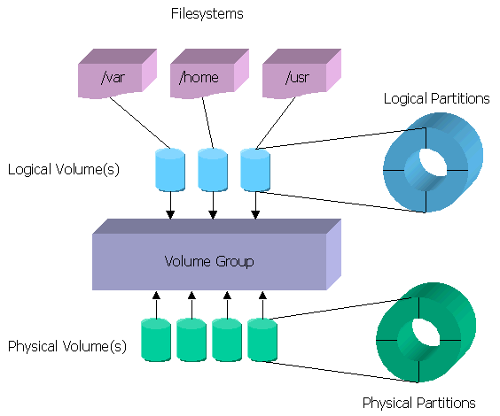
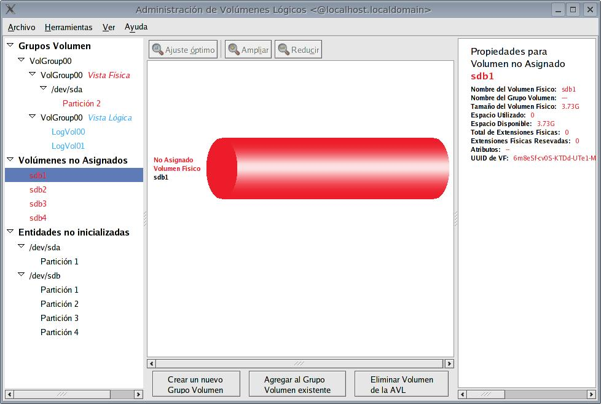
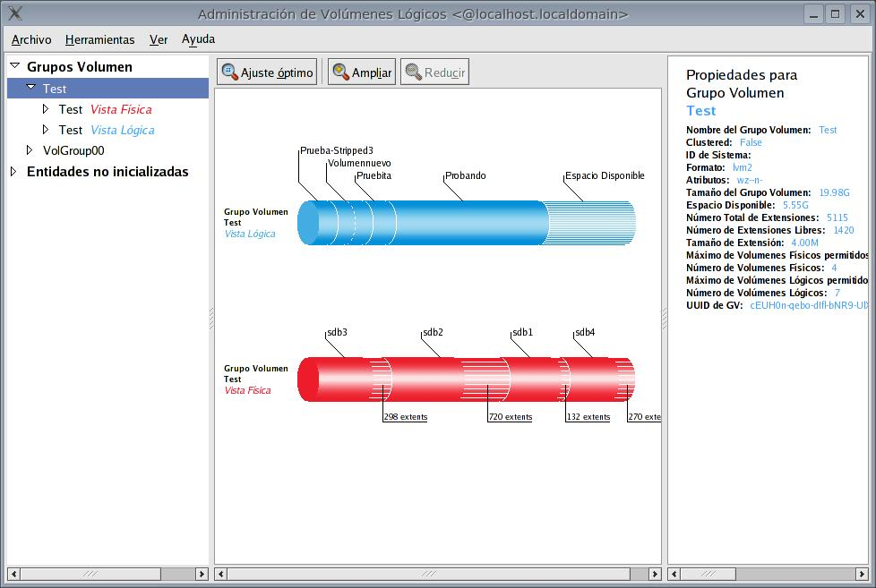

### Introduction

LVM are the initials for Logical Volume Manager, a powerful tool present in actual Linux systems inspired in the implementation available in other systems like AIX and HP-UX.

LVM introduces a separation between system structure and elements like disks, partitions, filesystems to which we are used to.

LVM has three levels:

- Physical volumes
- Volume Groups
- Logical volumes

One of the benefits of LVM over traditional systems is that LVM introduces an abstraction layer which improves the limitation of a disk, allowing us to have a filesystem to span over several disks, resizing thus making a more efficient usage of storage.

Volumes make use of `PE`[^1], which are the units (there's a relationship set during creation) used for measuring size and future size changes of the volumes.

LVM structure is as shown:



### Physical volumes (`PV`)

A physical volume is a disk or a slice of it that we will designate for inclusion in a volume group.

Physical volumes can be places in a partition (for example if they have to coexist with another operating systems), or well span over the whole disk, even over `md` devices[^2].

### Volume groups (`VG`)

Volume groups are defined grouping one or more physical volumes and are, as if they where physical disks which take their size from the different physical volumes associated to them.

### Logical volumes (`LV`)

Logical volumes are created inside a volume group and are the equivalent to partitions in other systems, is the part of LVM that we format with a filesystem and we join afterwards to our system for being used for storage.

### Commands

All commands related with LVM use a similar naming, which starts with the element they affect to:

- pv(change, display, remove, create, move, resize, scan) for physical volumes.
- vg(convert, extend, reduce, scan, create, import, remove, split, change, display, merge, rename, export) for volume groups
- lv(change, display, convert, extend, remove, rename, scan, create, reduce, resize) for logical volumes

### System preparation for LVM

### Hard drive partitioning

Before using LVM we need to designate some devices (full drives or partitions (type 8e on `fdisk`))

After doing so, we need to execute `partprobe` to refresh the partition layouts in running kernel with the defined schema.

In our example, we'll have two hard drives: `hda` and `sda`.

In `hda` we have one partition, `hda1` in which we store `/boot` (partition for `kernel` and `initrd`, as they cannot be on a LVM volume), and the rest is in a partition `hda2` which grows until the full size of the drive.

In `sda` we have the whole disk available for being used as LVM, so we will define a partition `sda1` for this use.

### Creation of physical volumes (PV)

Physical volumes are the places in which we put the structure for volume groups, it's creation is as easy as running:

```bash
#!bash
pvcreate /dev/hda2

pvcreate /dev/sda1
```

If we execute `pvscan`, we can check the listing of physical volumes defined on the system, as well as the kind of metadata (lvm or lvm2) and it's size, and a briefing on total, used and available.

For having a detailed state, we can execute `pvdisplay`, which will show more information like size, `PE's` available, etc.

### Creation of volume groups (VG)

Volume groups are like drawers, which placed over physical volumes, that define the grouping for logical volumes, making more clear the structure.

For creating the volume group we will execute:

```bash
#!bash
vgcreate Prueba /dev/sda1
```

This command will create a volume group named `Prueba` over the physical volume at `/dev/sda1`

For checking that the action went ok, was we can execute `vgscan` for getting a listing of defined volume groups.

### Creation of Logical volumes (LV)

Logical volumes are the equivalent to partitions, is the place over which we will put a filesystem and thus, the data we want to store.

Logical volumes are defined inside a volume group in the following way:

```bash
#!bash
lvcreate Prueba -n Inicial -L 2G
```

If we execute `lvscan`, we will have a listing of all the defined volume groups and it's size and between them, `Inicial`, inside of `Prueba` and with a 2Gb size

### Creation of a filesystem

Before using the logical volume we'll need to prepare it for data, and creating a filesystem, this time, the command is identical to the one we use over a physical disk, but specifying the logical volume, for example:

```bash
#!bash
mkfs.ext3 /dev/Prueba/Inicial
```

It's advisable to make use of a filesystem we can resize, as, one the improvements of LVM is the ability to resize logical units and, requires, as consequence that the filesystem works as a "container" able to grow or shrink the same way.

Now, we can mount the filesystem:

```bash
#!bash
mount /dev/Prueba/Inicial /mnt
```

### Resizing an LVM "drive"

EXT3, allows resizing of volumes, so they can grow while being used, but for reducing size we need to stop its usage, and even in that case, it allows the interesting opportunity to create small filesystems, fitted for our initial usage and then keep them growing based on our needs without stop running.

As an example, we're going to extend our `Inicial` filesystem, increasing it in 250Mb, we'll execute:

```bash
#!bash
pvscan #(where we will be told about physical volumes and free space)
#  In case of need, we can extend our volume group with:
pvcreate /dev/disconuevo
vgextend Prueba /dev/disconuevo
#  From now on, the vg will have the space ready for being used by lv and we will make it grow doing:
lvextend -L +250M /dev/Prueba/Inicial
ext2online /dev/mapper/Prueba-Inicial
```

After it finishes, the filesystem at `/mnt` will have an extra 250Mb available.

We can make the filesystem grow to a total size, for example, make it grow until 4Gb, to do so, we will do:

```bash
#!bash
lvextend -L 4G /dev/Prueba/Inicial
ext2online /dev/mapper/Prueba-Inicial
```

Starting in Fedora Core 6 (FC6), the utility ext2online doesn't exist, as it has been integrated in resize2fs, so we will execute instead: `resize2fs -p /dev/Prueba-Inicial [final size]`.

ATTENTION: **This is a dangerous step, we can lose data**

If we want to reduce the size of a logical volume, first, we'll need to know how much space is used by the filesystem and then, `umount` it:

```bash
#!bash
umount /dev/mapper/Prueba-Inicial
#Next step would be reduce the filesystem:
resize2fs /dev/mapper/Prueba-Inicial [new size]
```

I'm recommending reduce the filesystem under the final size we want to achieve, so we have a security margin. This size must ALWAYS be higher that the usage[^3] of the volume.

When the process has ended, we can reduce the volume running:

`lvextend -L -2G /dev/mapper/Prueba-Inicial`

And now we will make the filesystem grow to regain the "security margin" we left with: `resize2fs /dev/mapper/Prueba-Inicial`.

### Graphical tool

Red Hat or Fedora have a graphical tool `system-config-lvm` which allows to manage logical volumes in our system in the following way.

In the next screenshot we can see the physical volumes no assigned to a volume group, and with the options provided by the tool, we can add to an existing volume group or well, create a new volume group:



Here we can create a new logical volume inside the volume group, we can specify the volume name, the kind of volume as well as size and filesystem:


Here we can see the volume group "Test" and the logical and physical view created (as we see, Test is made of four physical volumes: sdb1,sdb2,sdb3,sdb4)



When we select the free space of the logical volume, the following is shown: number of extents, physical location for each physical volume.

[^1]: Physical Extents
[^2]: Multiple Devices: is a software technology that allows creation of several disk grouping levels: `linear`, `raid0`, `raid1`, `raid5`. Devices will identify themselves to the system as `/dev/md*0,1,2,3,etc*`, and it's status (defined `md's`, sync status, etc) in the file `/proc/mdstat`
[^3]: The one that we wrote down in the first step, before it was unmounted.
