This document is based on the original recipe and pictures that I gave to my colleague [Miguel Pérez Colino](https://twitter.com/mmmmmmpc) which he assembled in an internal company document and that he kindly translated for increased reach.

# Ingredients

- A bag of vegetables for paella (`garrofón`, Valencian white bean; `ferraura` y `bajoqueta`,
  Valencian green beans with pod)
- [Rice `bomba` 🛒#ad](https://www.amazon.es/dp/B00986HSH0?tag=redken-21) (7 handfuls)
- Chicken and Rabbit (700 and 400 grams)
- Grated tomato (The equivalent to 5 spoons)
- Sweet Red Paprika Powder ([`Pimentón Rojo` 🛒#ad](https://www.amazon.es/dp/B07FZLMP8N?tag=redken-21))
- [Spanish Saffron 🛒#ad](https://www.amazon.es/dp/B01N6OVPYQ?tag=redken-21) (300mg in threads) or [E102 dye](https://www.amazon.es/dp/B01HIVII4I?tag=redken-21) (small spoon just to the border)
- [Olive oil 🛒#ad](https://www.amazon.es/dp/B0781Z7TD4?tag=redken-21) to stir-fry (not much, so it doesn't get oily)
- [Rosemary 🛒#ad](https://www.amazon.es/dp/B01HN23N3S?tag=redken-21)
- Salt
- Water (from Valencia)

# Preparation

A garlic clove, to be grated, must be peeled and put together with tomato. They must be kept together until they are stir-fried.

Chicken must be sliced into small pieces.

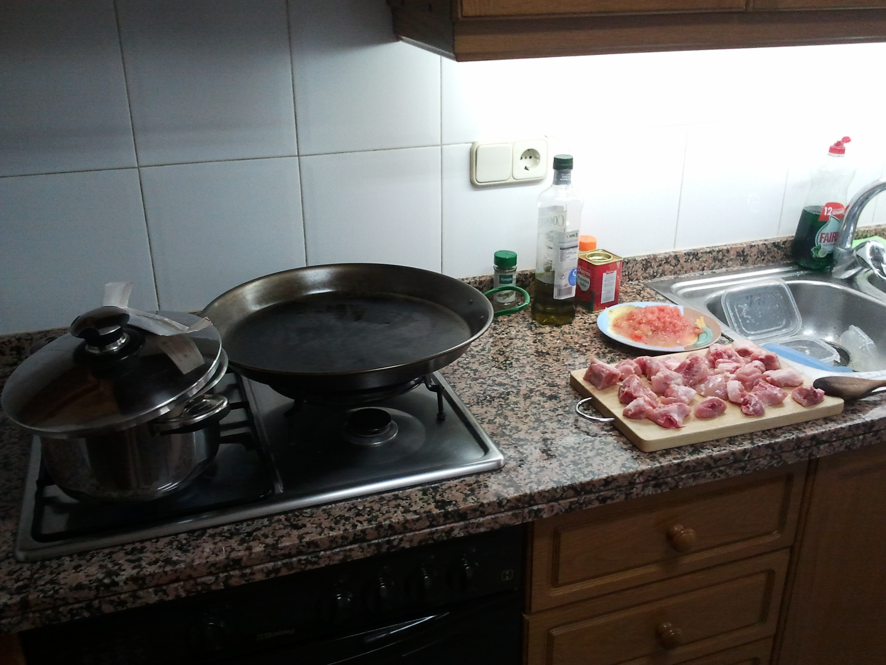

Cover the floor with old magazines or newspaper to avoid stains.

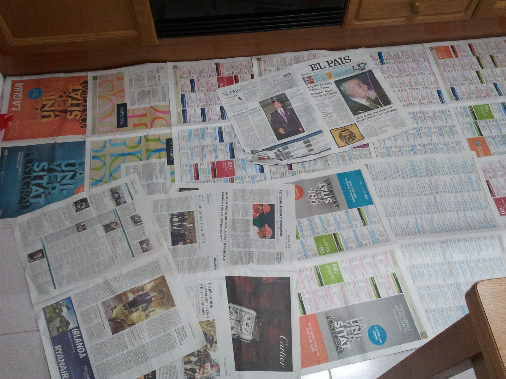

In parallel, prepare the pot with water to get it boiling and we start to prepare the chicken.

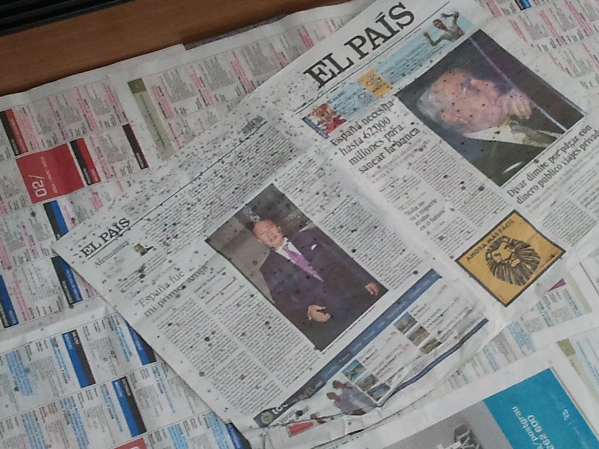

# Pot

The vegetables must be boiled with water (if they are frozen) or added directly to Paella.

The pot must be filled with abundant water, a bit of salt and , if possible some Rosemary, so it enhances the taste later on.

# Paella

Chicken must be stir-fried until it is well done.

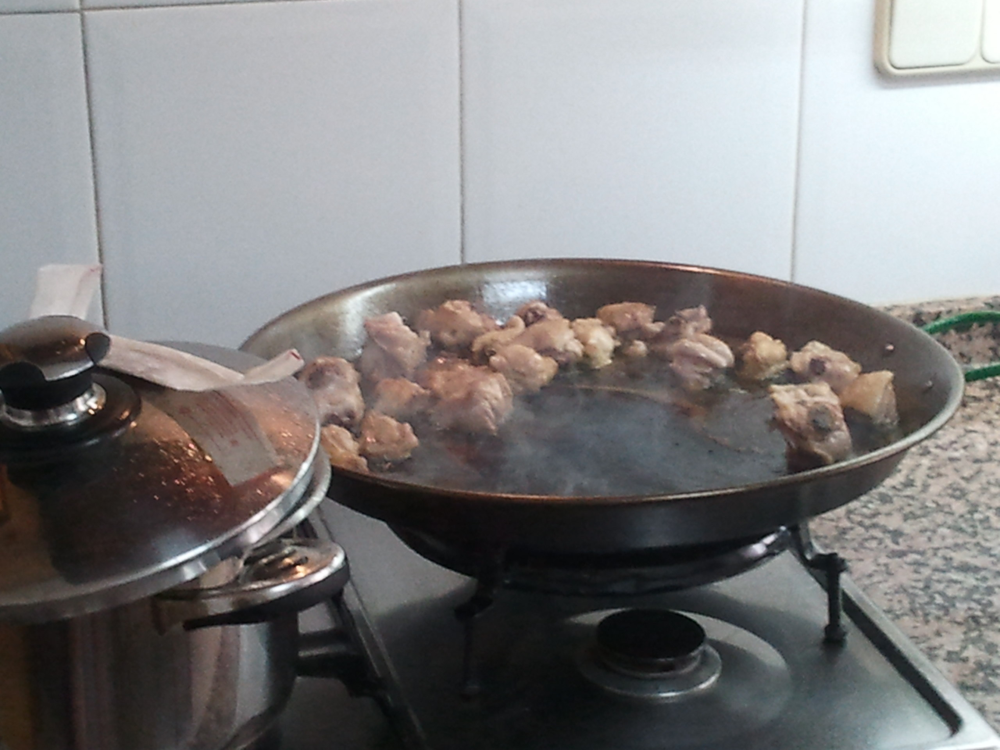

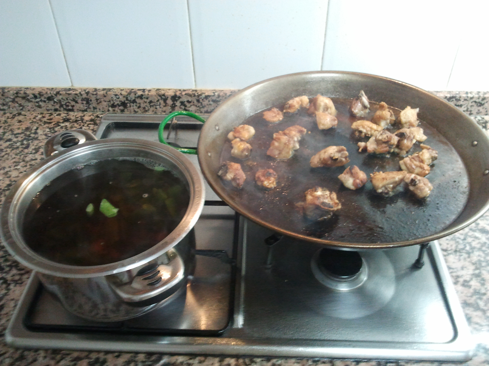

Some space is required in the centre for the tomato, do it with care as it may sputter.

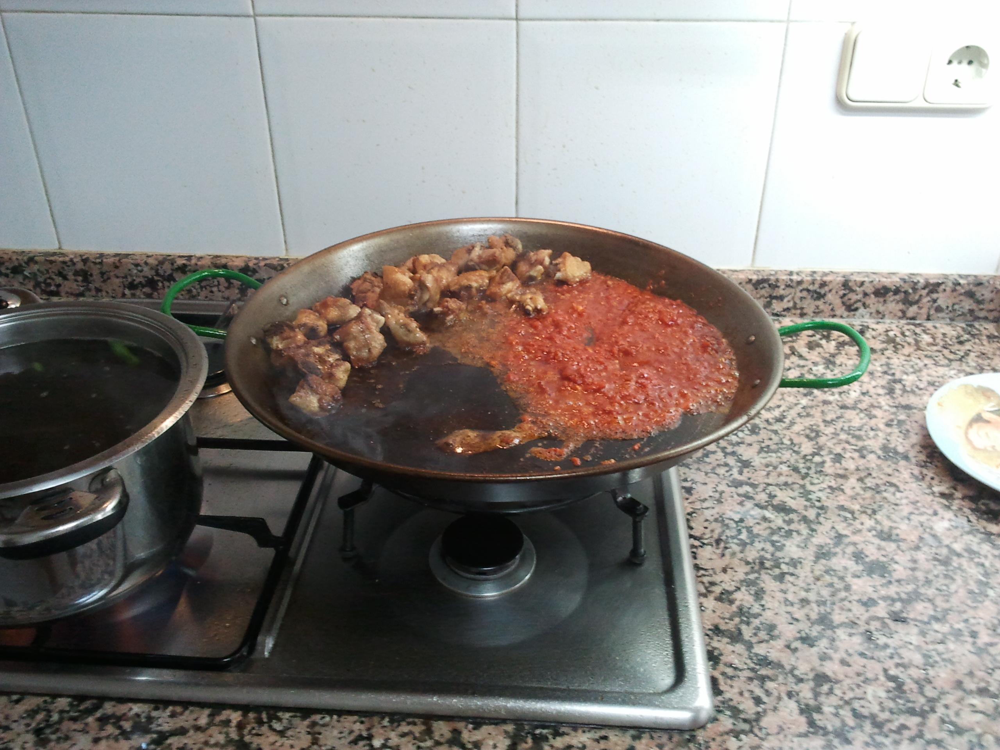

Using some different space the Sweet Paprika powder must be slightly fried with care, as it shouldn't get burned, and later sauted and mixed with tomato.

The boiling water from pot, together with the vegetables, must be added up to the border of the paella, adding more spare water if it's not enough.

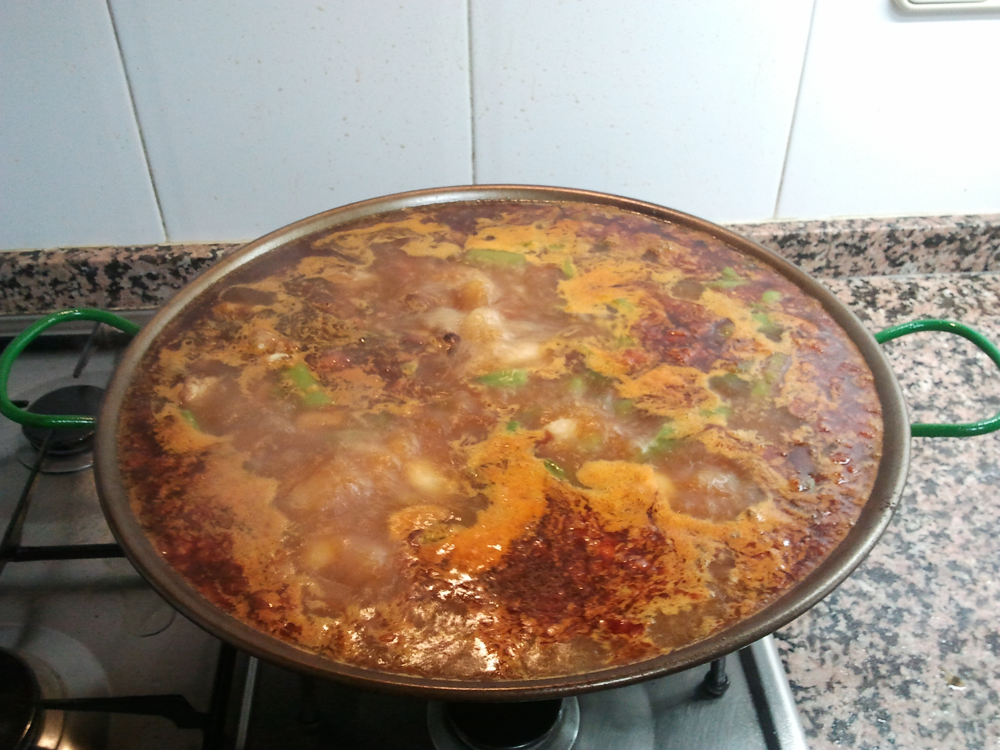

After 30 minutes boiling, when the broth has reached the level of the rivets, it must be tasted for salt, taking care that it is a bit salty, and the rice must be added.

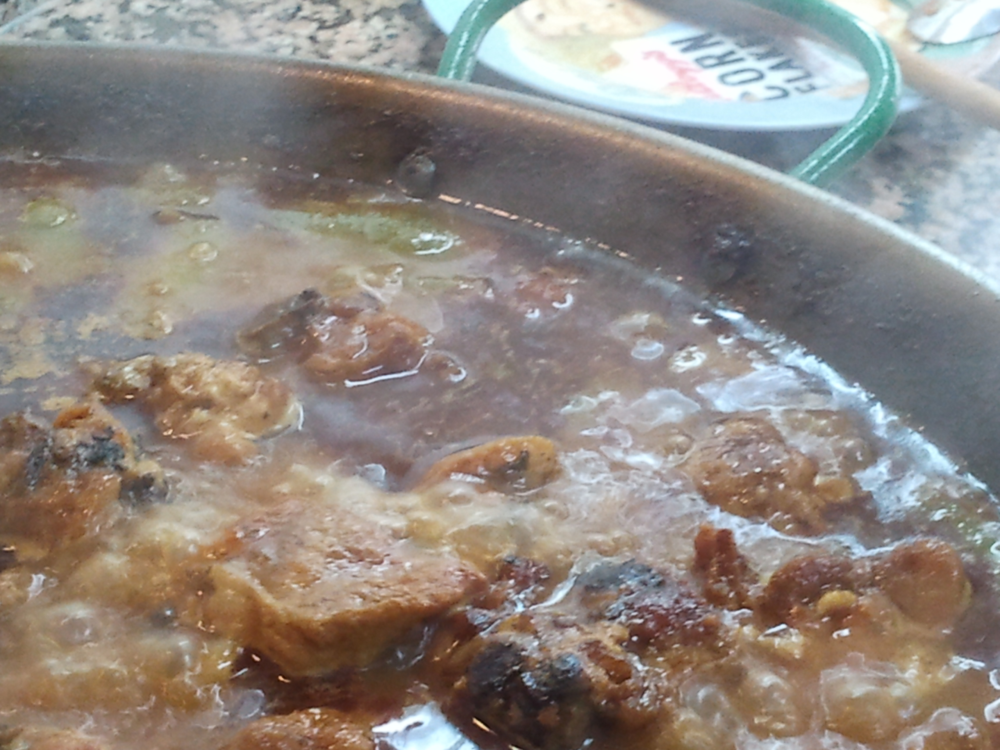

The 7 handfuls of rice, for 4 people, must be added to the paella (another option is to make a groove with it, so that it goes 2 cm above the broth), then the saffron/dye must be added and evenly distributed around the paella with meat, etc.

It must be kept on strong fire until the rice is half cooked and rises above the broth. (about 7 minutes)

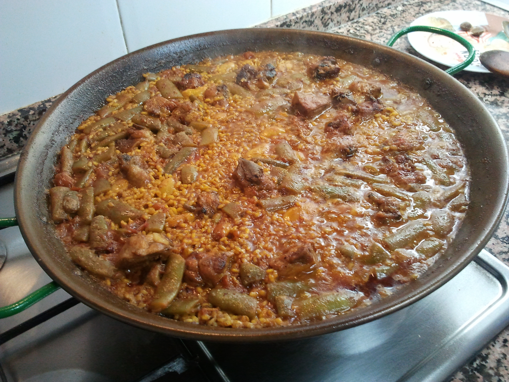

Then the fire must be lowered for 5 minutes more, taking care on the amount of broth that, if it becomes scarce will make us lower the fire even more. Right in this moment, a bit of Rosemary can be added to the Paella.

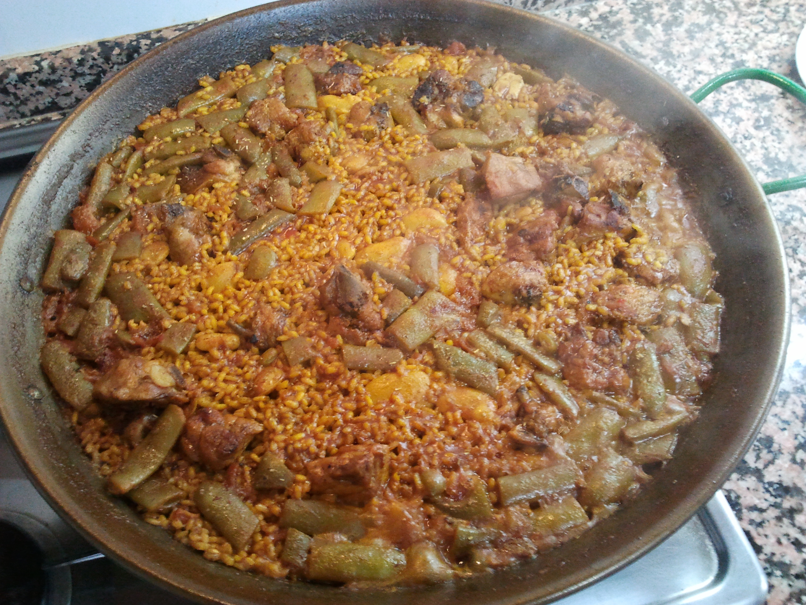

The last 3-4 minutes may end with medium to low fire depending on the amount of broth remaining.

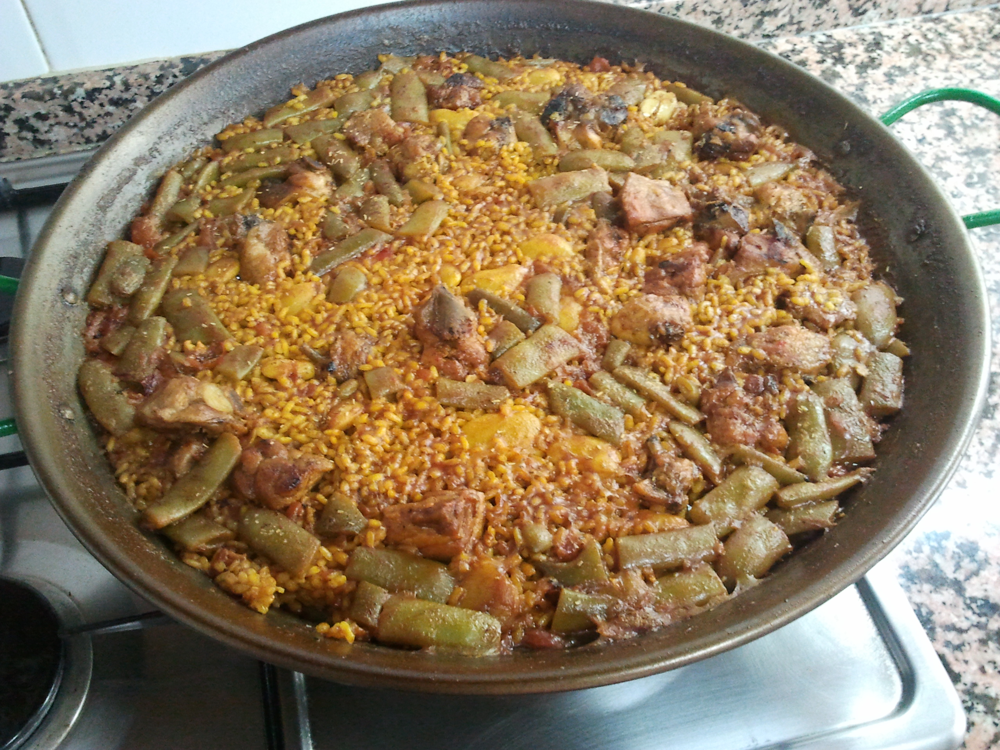

Once finished, rice must be tasted, fire must be switched off, and the paella must rest for some minutes with a piece of cloth or newspapers above it if the rice was still a bit 'hard'.

You can also become creative with the presentation once served:

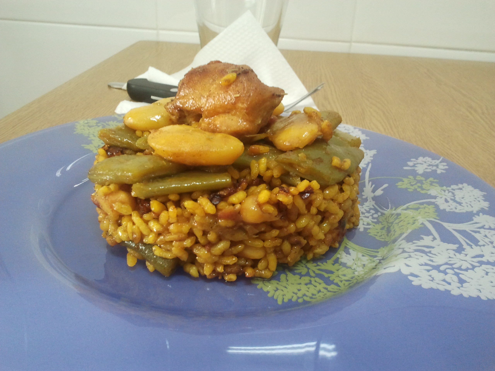

