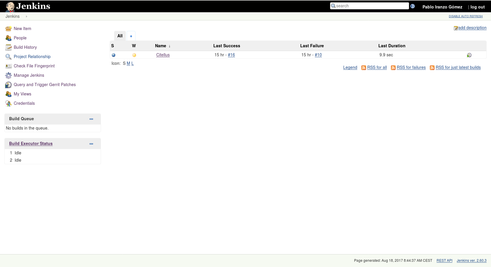
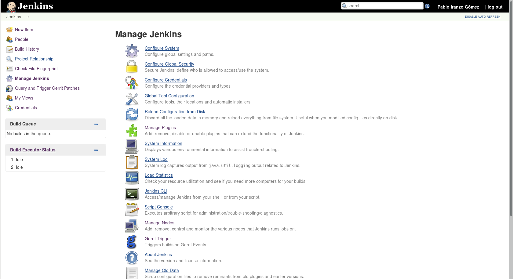
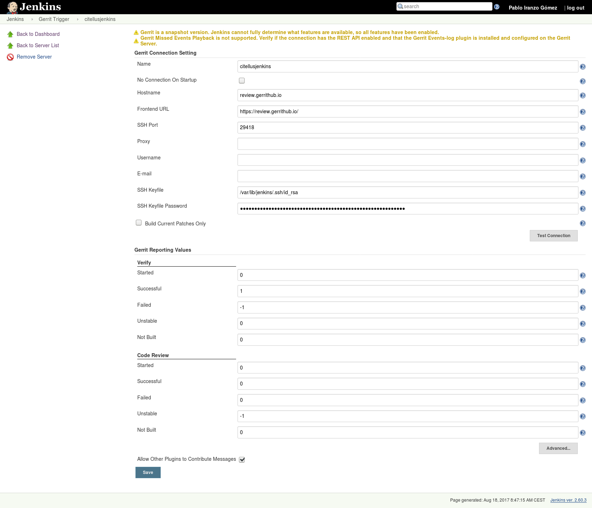
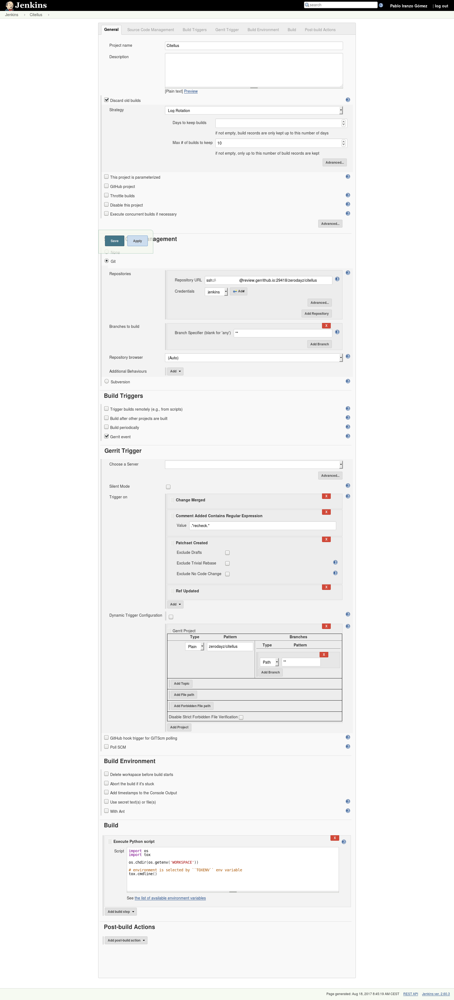
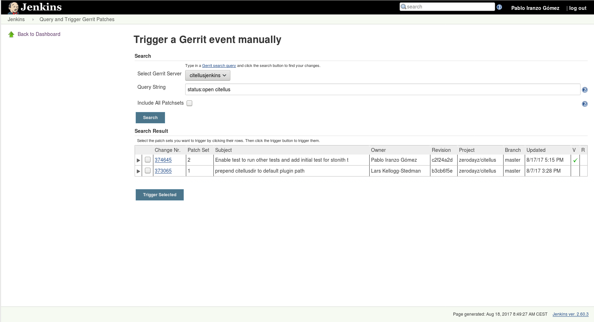

## Why?

While working on [Citellus]() and [Magui]() it soon became evident that Unit testing for validating the changes was a requirement.

Initially, using a `.travis.yml` file contained in the repo and the free service provided by <https://travis-ci.org> we soon got <https://github.com> repo providing information about if the builds succeeded or not.

When it was decided to move to <https://gerrithub.io> to work in a more similar way to what is being done in upstream, we improved on the code commenting (peer review), but we lost the ability to run the tests in an automated way until the change was merged into github.

After some research, it became more or less evident that another tool, like Jenkins was required to automate the UT process and report to individual reviews about the status.

## Setup

Some initial steps are required for integration:

- Create ssh keypair for Jenkins to use
- Creating github account to be used by Jenkins and configuring above ssh keypair
- Login into gerrithub with that account
- Setup Jenkins and build jobs
- Allow on the parent project, access to Jenkins github account permission to +1/-1 on Verify

In order to setup the Jenkins environment a new VM was spawned in one of our RHV servers.

This VM was installed with:

- 20 Gigabytes of HDD
- 2 Gigabytes of RAM
- 2 VCPU
- Red Hat Enterprise Linux 7 'base install'

### Tuning the OS

RHEL7 provides a stable environment for run on, but at the same time we were lacking some of the latest tools we're using for the builds.

As a dirty hack, it was altered in what is not a recommended way, but helped to quickly check as proof of concept if it would work or not.

Once OS was installed, some commands (**do not run in production**) were used:

```bash
pip install pip # to upgrade pip
pip install -U tox # To upgrade to 2.x version

# Install python 3.5 on the system
yum -y install openssl-devel gcc
wget https://www.python.org/ftp/python/3.5.0/Python-3.5.0.tgz
tar xvzf Python-3.5-0.tgz
cd Python*
./configure

# This will install in alternate  folder in system not to replace user-wide python version
make altinstall

# this is required to later allow tox to find the command as 'jenkins' user
ln -s /usr/local/bin/python3.5 /usr/bin/
```

## Installing Jenkins

For the Jenkins installation it's easier, there's a 'stable' repo for RHEL and the procedure is [documented](https://wiki.jenkins.io/display/JENKINS/Installing+Jenkins+on+Red+Hat+distributions):

```bash
wget -O /etc/yum.repos.d/jenkins.repo http://pkg.jenkins-ci.org/redhat-stable/jenkins.repo
rpm --import https://jenkins-ci.org/redhat/jenkins-ci.org.key
yum install jenkins java
chkconfig jenkins on
service jenkins start
firewall-cmd --zone=public --add-port=8080/tcp --permanent
firewall-cmd --zone=public --add-service=http --permanent
firewall-cmd --reload
```

This will install and start Jenkins and enable the firewall to access it.

If you can get to the url of your server at the port 8080, you'll be presented an initial procedure for installing Jenkins.



During it, you'll be asked for a password on a file on disk and you'll be prompted to create an user we'll be using from now on to configure.

Also, we'll be offered to deploy the most common set of plugins, choose that option, and later we'll add the `gerrit` plugin and `Python`.

## Configure Jenkins

Once we can login into gerrit, we need to enter the administration area, and install new plugins and install [Gerrit Trigger](https://wiki.jenkins.io/display/JENKINS/Gerrit+Trigger).



Above link details how to do most of the setup, in this case, for gerrithub, we required:

- Hostname: `our hostname`
- Frontend URL: `https://review.gerrithub.io`
- SSH Port: `29418`
- Username: `our-github-jenkins-user`
- SSH private key: `path_to_private_sshkey`



Once done, click on `Test Connection` and validate if it worked.

At the time of this writing, version reported by plugin was `2.13.6-3044-g7e9c06d` when connected to gerrithub.io.


### Creating a Job

Now, we need to create a Job (first option in Jenkins list of jobs).

- Name: `Citellus`
- Discard older executions:
  - Max number of executions to keep: `10`
- Source code Origin: `Git`
  - URL: `ssh://<username>@review.gerrithub.io:29418/citellusorg/citellus`
  - Credentials: `jenkins` (Created based on the ssh keypair defined above)
  - Branches to build: `$GERRIT_REFNAME.`
  - Advanced
    - Refspec: `$GERRIT_REFSPEC`
  - Add additional behaviours
    - Strategy for choosing what to build:
      - Choosing strategy `Gerrit Trigger`
- Triggers for launch:
  - Change Merged
  - Commend added with regexp: `recheck`
  - Patchset created
  - Ref Updated
  - Gerrit Project:
    - Type: `plain`
    - Pattern: `citellusorg/citellus`
  - Branches:
    - Type: `Path`
    - Pattern: `**`
- Execute:
  - Python script:

```python
import os
import tox

os.chdir(os.getenv("WORKSPACE"))

# environment is selected by ``TOXENV`` env variable
tox.cmdline()
```



From this point, any new push (review) made against Gerrit will trigger a Jenkins build (in this case, running `tox`). Additionally, a manual trigger of the job can be executed to validate the behavior.



### Checking execution

In our project, `tox` checks some UT's on `python 2.7`, and `python 3.5`, as well as python's `Flake8` compliance.

Now, Jenkins will build, and post messages on the review, stating that the build has started and the results of it, setting also the 'Verified' flag.



