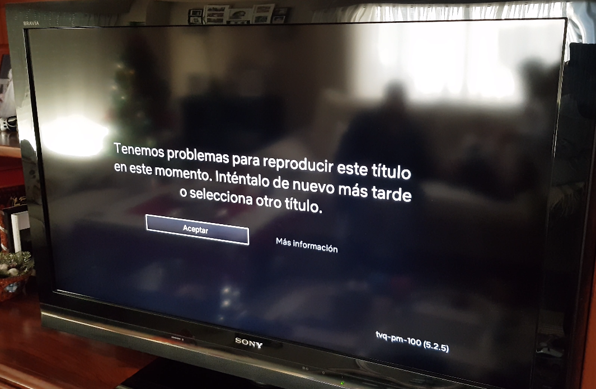

# Android TV versus Android TV-Box

Android, utilizado en múltiples dispositivos móviles es también parte de televisores y reproductores multimedia.

La mayor diferencia entre ambas aproximaciones es el interfaz de usuario y las aplicaciones.

Android TV-Box: es como un tablet o un teléfono conectado a una TV y generalmente necesita teclado externo, habitualmente integrado en el control remoto.

Android TV: es una versión de Android que incorpora cambios para TV en el sistema operativo, de forma que es posible controlarlo con un mando de cruceta así como teclas adicionales para ir atrás, ir al inicio y micrófono.

El rango de aplicaciones también difiere, un TV Box dispone del amplio rango de aplicaciones disponibles para android, pero con un coste asociado: no están optimizadas para utilizarlas en una pantalla y generalmente requiere de acciones moviendo un cursor virtual a modo de ratón y después 'pinchar' para poder trabajar, mientras que por el otro lado, Android TV dispone de un número menor de aplicaciones, pero preparadas para utilizarse mediante controles más sencillos más naturales para una televisión.

Android TV también tiene soporte de Chromecast, por lo que no sólo puedes replicar/espejar la imagen del móvil en el televisor, pero también 'enviar' (`cast`) contenido de aplicaciones soportadas, no sólo para reproducción de contenidos, pero también para jugar, por ejemplo con juegos en los que varios usuarios desde su móvil interactúan en la pantalla del televisor.

Entre los sistemas Android TV que he probado están:

- [Nvidia Shield TV 🛒](https://www.amazon.es/dp/B01NBJ6KZY?tag=redken-21) que actúa como consola de juegos y como dispositivo Android TV
- [Xiaomi Mi Box 🛒](https://www.amazon.es/dp/B07K3KC5CP?tag=redken-21) que permite 'actualizar' cualquier televisor a disponer de un sistema Android TV via el puerto HDMI
- [Sony Bravia Android TV 🛒](https://www.amazon.es/dp/B01IW656UC?tag=redken-21) que directamente incorporan AndroidTV como sistema operativo del televisor.

Tanto Nvidia como Xiaomi TV Box permiten convertir o 'actualizar' cualquier televisor y a su vez, permiten, que en un futuro, en caso de querer actualizar el dispositivo, el coste es claramente inferior que reemplazar un televisor entero.

# Netflix

Una de las características de Android TV es la posibilidad de utilizarlo con plataformas de video como [Amazon Prime Video](https://www.primevideo.com/?tag=redken-21) o [Netflix](https://netflix.com).

Lamentablemente, recientemente empecé a recibir este mensaje de error en el Xiaomi TV Box que compré para un televisor más antiguo:

Tras buscar por el mensaje recibido `tvq pm 5.2 5`, llegué a este PUF de netflix: <https://help.netflix.com/es/node/59709>

Que muy a mi pesar, no resolvió nada, incluso el soporte técnico de Netflix dijo que su plataforma soportada son los dispositivos [Fire TV](https://www.amazon.es/dp/B01ETRGE7M?tag=redken-21), que no era la respuesta que quería oir.

# Kodi al rescate

Tras una búsqueda algo más detallada, un artículo sugería usar:

- Kodi v18 ([nightly](https://mirrors.kodi.tv/nightlies/android/arm/master/) si no ha salido oficialmente cuando lo leas)
- Habilitar [Netflix Addon](https://forum.kodi.tv/showthread.php?tid=329767)

Una vez configurado (email y password), pude utilizar Kodi para acceder a netflix usando Kodi, como 'parche' hasta que el problema sea resuelto.

