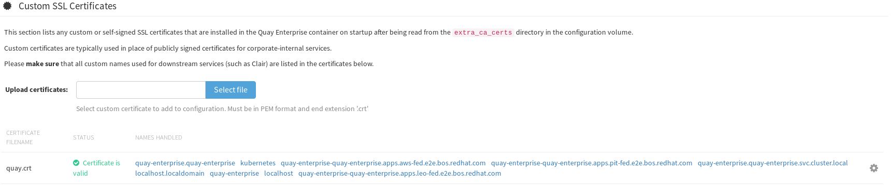
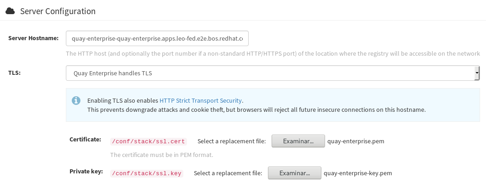
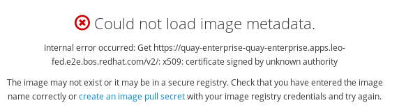

## Why this article?

For Federation of OpenShift/Kubernetes clusters we want not only to demo some applications, but build a solution that covers all that will be needed in a real-world deployment.

Colleagues in the Solutions Engineering team have been working on
demonstrating an application running on different clusters over a Federated Control Plane, allowing it to 'roam' between clusters with shared data access as a way to demonstrate how an application can 'scale' from on-premise deployment to external clouds in order to satisfy business requirements for peak demands.

This article tries to demonstrate on how to setup Quay, as a container registry for your applications, in a way that can work both for this Federated approach as well as High-Availability setup.

## What is Quay?

The one liner would be: `Quay is a container registry`.

The extended one, would be more in the lines of:

> Quay is a container registry that can be used via the provided service at <https://quay.io> or can be used via Quay Enterprise as 'on premise' registry.

A container registry provides a point for containers to be downloaded or uploaded for later consumption.

## Why quay?

Quay allows to be configured either to use the provided service via <https://quay.io> or deploy it on premise, so that you gain additional control over the setup like which namespaces to replicate, policies, etc.

Quay features `clair` analysis of images, allowing to detect known vulnerabilities from different sources to later check the images.

Also, allows to automate builds when a push to a repository has happened, allowing to quickly spawn an update container image when our tracked repository has a new commit that can be later updated in our OpenShift/Kubernetes image stream.

Quay can also, when having several storage backends defined, do [geo-replication](#georeplication), that allows OpenShift to grab the needed bytes from the closest backend while handling in the background the copy of new data to the other replicas.

## What is Swift?

Swift is object storage provided by OpenStack Environment, defined at <https://wiki.openstack.org/wiki/Swift> as:

> The OpenStack Object Store project, known as Swift, offers cloud storage software so that you can store and retrieve lots of data with a simple API. It's built for scale and optimized for durability, availability, and concurrency across the entire data set. Swift is ideal for storing unstructured data that can grow without bound.

Swift allows to define a `container` (not in the <https://www.opencontainers.org/> sense but in a 'data storage').

### How does it come to play with Quay?

Quay allows to define storage backend based on swift that can be used together with other backends to provide
geo-replication for availability.

### The Setup process of Swift for Quay

At the beginning it was not easy to find out all the required configuration variables or settings to define, but what finally worked for the setup described in this article was:

#### Create the Swift container

First we do need to create a swift container in OpenStack that will hold the information from Quay:

- Create swift container for holding the storage:

  ```sh
      (overcloud) [stack@osp-ait-director ~]$ openstack container create quay-enterprise
  ```

  - Output:

| account                                 | container       | `x-trans-id`                         |
| --------------------------------------- | --------------- | ------------------------------------ |
| `AUTH_b3b8ce2eca3c4556ac01c12772b0d141` | quay-enterprise | `txd7d654f499db457da0fa0-005bf53d32` |

#### Configuration settings defined in Quay

| Setting                | Value                                                                                         |
| ---------------------- | --------------------------------------------------------------------------------------------- |
| `Storage Engine`       | OpenStack Storage (Swift)                                                                     |
| `Swift Auth Version`   | 3                                                                                             |
| `Swift Auth URL`       | `\$YOURKEYSTONE PUBLIC ENDPOINT` (like http://aaa.bbb.ccc.ddd:5000)                           |
| `Swift container name` | `\$YOURCONTAINER` (created with swift container create 'name')                                |
| `Storage path`         | `\$WHATEVER` (we did use `/quay`)                                                             |
| `Username`             | `\$OSP_USERNAME` (we did use `admin`)                                                         |
| `key/password`         | `\$OSP_PASSWORD`(we did use `redhat`)                                                         |
| OS OPTIONS drop-down   | <----- This is an important one if not it will fail                                           |
| `tenant_id`            | `\$YOURTENANTID` (I did use 'admin' id as obtained with `openstack project list\|grep admin`) |

Once done, Quay should 'validate' the upload and `swift list $YOURCONTAINER` should give something like:

```sh
(overcloud) [stack@osp-director ~]$ swift list quay-enterprise
quay/_verify
```

Showing that the verification file has been created succesfully.

## Georeplication

Quay allows to define several backends that can be also configured as a foundation for GeoReplication.

Georeplication in quay, is used to:

- define a 'zone name' for a storage backend
- when booting Quay containers or apps, define which backend is 'closest' (via environment variable `QUAY_DISTRIBUTED_STORAGE_PREFERENCE`)

Quay will store and replicate on the different backends defined the information uploaded. The requirement is that the backend is an object storage, but you can also define 'mixed' backends like for example GCE, AWS, Swift, Ceph RadosGW, etc. Quay will take care of the copy and once the backend 'closest' to the quay instance is ready, it will serve from that one (or fallback to the one having the actual data).

For each one of the configured backends, a different number of settings will be requested to do the proper configuration.

### Google Cloud Storage

For setting Google Cloud Storage, we did use the following values:

| Setting           | Value                 |
| ----------------- | --------------------- |
| Location ID       | \$yourvalue           |
| Storage Engine    | Google Cloud Storage  |
| Cloud Access Key  | GOOGXXXXXXXX          |
| Cloud Secret Key  | pksXXXXXX             |
| GCS Bucket        | quay-enterprise       |
| Storage Directory | /datastorage/registry |

### Amazon S3

For setting Amazon S3 storage, we did use the following values:

| Setting           | Value           |
| ----------------- | --------------- |
| Location ID       | \$yourvalue     |
| Storage Engine    | Amazon S3       |
| S3 Bucket         | quay-enterprise |
| Storage Directory | /quay/ait       |
| AWS Access Key    | AKIAXXXXXXXX    |
| AWS Secret Key    | /9bkfXXXXXXXXXX |

### Validation of the replication

Once all the defined storage backends have been configured, there's a button in the interface that will validate access and create the 'marker' files on each storage backend to verify the access permissions to them similar to what was shown on Swift configuration.

## Quay SSL deployment

This procedure will guide you through the configuration of Quay with SSL certificates so the deployment is both secure and deployed in a highly available enterprise way.

### SSL Certificates

Setting up certificates requires several steps involving:

- Creating a CA
- Create a Certificate Signing Request with all the possible quay hostnames
- Sign the certificates
- Upload the certificates on Quay

#### Create CA

Execution of [generate-ca.sh](other/generate-ca.sh)

```sh
./generate-ca.sh
```

With output:

```sh
2018/11/29 15:01:13 [INFO] generating a new CA key and certificate from CSR
2018/11/29 15:01:13 [INFO] generate received request
2018/11/29 15:01:13 [INFO] received CSR
2018/11/29 15:01:13 [INFO] generating key: rsa-2048
2018/11/29 15:01:13 [INFO] encoded CSR
2018/11/29 15:01:13 [INFO] signed certificate with serial number 432855461933024796113382064222588753737107796958
```

And creates:

```sh
-rw-rw-r--. 1 iranzo iranzo  232 nov 29 15:01 ca-config.json
-rw-r--r--. 1 iranzo iranzo 1001 nov 29 15:01 ca.csr
-rw-rw-r--. 1 iranzo iranzo  208 nov 29 15:01 ca-csr.json
-rw-------. 1 iranzo iranzo 1679 nov 29 15:01 ca-key.pem
-rw-rw-r--. 1 iranzo iranzo 1359 nov 29 15:01 ca.pem
```

#### Create Quay Certs

We are going to use the same certificate for each replica, we need to know the hostname that will be used on the OCP routes beforehand in order to use it for the SAN property in the certificate.

Having each of the routes in the SAN makes it possible to use the same cert for each replica, so we can federate a single secret containing those certs rather than creating one SSL secret for each cluster.

Execution of [generate-cert.sh](other/generate-cert.sh)

```sh
./generate-cert.sh quay-enterprise
```

With output:

```
2018/11/29 15:01:26 [INFO] generate received request
2018/11/29 15:01:26 [INFO] received CSR
2018/11/29 15:01:26 [INFO] generating key: rsa-2048
2018/11/29 15:01:26 [INFO] encoded CSR
2018/11/29 15:01:26 [INFO] signed certificate with serial number 570248288515480165542553575432827729263232937534
```

Now, we have all the required certificates for Quay generated.

```sh
-rw-r--r--. 1 iranzo iranzo 1001 nov 29 15:01 quay-enterprise.csr
-rw-rw-r--. 1 iranzo iranzo  208 nov 29 15:01 quay-enterprise-csr.json
-rw-------. 1 iranzo iranzo 1675 nov 29 15:01 quay-enterprise-key.pem
-rw-rw-r--. 1 iranzo iranzo 1809 nov 29 15:01 quay-enterprise.pem
```

#### Load Quay certificates

Now using the web interface of quay, we can start uploading the certificates required for operation.

**_Custom SSL Certificates_**
Here, load the `quay.pem`



**_Server Configuration_** \***\*TLS\*\***
Certificate: load the `quay-enterprise.pem`
Key: load the `quay-enterprise-key.pem`



At this point Quay will be using the certificates, but by default the service created only works on port 80.

**REMEMBER**: We'll need to edit:

- the app
- the route

So that both work on port 443 instead of port 80 that is used by default.

We'll also need to load `ca.pem` and `quay-enterprise.pem` into our `/etc/pki/ca-trust/source/anchors` folder and then run:

```sh
update-ca-trust extract
service docker restart
# Now let's go login into the registry
docker login https://quay-enterprise-quay-enterprise.apps.leo-fed.e2e.bos.example.com
# Let's download a container:
docker pull quay.io/mavazque/pacman
# let's tag and upload to our registry
docker images|grep pacman
quay.io/mavazque/pacman                                                          latest              6c5211874850        29 hours ago        689 MB
# Tag and upload
# Find image
docker images|grep pacman
quay.io/mavazque/pacman                                                          latest              6c5211874850        29 hours ago        689 MB
# Tag image
docker tag 6c5211874850 quay-enterprise-quay-enterprise.apps.leo-fed.e2e.bos.example.com/admin/pacman:latest
# Upload image
docker push quay-enterprise-quay-enterprise.apps.leo-fed.e2e.bos.example.com/admin/pacman
The push refers to a repository [quay-enterprise-quay-enterprise.apps.leo-fed.e2e.bos.example.com/admin/pacman]
fb2d3be23d30: Pushed
c02d067bd364: Pushed
3edd111b03f2: Pushed
2221babd26ac: Pushed
911d290ce59f: Pushed
fae583f1d4e5: Pushed
9d22e51f0c6d: Pushed
58b8d417193d: Pushing [===================================>               ] 225.5 MB/320.1 MB
704a8634956f: Pushing [==================================================>]   127 MB
05f0b6bcfa5c: Pushed
0972cc82b682: Pushing [=============================>                     ]  74.2 MB/126.8 MB
```

### OpenShift certificate

Unless we also load the SSL certificate from Quay into OpenShift, we'll be facing issues like this:


## Wrap up

At this point, we've Quay setup for using geo-replication for HA and faster speeds from each cluster, we do have an underlying postgres setup using replication across sites and the URL's have been secured for being used by our servers downloading images from there to deploy our applications.

Hope that you've enjoyed it!
