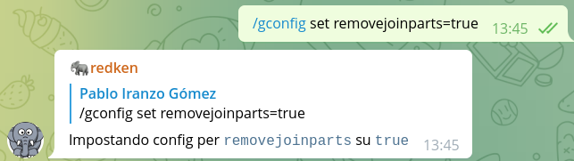

# Redken in action with some examples

Let's learn about using Redken in Telegram or Discord with some examples.... but first, let's add the bot to a new group based on the platform we're using:

- [Redken_bot in Telegram](https://t.me/redken_bot)
- [Redken in discord](https://discord.com/oauth2/authorize?client_id=826069772822773790&scope=bot&permissions=8)

## Let's get hands on!

First of all, some of the commands shown will require admin privileges in the chat (from the user point of view) and from Redken.

Redken uses admin privileges to:

- read the user admin level changes
- allow it to remove service messages (message pinned, user joined, etc)
- expand short urls into longer ones
- kick users out of the chat, for example when a user is reported as spammer
- etc

When the user is an admin of the chat, some commands like `/gconfig` will be available, but ignored for non-admin users, we'll come back to this later in this tutorial.

I assume you might have checked the [Redken documentation]()... but let's go with the easy approach:

As said in the docs:

> By default, new groups where the bot is added are just ready to start being used.

So, let's start with that, let's add a bot to a new group so that we can get working with it:

We've added the bot via the `redken_bot` username to our group, and it replied with the welcome message.

Each group has an unique identifier that is used by redken to store configuration, karma, etc relevant to that group, this makes each group independent from others, unless you use the advanced feature of linking them together.

So basic usage is to say `word++` or `word--`:

We can also reply to another message with just `++` or `--` to give karma to that user or with `==` to give karma by simulating the same message as the one replied being sent by current user:

The bot, also speaks different languages, by default it will answer in English, but once it learns from you and the group the bot is in, will automatically switch to the most used language.

You can check the [available translations](https://crowdin.com/project/stampython/) and even contribute to improve them!

And that's all... we can keep working with the bot as it is, or go ahead with other features!

## Put some configuration in place

### Setting language

If we want to force the language to use, we can do so with the `/gconfig set lang=it` command, for setting it to Italian.

### Removal of service messages

If we want to remove the service messages, we can do so with the `/gconfig set removejoinparts=true` command, for example:

### Reduce number of karma messages

If you've a very active group, the amount of karma messages might be too high, in that case, set a value for `modulo` that will show karma counts only after multiples of `modulo`.

For example `/lconfig set modulo=5` will only show karma for 0,5,10, etc karma points.

General usage and features:

- `/quote add username text` to add a quote for given username with the following text as message
- `/quote username` to retrieve a random quote for that username.
- `@all` to ping all usernames for users in a channel
- `@all++` to give karma to all usernames in a channel
- `stock <ticker>` to get trading quote for ticker in stock market
- `/hilight <add|delete|list> <word>` Adds/deletes word or lists words that will cause a forward to notify you
- `/feed <add|delete|list> name url` Adds/deletes/lists a new feed form URL on channel
- `/remind <add|delete|list> name interval text` Adds/deletes/lists a new reminder for interval in channel, interval can be specified as '1y2m3w5d'
- `/ical <add|delete|list> name url` Adds/deletes/lists a new ical url to print events happening during the day
- `/cn <word>` To get a random Chuck Norris fact related with provided word (or random)
- `/excuse` To get a random excuse
- Spam check for the messages based on the availability of database to train the bot, and only if certainty level is over or equal to `85%`.

Also, while nothing is set against, you could use `/gconfig` to configure several aspects of it like:

- `stock` (to define the stock tickers to query when invoking `stock`)

Once you started chatting with the bot, you can also use /hilight `word` so messages containing that word will be forwarded to you as a private message.

On the channel to become `master` execute: `/admin link master` and it will generate a code (token) to link against just once.

On the channel to be linked against `master`, a.k.a. `slave`, execute: `/admin link slave <token>` where `token` is the code received as reply to the command in master channel.

## User/chat configuration

The bot, once token has been used and admin has been set, will store that information in the database, so you can control it from a chat window

- `/[g|l]config show` will list actual defined settings (`/gconfig`, `/lconfig` or `/config`)
- `/[g|l]config set var=value` will set one of those settings with a new value
  - As of this writing (verbosity, url for api, token, sleep timeout, owner, database, run in daemon mode)
- `/[g|l]config delete var` will delete that variable from configuration.

The available list of configuration options that can be used depending on private or chats is listed below:

### common

- `currency`: EUR
- `modulo`: 1 (to just show karma every X/modulo points, 0 to disable)
- `stock`: stock tickers to check
- `cleanlink`: True if we want links to be expanded and removed
- `cleankey`: Regexp to replace, for example tag=
- `splitkarmaword`: Set to 'False' to make that `johndoe.linux.expert++` stops reporting karma to the word and to `johndoe`
- `lang`: set to language of choice to get some strings translated into supported languages <https://crowdin.com/project/stampython> and override autodetected language.
- `privacy`: Enables privacy for forwarded messages, if a message is
  forwarded and the config is set, redken will remove original message and
  resend text to the chat so that the original sender is removed but
  forwarder is credited. If value is set to `silent` it will just clean the message forwarder.

### chat

- `isolated`: False, if true, allow link, all karma, etc is tied to GID
- `link`: empty, if defined, channel is slave to a mater
- `admin`: List of admins of channels, default empty: everyone
- `maxage`: chats older than this will be removed
- `silent`: makes stampy not to output messages to that chat
- `welcome`: outputs the text when a new user joins the chat, replacing "\$username" by user name
- `usernamereminder`: Set this `False` to stop reminding new users to get a username to get the most out of karma commands.
- `inactivity`: Set this to the number of days without user activity before kicking it out.
- `hiordie`: Set this to the initial number of minutes that a user has to say something on the chat, similar to grace but for shorter periods
- `grace`: Set this to the initial grace period in days for user to say something when added to a channel before being kicked out of `inactivity` (fakes the join date as `grace` days before being kicked out of max `inactivity`)
- `removejoinparts`: Set this to automatically remove 'User XXX has joined' or 'User XXX has left' messages from the groups.
- `enableall`: Set this to `admin` or `karma` or `false` to allow being used only by admins, allow regular users to just give karma but no pinging or to disable it in your chat.
- `spamcheck`: Set this to `false`, `True` or `auto` to process the text messages with Machine Learning predictions about spam. This only works in English right now and only while the model is `85%` accurate or more. Leaving the default (`True`), will show two buttons for the messages when it is considered SPAM, if confirmed, spam actions will happen. In `auto` mode, spam actions will trigger automatically if the message is considered spam.
- `alladmins`: Set this to True to make all users in chat being able to use administrative commands, by default (`False`) means that only chat admins can run the commands.



- Delete spam message
- Submit spam message to database of spam
- Add spammer userid to database
- Kick user from the group
  

## Extra commands

Only for admin user in groups or for individuals against the bot

- `/reload_admins`: Uses telegram API to find admins and populate the `admin` variable for commands that require admin access.
- `/spam`: reports a message as SPAM to redken
- `/thanks [add|list|delete]`: Manage the list of words that, when replied, give karma to original sender
- `/spoiler`: Reploy to a message with this to delete it and send it back with hidden text

### Karma

- `skarma word=value` will set specified word to the karma value provided.

### Auto-karma triggers

Bot allows to trigger auto-karma events, so when keyword is given, it will trigger an event to increase karma value for other words

- `/autok key=value` Will create a new auto-karma trigger, so each time `key` is used, it will trigger value++ event
- `/autok list [word]` Will show current defined autokarma triggers and in case a word is provided will search based on that word
- `/autok delete key=value` will delete a previously defined auto-karma so no more auto-karma events will be triggered for that pair

### Auto-gif triggers

Bot allows to trigger gif sending when a keyword is given.

- `/autog key=value` Will create a new auto-gif trigger, so each time `key` is used, it will trigger gif send event
- `/autog list [word]` Will show current defined autogif triggers and in case a word is provided will search based on that word
- `/autog delete key=value` will delete a previously defined auto-gif so no more gifs will be sent for that keyword

### Alias

Bot allows to setup aliases, so when karma is given to a word, it will instead add it to a different one (and report that one)

- `/alias key=value` Will create a new alias, so each time `key++` is used, it will instead do value++
  - This operation, sums the previous karma of `key` and `value` and stores it in value so no karma is lost
  - Recursive aliases can be defined, so doing:
    - `/alias lettuce=vegetable`
    - `/alias vegetable=food`
    - `lettuce++` will give karma to `food`.
  - Alias can be defined to groups of words so, it can be defined to have:
    - `/alias friday=tgif tfsmif`
    - `friday++` will increase karma on `tgif` and `tfsmif`.
- `/alias list` Will show current defined aliases
- `/alias delete key` will delete a previously defined alias so each word gets karma on its own

### Alias team

Bot allows to setup team aliases, so it can ping several users in a chat

- `/ateam team=members` Will create a new team, so when `@team` is used, it will ping each member's username (prepending @ to each word defined as members)
  - Teams can be defined to groups of words so, it can be defined to have:
    - `/ateam ateam=face murdock hannibal mr-t`
- `/ateam list` Will show current defined teams
- `/ateam delete team` will delete a previously defined team

### quote

- `/quote del id` to remove a specific quote id from database
