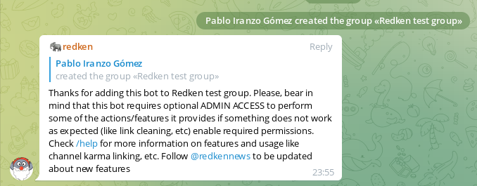
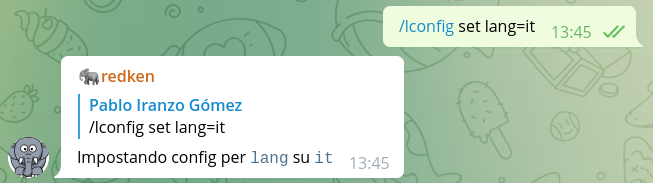
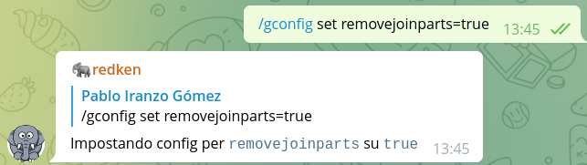

# Redken in action with some examples

Let's learn about using Redken in Telegram or Discord with some examples.... but first, let's add the bot to a new group based on the platform we're using:

- [Redken_bot in Telegram](https://t.me/redken_bot)
- [Redken in discord](https://discord.com/oauth2/authorize?client_id=826069772822773790&scope=bot&permissions=8)

## Let's get hands on!

First of all, some of the commands shown will require admin privileges in the chat (from the user point of view) and from Redken.

Redken uses admin privileges to:

- read the user admin level changes
- allow it to remove service messages (message pinned, user joined, etc)
- expand short URLs into longer ones
- kick users out of the chat, for example when a user is reported as spammer
- etc

When the user is an admin of the chat, some commands like `/gconfig` will be available, but ignored for non-admin users, we'll come back to this later in this tutorial.

I assume you might have checked the [Redken documentation]()... but let's go with the easy approach:

As said in the docs:

> By default, new groups where the bot is added are just ready to start being used.

So, let's start with that, let's add a bot to a new group so that we can get working with it:

We've added the bot via the `redken_bot` username to our group, and it replied with the welcome message.

Each group has an unique identifier that is used by redken to store configuration, karma, etc relevant to that group, this makes each group independent from others, unless you use the advanced feature of linking them together.

So basic usage is to say `word++` or `word--`:

We can also reply to another message with just `++` or `--` to give karma to that user or with `==` to give karma by simulating the same message as the one replied being sent by current user:

The bot, also speaks different languages, by default it will answer in English, but once it learns from you and the group the bot is in, will automatically switch to the most used language.

You can check the [available translations](https://crowdin.com/project/stampython/) and even contribute to improve them!

And that's all... we can keep working with the bot as it is, or go ahead with other features!

## Put some configuration in place

### Setting language

If we want to force the language to use, we can do so with the `/gconfig set lang=it` command, for setting it to Italian.

### Removal of service messages

If we want to remove the service messages, we can do so with the `/gconfig set removejoinparts=true` command, for example:

### Reduce number of karma messages

If you've a very active group, the amount of karma messages might be too high, in that case, set a value for `modulo` that will show karma counts only after multiples of `modulo`.

For example `/lconfig set modulo=5` will only show karma for 0,5,10, etc karma points.

Enjoy!
