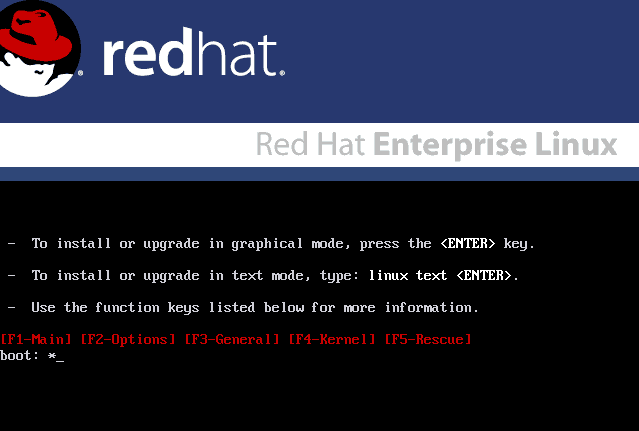
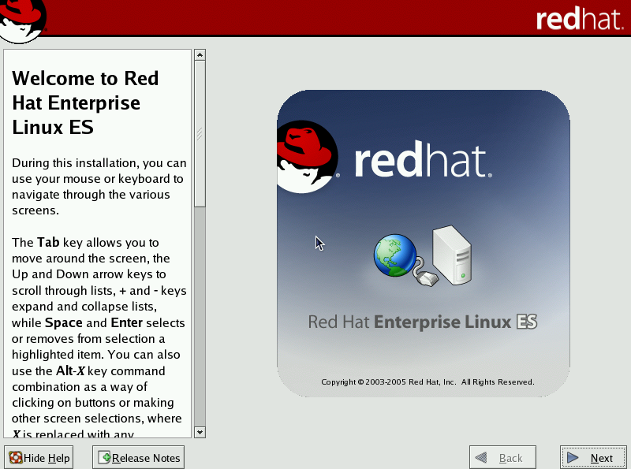
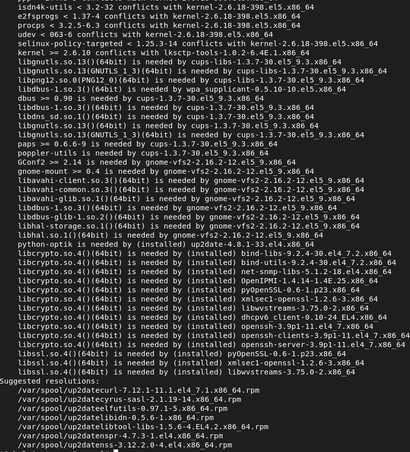
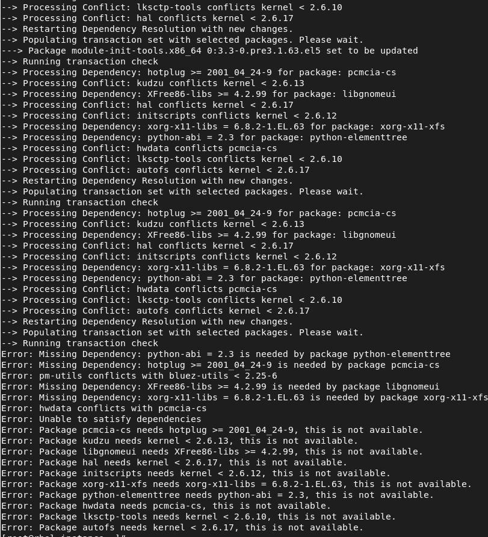
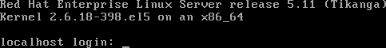
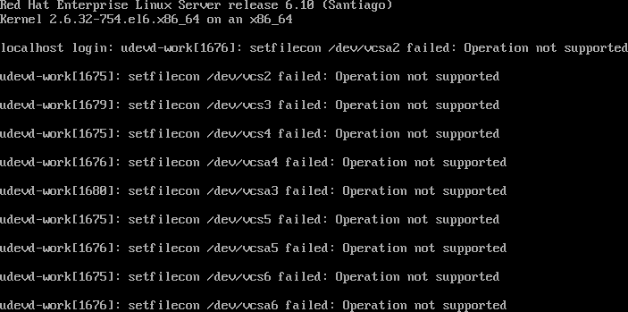

Most systems, based on RHEL, were not able to upgrade without
reinstallation, or best said, not supported. The new version, that was
released at around 18 months later contained so many changes that it was
hard to test the upgrades themselves until `leapp` was introduced.

Check the lifecycle here: <https://access.redhat.com/support/policy/updates/errata>

However, the biggest problem could be the incompatibility of packages or
package formats... but as usually there were some middle layers it was
possible to upgrade without reinstallation by performing some manual steps.



This procedure is completely unsupported, it should not be
used on production systems and doesn't ensure service availability during
the upgrade. Or even system availability once finished...



In the past, the method that could be used, was to provide the `upgradeany`
parameter to anaconda installer via the command line options, but this still
required to boot from an `ISO` (or physical media) to perform the upgrade,
and have little chance of recovery in case of any failure during the
installation as anaconda environment was very limited in recovery options.

In brief:

- We'll move in unsupported ways from one release to another
- Package dependencies will require removing some packages or forcing installations ignoring dependencies that might cause issues
- At some point, if a power cut happens, the system might not be recoverable as it will be missing important parts.
- There could be leftovers in the system
- This will be a lengthy, process and prone to failure
- Upgrade the systems always before you reach to this situation, this is not something you want to do on regular basis because product has reached End-Of-Life (EOL)
- It should be easier to work on automating deployments and configurations so in the future you can redeploy on newer releases or newer hardware and get a track of all the performed configurations, etc, ideally on a control version system for traceability.
- Downloading files from older servers might be difficult, or even connecting to them, because of now obsoleted SSL or other crypto libraries.
- Don't do this unless you want to fully risk the system you had
- For each release, try to download `.0` and `.latest` versions, we will use `.0` when upgrading from prior major, and before moving to next major version, we'll update to the latest minor... in this way we might catch some errors of packages not upgraded or procedures... like kernel scripts that might install on the `.0` but end up in an unbootable system, moving from `.0` to `.latest` will allows us to reduce the chances of hitting this kind of issues.

## Preparation steps

In order to start, it is safe to perform some steps:

- Perform a backup and prepare for reinstallation
- Ensure there's enough free disk
- Get a copy of the install media on the system we're going to update and have it at hand in case we need to recover
- Use `tmux`[^1] or `screen` as screen multiplexers so that we can recover in case of network connectivity issues
- Ensure that tools like `wget` are installed
- Have access to remote console, either via `BMC` or the virtualization platform if that's the case.
- Check the documentation for the next release to see what are the breaking changes included in the release notes for each version, this will give us some hints about packages that we were using and are no longer available in our system.

[^1]: `tmux` or `screen` allows to disconnect, re-attach or even open new terminals without having to open a new ssh connection, this makes it a lot easier to spawn a new shell and operate without risking a disconnection from our system.

### Upgrade the system

To have a smoother experience, first step is to fully update the system to the latest version of the packages

```sh
# EL5 onwards
yum update --skip-broken
```

Once we made sure that no further updates are available we're ready for the next steps.

### Download the install media to the system

As indicated in the previous section, we need to download the install media
to the system, this will make sure that we'll have available a copy we can
use without requiring network access to install whatever is needed in our
host.

We'll mount it to `/mnt` and create a repository file for using it in each release step. For mounting, we'll execute:

```sh
mount -o loop /root/rhel${VERSION}.iso /mnt
```

## Attempting the update

The package managers `yum` and `dnf` include a flag that might be really
useful as long as we've compatible repositories or we've made available our
`ISO` install media on our system and created a custom repo definition for
it.

We'll follow this procedure on a RHEL base system, starting with RHEL 4.8 until RHEL 9 Beta.

Let's get ready on the environment...

## RHEL 4.8 installation

Proceed to install RHEL 4.8 via the ISO on the system so that we've the test-bed ready for our procedure.





As you might have experienced... using a recent system to connect to a legacy one could be complicated as some insecure protocols have been disabled.

Create an entry like this in your `.ssh/config` file, so that insecure methods can be used to connect:

```console
Host 192.168.2.82
	HostKeyAlgorithms=+ssh-rsa
	KexAlgorithms=+diffie-hellman-group1-sha1
  PubkeyAcceptedKeyTypes=+ssh-rsa
	User root
```

or alternatively on the commandline:

```sh
ssh -oHostKeyAlgorithms=+ssh-rsa -oPubkeyAcceptedKeyTypes=+ssh-rsa root@192.168.2.8
```



RHEL 4.8 used `up2date` as method for connecting to `RHN`, however, as it is out of the support cycle I wouldn't expect to get RHN working for it.

At that time, CentOS had the chance to create repositories and copy over the
`yum` command so that it could be used on it, but let's try to use what
we've in the system... first of all, we need to load the `RHEL` ISO image
into our system.

As we don't have access to RHN, let's loopback mount the `ISO` image and let's install `screen`:

```sh
[root@rhel-instance mnt]# mount /root/rhel4.8.iso /mnt
[root@rhel-instance mnt]# cd /mnt

[root@rhel-instance mnt]# rpm -Uvh RedHat/RPMS/screen-4.0.2-5.x86_64.rpm
Preparing...                ########################################### [100%]
   1:screen                 ########################################### [100%]
[root@rhel-instance mnt]#
```

From this point, we should execute `screen` and continue working from within that shell

We can now `cd` into our user home folder and `umount /mnt` to start the process.

## RHEL 4.8 to RHEL 5.x upgrade

First, let's mount RHEL 5.x CD-ROM on `/mnt` and let's start over...

In RHEL5, we used to have the main OS packages in the `Server/` folder so let's `cd` into it via `cd /mnt/Server`.

If you're familiar with `rpm` the first attempt would be to use `rpm -Fvh *.rpm` to freshen all the packages, that is, install the updated versions and carry on... but we'll get into a dependency hell, and if you attempt it, lot of the installed packages might have been already removed, and not be possible to upgrade...

To make our life easier, we need to do whatever we can to get `yum` and `rpm` packages updated to RHEL 5 versions, so that we can later use `yum` for the dependency resolution.

Now, we begin a loop of package additions and removals to get to some state we can move forward...

When we first attempt to update `rpm`, `yum`, etc. we begging requiring `python` and upgrading it will complain about some of the `system-config-lvm` or `system-config-network`... so the procedure is a try-and-error approach:

```sh
rpm -e system-config-lvm
rpm -e system-config-network
rpm -e system-config-packages
rpm -e gnome-python2-bonobo gnome-python2 gnome-python2-canvas
```

And then start attempting to upgrade `yum` and `rpm` while you get into dependency hell like this:



So... we realized it is a pain, so let's grab some 'CentOS' packages from the [CentOS 4.9 VAULT](https://vault.centos.org/4.9/os/x86_64/CentOS/RPMS/) that we can use to get yum working:

```
 python-elementtree-1.2.6-5.el4.centos.x86_64.rpm
 python-sqlite-1.1.7-1.2.1.x86_64.rpm
 python-urlgrabber-2.9.8-2.noarch.rpm
 sqlite-3.3.6-2.x86_64.rpm
 yum-2.4.3-4.el4.centos.noarch.rpm
 yum-metadata-parser-1.0-8.el4.centos.x86_64.rpm
```

Let's copy them to our system (in case we haven't downloaded them there) and let's install them... using `--nodeps` as the packages require `yumconf` that we will not find as a built package:

```sh
# Disable SELinux Enforcing
setenforce 0

# Preferably, configure SElinux to be in permissive mode via editing the /etc/selinux/config file and setting it to 'SELINUX=permissive'

# Install the packages for  yum
rpm -Uvh --nodeps python-elementtree-1.2.6-5.el4.centos.x86_64.rpm  python-sqlite-1.1.7-1.2.1.x86_64.rpm   python-urlgrabber-2.9.8-2.noarch.rpm  sqlite-3.3.6-2.x86_64.rpm  yum-2.4.3-4.el4.centos.noarch.rpm  yum-metadata-parser-1.0-8.el4.centos.x86_64.rpm
```

Now, let's create a repo file at `/etc/yum.repos.d/cdrom.repo` with the following contents:

```inifile
[cdrom]
name=CDROM
baseurl=file:///mnt/Server/
enabled=1
gpgcheck=0
```

From this point, we could use `yum` to install packages...

First packages to upgrade should be... again... `yum` and `rpm` and it will start several dependency loop checks that we'll need to resolve... but in a lot easier way than having to manually specify the packages to upgrade.



As we're on a server, let's remove some more packages to get this progressing:

```sh
rpm -e pcmcia-cs pm-utils bluez-utils
rpm -e xorg-x11-xfs chkfontpath urw-fonts
rpm -e kudzu system-config-mouse system-config-network-tui system-config-soundcard --nodeps
rpm -e autofs libgnomeui up2date
```

Now, let's update some packages:

```console
yum update hwdata
--> Restarting Dependency Resolution with new changes.
--> Populating transaction set with selected packages. Please wait.
---> Package glibc-common.x86_64 0:2.5-123 set to be updated
--> Running transaction check
--> Processing Conflict: glibc-common conflicts glibc < 2.5
--> Processing Dependency: glibc-common = 2.3.4-2.43 for package: glibc
--> Restarting Dependency Resolution with new changes.
--> Populating transaction set with selected packages. Please wait.
---> Package glibc.i686 0:2.5-123 set to be updated
--> Running transaction check

Dependencies Resolved

=============================================================================
 Package                 Arch       Version          Repository        Size
=============================================================================
Updating:
 hwdata                  noarch     0.213.30-1.el5   cdrom             477 k
Updating for dependencies:
 glibc                   x86_64     2.5-123          cdrom             4.8 M
 glibc                   i686       2.5-123          cdrom             5.4 M
 glibc-common            x86_64     2.5-123          cdrom              16 M
 module-init-tools       x86_64     3.3-0.pre3.1.63.el5  cdrom             446 k

Transaction Summary
=============================================================================
Install      0 Package(s)
Update       5 Package(s)
Remove       0 Package(s)
Total download size: 28 M
Is this ok [y/N]: y
Downloading Packages:
Running Transaction Test
Finished Transaction Test
Transaction Test Succeeded
Running Transaction
  Updating  : glibc-common                 ####################### [ 1/10]
  Updating  : glibc                        ####################### [ 2/10]
  Updating  : glibc                                                [ 3/10]warning: /etc/localtime created as /etc/localtime.rpmnew
  Updating  : glibc                                                [ 3/10]warning: /etc/nsswitch.conf created as /etc/nsswitch.conf.rpmnew
  Updating  : glibc                        ####################### [ 3/10]
  Updating  : module-init-tools            ####################### [ 4/10]
  Updating  : hwdata                       ####################### [ 5/10]
  Cleanup   : glibc                        ####################### [ 6/10]
  Cleanup   : module-init-tools            ####################### [ 7/10]
  Cleanup   : glibc-common                 ####################### [ 8/10]
  Cleanup   : glibc                        ####################### [ 9/10]
  Cleanup   : hwdata                       ####################### [10/10]

Updated: hwdata.noarch 0:0.213.30-1.el5
Dependency Updated: glibc.x86_64 0:2.5-123 glibc.i686 0:2.5-123 glibc-common.x86_64 0:2.5-123 module-init-tools.x86_64 0:3.3-0.pre3.1.63.el5
Complete!

```

First packages updated using `yum`!!

Now, we're hitting several issues with kernel being incompatible... so let's remove it but just from the database (as well as other packages):

```sh
rpm -e kernel --nodeps --justdb --noscripts
rpm -e python-elementtree util-linux yum initscripts glib2  procps --justdb  --noscripts
rpm -e system-config-securitylevel
```

After those steps... that again... are critical we can start updating some more packages:

```sh
yum -y install yum hal initscripts
```

After it finishes, we can try again to update yum:

```console
[root@rhel-instance ~]# yum install yum
There was a problem importing one of the Python modules
required to run yum. The error leading to this problem was:

   No module named urlgrabber

Please install a package which provides this module, or
verify that the module is installed correctly.

It's possible that the above module doesn't match the
current version of Python, which is:
2.4.3 (#1, Oct 23 2012, 22:02:41)
[GCC 4.1.2 20080704 (Red Hat 4.1.2-54)]

If you cannot solve this problem yourself, please go to
the yum faq at:
  http://wiki.linux.duke.edu/YumFaq
```

And BAM!, it fails... let's check RPM for yum:

```console
[root@rhel-instance ~]# rpm -q yum
rpmdb: Program version 4.3 doesn't match environment version
error: db4 error(-30974) from dbenv->open: DB_VERSION_MISMATCH: Database environment version mismatch
error: cannot open Packages index using db3 -  (-30974)
error: cannot open Packages database in /var/lib/rpm
package yum is not installed
```

BAM!, rpm can't find the packages...

Let's remove the old database of `rpm`:

```sh
rm -fv /var/lib/rpm/__db*
```

```console
[root@rhel-instance ~]# cd /var/lib/rpm/
[root@rhel-instance rpm]# ls
Basenames     __db.000  __db.002  Dirnames  Group       Name      Providename     Pubkeys      Requireversion  Sigmd5
Conflictname  __db.001  __db.003  Filemd5s  Installtid  Packages  Provideversion  Requirename  Sha1header      Triggername
[root@rhel-instance rpm]# ls -l
total 19800
-rw-r--r--  1 root root  1445888 Mar 25 21:58 Basenames
-rw-r--r--  1 root root    12288 Mar 25 21:58 Conflictname
-rw-r--r--  1 root root        0 Mar 25 22:00 __db.000
-rw-r--r--  1 root root    16384 Mar 25 20:02 __db.001
-rw-r--r--  1 root root  1318912 Mar 25 20:02 __db.002
-rw-r--r--  1 root root   663552 Mar 25 20:02 __db.003
-rw-r--r--  1 root root   352256 Mar 25 21:58 Dirnames
-rw-r--r--  1 root root  2613248 Mar 25 21:58 Filemd5s
-rw-r--r--  1 root root    12288 Mar 25 21:58 Group
-rw-r--r--  1 root root    16384 Mar 25 21:58 Installtid
-rw-r--r--  1 root root    24576 Mar 25 21:58 Name
-rw-r--r--  1 root root 14315520 Mar 25 21:58 Packages
-rw-r--r--  1 root root   180224 Mar 25 21:58 Providename
-rw-r--r--  1 root root    65536 Mar 25 21:58 Provideversion
-rw-r--r--  1 root root    12288 Mar 25 21:57 Pubkeys
-rw-r--r--  1 root root   188416 Mar 25 21:58 Requirename
-rw-r--r--  1 root root   102400 Mar 25 21:58 Requireversion
-rw-r--r--  1 root root    45056 Mar 25 21:58 Sha1header
-rw-r--r--  1 root root    45056 Mar 25 21:58 Sigmd5
-rw-r--r--  1 root root    12288 Mar 25 21:58 Triggername
[root@rhel-instance rpm]# rm -fv __db.00*
removed `__db.000'
removed `__db.001'
removed `__db.002'
removed `__db.003'
[root@rhel-instance rpm]# rpm -q yum
yum-3.2.22-40.el5
```

Now, as you can see, we've yum again :-) (but it still doesn't work)...

Let's manually install the missing libraries:

```sh
rpm -Uvh python-urlgrabber-3.1.0-6.el5.noarch.rpm m2crypto-0.16-9.el5.x86_64.rpm
```

Next one failing after this... is `sqlite`...

Let's reinstall it:

```sh
rpm -Uvh --force python-sqlite-1.1.7-1.2.1.x86_64.rpm
```

After this step, `yum` works again, so let's find next target for installation... but first let's install some more packages with `rpm`:

```sh
rpm -Uvh rhn-client-tools-0.4.20.1-9.el5.noarch.rpm python-dmidecode-3.10.13-1.el5_5.1.x86_64.rpm rhn-check-0.4.20.1-9.el5.noarch.rpm rhn-setup-0.4.20.1-9.el5.noarch.rpm rhnsd-4.7.0-14.el5.x86_64.rpm yum-rhn-plugin-0.5.4.1-7.el5.noarch.rpm rhnlib-2.5.22.1-6.el5.noarch.rpm
```

Let's install some packages as well as some of the already installed ones...

```sh
[root@localhost Server]# rpm -Uvh libpcap-0.9.4-15.el5.x86_64.rpm ppp-2.4.4-2.el5.x86_64.rpm   kernel-2.6.18-398.el5.x86_64.rpm  mkinitrd-5.1.19.6-82.el5.x86_64.rpm  procps-3.2.7-26.el5.x86_64.rpm  nash-5.1.19.6-82.el5.x86_64.rpm kpartx-0.4.7-63.el5.x86_64.rpm e2fsprogs-1.39-37.el5.x86_64.rpm device-mapper-multipath-0.4.7-63.el5.x86_64.rpm  selinux-policy-targeted-2.4.6-351.el5.noarch.rpm  hmaccalc-0.9.6-4.el5.x86_64.rpm   iscsi-initiator-utils-6.2.0.872-16.el5.x86_64.rpm  lksctp-tools-1.0.6-3.el5.x86_64.rpm  selinux-policy-targeted-2.4.6-351.el5.noarch.rpm  quota-3.13-8.el5.x86_64.rpm krb5-workstation-1.6.1-78.el5.x86_64.rpm  NetworkManager-0.7.0-13.el5.x86_64.rpm  parted-1.8.1-30.el5.x86_64.rpm util-linux-2.13-0.59.el5_8.x86_64.rpm cryptsetup-luks-1.0.3-8.el5.x86_64.rpm openssh-server-4.3p2-82.el5.x86_64.rpm gtk2-2.10.4-30.el5.x86_64.rpm  gnupg-1.4.5-18.el5_10.1.x86_64.rpm  e2fsprogs-libs-1.39-37.el5.x86_64.rpm  isdn4k-utils-3.2-56.el5.x86_64.rpm  libsysfs-2.1.0-1.el5.x86_64.rpm  policycoreutils-1.33.12-14.13.el5.x86_64.rpm selinux-policy-2.4.6-351.el5.noarch.rpm  audit-libs-python-1.8-2.el5.x86_64.rpm libselinux-python-1.33.4-5.7.el5.x86_64.rpm libsemanage-1.9.1-4.4.el5.x86_64.rpm  --force
```

Let's get remove some other conflict packages...

```sh
[root@localhost Server]# rpm -Uvh gettext-0.17-1.el5.x86_64.rpm libgomp-4.4.7-1.el5.x86_64.rpm
```

For Updating the `filesystem` package we need to make a trick... find the file on the `/mnt` folder... copy it over to `/root` and umount the CD-ROM

Then install it from the root folder:

```sh
rpm -Uvh filesystem.rpm
```

Once finished, remount the CD-ROM and let's continue with some other dependencies:

```sh
rpm -Uvh openib-1.5.4.1-4.el5.noarch.rpm pycairo-1.2.0-1.1.x86_64.rpm
rpm -Uvh gnome-python2-canvas-2.16.0-1.fc6.x86_64.rpm yelp-2.16.0-30.el5_9.x86_64.rpm firstboot-1.4.27.9-1.el5.x86_64.rpm rhpxl-0.41.1-12.el5.x86_64.rpm metacity-2.16.0-16.el5.x86_64.rpm gnome-python2-2.16.0-1.fc6.x86_64.rpm gnome-doc-utils-0.8.0-2.fc6.noarch.rpm scrollkeeper-0.3.14-9.el5.x86_64.rpm firstboot-tui-1.4.27.9-1.el5.x86_64.rpm system-config-display-1.0.48-4.el5.noarch.rpm system-config-network-1.3.99.23-1.el5.noarch.rpm redhat-artwork-5.0.9-2.el5.x86_64.rpm docbook-dtds-1.0-30.1.noarch.rpm xorg-x11-fonts-Type1-7.1-2.1.el5.noarch.rpm pkgconfig-0.21-2.el5.x86_64.rpm system-config-soundcard-2.0.6-1.el5.noarch.rpm alsa-utils-1.0.17-7.el5.x86_64.rpm xml-common-0.6.3-18.noarch.rpm openjade-1.3.2-27.x86_64.rpm redhat-menus-6.7.8-3.el5.noarch.rpm redhat-logos-4.9.16-1.noarch.rpm sgml-common-0.6.3-18.noarch.rpm xorg-x11-server-Xorg-1.1.1-48.101.el5_10.3.x86_64.rpm system-config-securitylevel-tui-1.6.29.1-6.el5.x86_64.rpm xorg-x11-utils-7.1-2.fc6.x86_64.rpm xorg-x11-server-utils-7.1-5.el5_6.2.x86_64.rpm xorg-x11-drv-vesa-1.3.0-8.3.el5.x86_64.rpm xorg-x11-drv-void-1.1.0-3.1.x86_64.rpm xorg-x11-drv-evdev-1.0.0.5-5.el5.x86_64.rpm xorg-x11-drv-mouse-1.1.1-1.1.x86_64.rpm cpp-4.1.2-55.el5.x86_64.rpm gtk2-engines-2.8.0-3.el5.x86_64.rpm gnome-python2-2.16.0-1.fc6.x86_64.rpm gnome-python2-bonobo-2.16.0-1.fc6.x86_64.rpm pyxf86config-0.3.31-3.el5.x86_64.rpm system-config-securitylevel-1.6.29.1-6.el5.x86_64.rpm xorg-x11-drv-keyboard-1.1.0-3.x86_64.rpm xorg-x11-fonts-base-7.1-2.1.el5.noarch.rpm gnome-python2-gnomevfs-2.16.0-1.fc6.x86_64.rpm --nodeps
```

Let's install some more missing dependencies with `rpm`:

```sh
rpm -Uvh python-numeric-23.7-2.2.2.el5_6.1.x86_64.rpm pygobject2-2.12.1-5.el5.x86_64.rpm
```

And let's attempt freshen of all the remaining packages:

```sh
rpm -Fvh *.rpm

# Let's also install createrepo... we'll need it later
rpm -ivh createrepo*.rpm
```

After this... only a few packages are missing to upgrade, yum is still not working as it complains with some problems with the rpm database, so we need to continue with `rpm`:

```sh
rpm -Uvh kexec-tools-1.102pre-165.el5.x86_64.rpm  busybox-1.2.0-14.el5.x86_64.rpm mesa-libGL-6.5.1-7.11.el5_9.x86_64.rpm  libdrm-2.0.2-1.1.x86_64.rpm
rpm -Uvh mlocate-0.15-1.el5.2.x86_64.rpm redhat-release-notes-5Server-52.x86_64.rpm tzdata-2014e-1.el5.x86_64.rpm
```

Here, `yum` now reports that no packages are missing to update... so let's attempt to reboot the system and cross fingers..

If the system rebooted, make sure it shows the right kernel for EL5... `2.6.9` is a bad value... it should read `2.6.18`... if you're in that case, once the system boots, mount the CD-ROM again, and force kernel reinstallation via:

```sh
rpm -ivh --force /mnt/Server/kernel-2.6.18-398.el5.x86_64.rpm
```

And reboot again.



## RHEL5 to RHEL6 upgrade

Wow, now we're on RHEL5, yum is already native in this version, so that we can update the `cdrom.repo` file to point to the root of the mount point instead of the `Server` folder, then run `yum update` and... BAM!, incompatible hash for the repository...

As we installed `createrepo` before we can `cd` into our home folder and run:

```sh
[root@localhost ~]# cd
[root@localhost ~]# mkdir el6
[root@localhost ~]# for file in /mnt/Packages/*.rpm; do ln -s $file . ;done
[root@localhost ~]# createrepo  -o el6 -u file:///mnt/Packages/  /mnt/Packages/

3861/3861 - zsh-4.3.11-8.el6.x86_64.rpm
Saving Primary metadata
Saving file lists metadata
Saving other metadata

```

Once this is done, we need to update our `cdrom.repo` file to point to the location `file:///root/el6` ;-)

Let's start again... removing some packages:

```sh
yum remove system-config-* kudzu rhnlib python-numeric rhpl avahi ipsec-tools OpenIPMI authconfig
yum remove xorg-x11-server-utils  xorg-x11-server-Xorg  xorg-x11-utils  xorg-x11-fonts-base  xorg-x11-fonts-Type1  openjade
rpm -e sudo-1.6.7p5-30.1.5.x86_64 --justdb
# (as package-cleanup --dupes was showing it)
yum remove OpenIPMI-libs-2.0.16-16.el5.x86_64 bluez-hcidump-1.32-1.x86_64
rpm -e libnotify-0.4.2-6.el5.x86_64 net-snmp-libs-5.3.2.2-22.el5_10.1.x86_64 libbonobo-2.16.0-1.1.el5_5.1.x86_64 libibcommon-1.2.0-1.el5.x86_64 libsdp-1.1.108-1.el5.x86_64 bluez-libs-3.7-1.1.x86_64 glib-1.2.10-20.el5.x86_64 libmthca-1.0.6-1.el5.x86_64 compat-libstdc++-33-3.2.3-61.x86_64 libgnomecanvas-2.14.0-4.1.x86_64 libart_lgpl-2.3.17-4.x86_64

```

```sh
# Remove packages that are not from x86_64 (it used to be required in older ones, but not any longer.)
uname -a |grep x86_64 && yum remove *.i{3,4,5,6}86
```

Ok, so we're back on having issues with rpm features that we don't have at EL5... so we need to update rpm and required components so that we can continue installing newer packages.

This approach brings us to the egg-chicken issue... we can't install the packages because our installed version is old, and until we update them, we can't install the other updates... and even `cpio` is older than the version used, so we might need to use an intermediate machine to uncompress the rpm related packages copy them over, and use them to install the updates on the system itself.

We need to prepare and uncompress the following files from the install media on a newer machine

```sh
PACKAGES="db4-4.7.25-16.el6.x86_64.rpm glibc-2.12-1.7.el6.x86_64.rpm glibc-common-2.12-1.7.el6.x86_64.rpm glibc-utils-2.12-1.7.el6.x86_64.rpm libcap-2.16-5.2.el6.x86_64.rpm lua-5.1.4-4.1.el6.x86_64.rpm popt-1.13-7.el6.x86_64.rpm rpm-4.8.0-12.el6.x86_64.rpm rpm-build-4.8.0-12.el6.x86_64.rpm rpm-libs-4.8.0-12.el6.x86_64.rpm rpm-python-4.8.0-12.el6.x86_64.rpm xz-libs-4.999.9-0.3.beta.20091007git.el6.x86_64.rpm"

for package in $PACKAGES;do
  echo "Uncompressing $package"
  rpm2cpio /mnt/Packages/$package | cpio -idmv
done
```

Once the process has finished, you'll get a list of folders that need to be
copied back to the host... note, this will overwrite libraries, binaries
and can render your system unusable.

Once that step is done... your system should have RPM version 4.8.0 and you
can use it to install and force install several set of packages... until
you can get yum working again...

In this case, yum provided in EL6, features the `distro-sync` command, which
is a simple way to update the system to the latest available packages in our
local repository.

Yum might complain of some missing packages.. ensure to get yum packages
installed, as well as expat, SSL and some other dependencies that will
complain.

Once YUM is working and distro-sync has finished, we need to edit the
`cdrom.repo` to act against the folder with the packages (so that it has the
group information), perform a `yum clean` and then `yum groupinstall base`
so that all the missing packages from a base system are installed..
resolving conflicts like the `redhat-release-notes` etc by manually removing
and then adding the new versions of the files.

Ensure also to remove all packages named `.el5.` from our system... we
should be on `el6` now...



And our system is ready for next step!

## RHEL6 to RHEL7 upgrade

Well, we got until this point, so we're back into the versions that are
'supported' under the ELS.

Let's follow the standard approach to register our system and attach to a pool:

```sh
yum -y install subscription-manager
subscription-manager  register
subscription-manager attach pool=XXXXXXX
```

Then, let's add extra repositories we might require:

```sh
subscription-manager repos --enable rhel-6-server-extras-rpms
subscription-manager repos --enable rhel-6-server-optional-rpms

# And then, let's install preupgrade tools
yum install preupgrade-assistant preupgrade-assistant-el6toel7 redhat-upgrade-tool
```

Check for the next steps in the official documentation:

<https://access.redhat.com/documentation/en-us/red_hat_enterprise_linux/7/html-single/upgrading_from_rhel_6_to_rhel_7/index>


