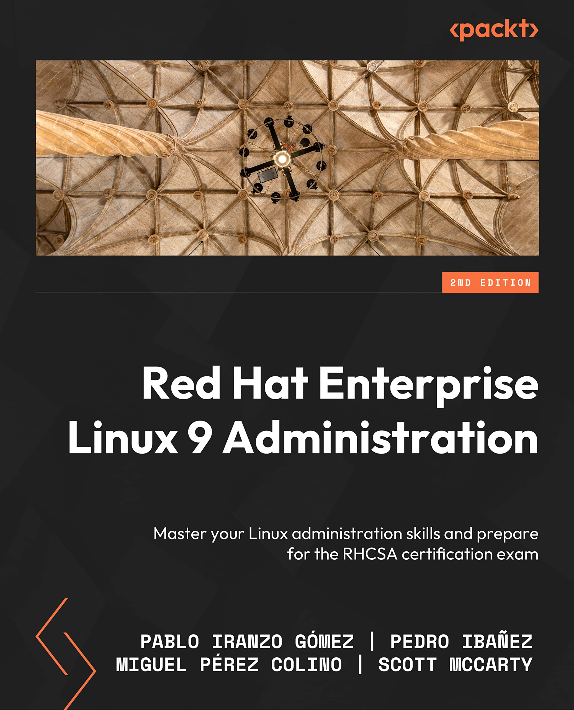

Last year, together with my colleagues Miguel and Scott, we released with the help of Packt team the [RHEL8 Administration]().

During this one, with the collaboration of Pedro, a long-time colleague from the University LUG, we worked on the updated [Red Hat Enterprise Linux 9 Administration](https://s.admins.guru/buy-on-amazon-rhel9) book that it's now available for preorder on Amazon.

As with the previous version, the book targets users willing to learn skills to administer Red Hat Enterprise Linux or compatible systems. It is a hands-on guide to the administration and can be used as reference thanks to the real-life examples provided along the text.

It has been updated to cover the differences that came with RHEL9, new additions, changes in the configurations, etc and it features two chapters dedicated to exercises to check your knowledge acquired in the book.

Available at Amazon: [Red Hat Enterprise Linux 9 Administration](https://s.admins.guru/buy-on-amazon-rhel9)


