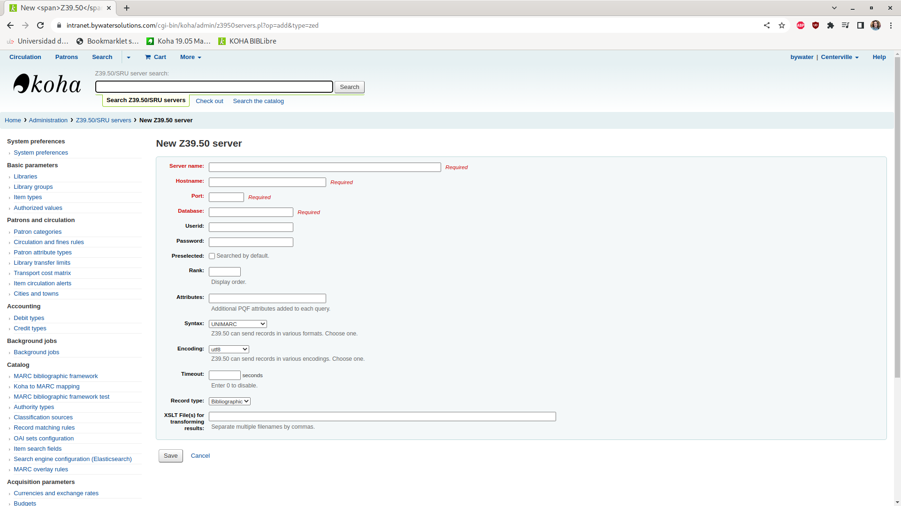
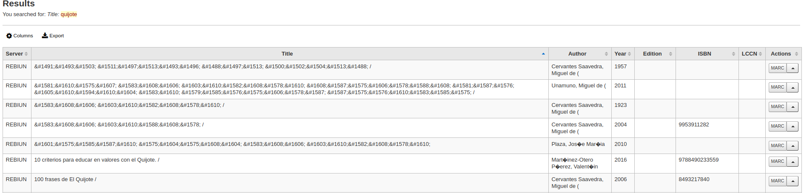
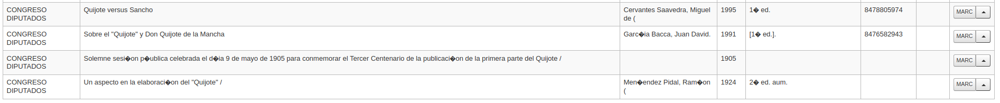
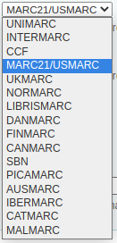
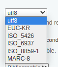

## Presentación del protocolo Z39.50, y casos prácticos

El protocolo Z39.50 es un protocolo cliente-servidor que está orientado a la recuperación de información a través de una misma interfaz y de amplia aplicación en el mundo de las bibliotecas y centros documentales, permitiendo acceder a diversas bases de datos desde un mismo punto de acceso. El protocolo en sí, está cubierto por la ISO 23950 [estándar 27446](https://www.iso.org/standard/27446.html), [Z39.59](http://www.loc.gov/z3950/agency/Z39-50-2003.pdf).

Este protocolo cumple uno de los fines principales de las bibliotecas, el acceso al conocimiento y la posibilidad de encontrar los recursos que lo contienen.
El primer caso práctico que hemos visto, es la importación de registros de ejemplares en nuestro sistema de gestión bibliográfica, en el caso de KOHA, al acceder al catálogo tenemos la opción de añadir registros de forma manual, o bien realizar la importación vía Z39.50:

## ¿Qué ventajas nos aporta como bibliotecarios?

Pongamos por caso, que queremos añadir un libro a nuestra biblioteca, por ejemplo, El Quijote (o cualquiera de los tratados o estudios sobre el mismo), para ello deberemos recopilar mucha información: ISBN, Año, Autor, Edición, Título, etc.; el protocolo Z39.50, en cambio, nos permite consultar dichos datos en otros servidores que ya los tienen añadidos, facilitando mucho la tarea de añadir nuevos ejemplares a nuestra biblioteca.

Así pues, el Z39.50 nos permite reutilizar datos que otras instituciones ya han introducido y ahorrarnos tiempo y evitar errores en la introducción de datos, pero… ¿cómo funciona?
Como dijimos al principio, Z39.50 es un protocolo cliente-servidor, es decir, existe una aplicación que consulta (p.e. KOHA) y un servidor que responde a dichas consultas. Un ejemplo de servidor Z39.50, es el propio KOHA, que puede actuar como servidor Z39.50 y [SRU](https://www.loc.gov/standards/sru/misc/simple.html), que permite dar acceso a nuestros datos a clientes externos.

Lo más probable es que como bibliotecarios no entremos en los entresijos de configurar nuestro KOHA como servidor para otras entidades, pero sí que nos va a resultar muy útil el configurarlo como cliente, para así acceder a la información ya recabada por otras entidades para su consumo.

En la sección de administración de KOHA tenemos la opción de realizar el mantenimiento de los servidores Z39.50 y SRU, que como se indica en la descripción que la acompaña, nos permite realizar consultas de datos MARC para nuestros ejemplares:

En el enlace podemos ver un formulario bastante sencillo con 4 datos obligatorios a rellenar:

El ‘server name’ es la descripción del servidor, como aparecerá en el interfaz de KOHA; el hostname, el nombre del servidor que contiene los datos; el puerto, donde está funcionando dentro del equipo, el servicio Z39.50 (a modo de ejemplo, un servidor web, suele usar el puerto 80 y 443 para http y para https respectivamente) y además un nombre de base de datos.
Podemos utilizar también credenciales si son necesarias, así como decir si se deben dirigir las búsquedas a dicho catálogo por defecto, la prioridad en el listado y atributos adicionales que pueden ser necesarios, así como el formato de sintaxis a utilizar para procesar los datos, la codificación (juego de caracteres), el tiempo máximo de respuesta, tipo de registros a obtener, y muy importante, ficheros XSLT para transformar los resultados obtenidos.

Ahora viene la pregunta… ¿quién tiene un servidor para prestarnos?

Por suerte, tenemos varios servidores disponibles, algunos de ellos de organismos españoles, tales como:

- [Biblioteca Nacional de España](https://www.bne.es/es/servicios/servicios-para-bibliotecarios/suministro-registros/descarga-z3950)
- [CSIC](http://bibliotecas.csic.es/es/servidor-z3950)
- [REBECA](https://www.culturaydeporte.gob.es/cultura/areas/bibliotecas/mc/rebeca/descargar-registros.html)
- [REBIUN](https://www.rebiun.org/sites/default/files/2017-11/Provisional_Manual%20de%20procedimiento%20%20REBIUN_corregido_oct17.pdf)
- [Instituto Cervantes](https://travesia.mcu.es/server/api/core/bitstreams/ead7a2be-c335-4dc4-9202-3d25a1d0f0d6/content)
- [Congreso de los Diputados](https://www.congreso.es/cem/serz3950)

Podemos encontrar varias páginas que muestran información acerca de los servidores censados que nos pueden servir de fuente de datos:

- <http://irspy.indexdata.com/>
- <https://espabiblio.sourceforge.net/lookup2/lookupHostsForm.php?reset=Y>

## ¿Qué cosas debemos tener en cuenta?

Como todos los servicios externos, deberíamos verificar, como parte del mantenimiento del sistema de gestión bibliotecaria, que los servicios :

- siguen accesibles (en servidor, puerto y base de datos)
- los datos proporcionados se importan correctamente (por ejemplo, con búsquedas que no muestran campos bien, plantillas de importación actualizadas o incluso el formato de la respuesta).

Por ejemplo si añadimos el servidor de Rebiun y seleccionamos como formato de respuesta USMARC, al realizar búsquedas, podemos obtener respuestas como:

Donde vemos que la codificación de caracteres no muestra bien los acentos ni los títulos, parecido a lo que ocurre con el Congreso de los Diputados:

En otros casos, como en el de la Biblioteca Nacional, sí que obtenemos resultados válidos que podremos importar directamente:

Cabe destacar, que el que no se obtengan resultados libres de errores no quiere decir que los datos del servidor sean incorrectos, sino que posiblemente, la forma de interpretarlos o el juego de caracteres a utilizar, deban ser ajustados entre los disponibles:

y la codificación:

Recordemos, que en cualquier caso podemos contactar con los proveedores del servicio para consultar los parámetros y así ajustar nuestro cliente para la correcta recepción de los mismos.

## Conclusión

Como hemos podido ver, configurar fuentes de datos externas basadas en el protocolo Z39.50 es una tarea muy sencilla y que nos permitirá reutilizar registros ajenos en las nuevas incorporaciones a nuestro catálogo, ahorrando tiempo y mejorar la calidad de los registros.

