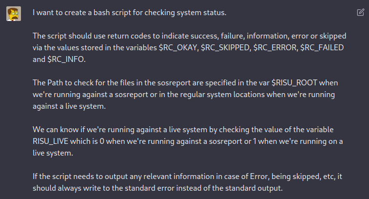
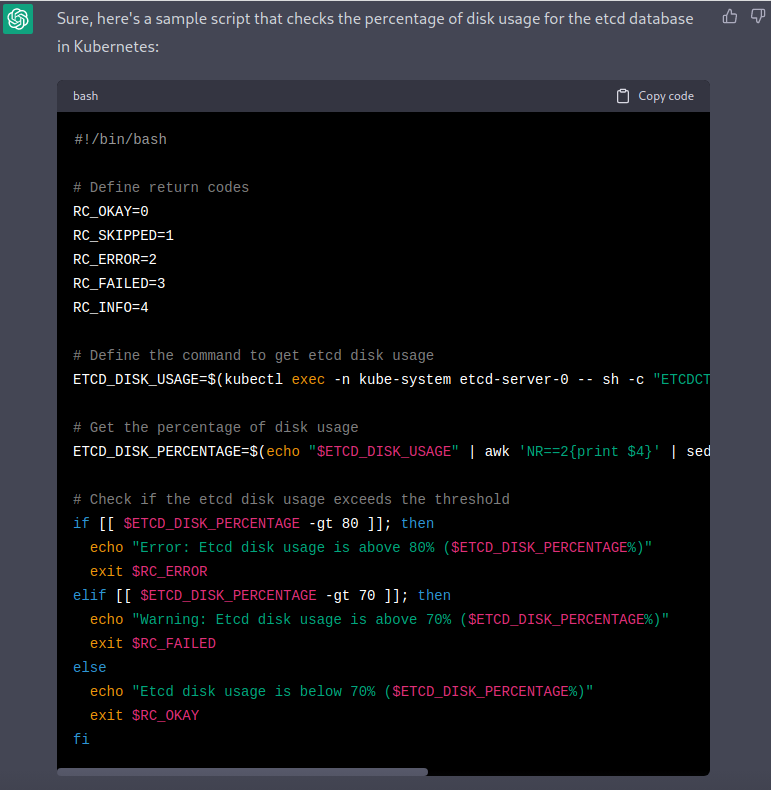
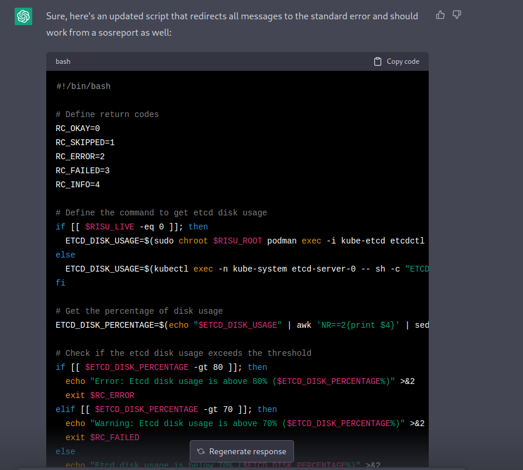

Lately, there's a lot of interest on [ChatGPT](https://chat.openai.com/chat), and yes, it's really impressive the way it processes the context to provide answers to the questions.

To give it a try, and put into play the requirements for writing a [Risu]() plugin, I wrote some of the requirements in a paragraph:

> I want to create a bash script for checking system status.
>
> The script should use return codes to indicate success, failure, information, error or skipped via the values stored in the variables $RC_OKAY, $RC_SKIPPED, $RC_ERROR, $RC_FAILED and $RC_INFO.
>
> The Path to check for the files in the sosreport are specified in the var $RISU_ROOT when we're running against a sosreport or in the regular system locations when we're running against a live system.
>
> We can know if we're running against a live system by checking the value of the variable RISU_LIVE which is 0 when we're running against a sosreport or 1 when we're running on a live system.
>
> If the script needs to output any relevant information in case of Error, being skipped, etc, it should always write to the standard error instead of the standard output.

and then, send it to ChatGPT:

More or less those are the requirements for the plugins, so we were ready to mention the next step... what we want to achieve:

And the answer we get:

As we can see, the answer is pretty good, uses the error codes, but the interesting part is allowing to fine tune the answers:

so the answer becomes:

It has improved a lot, but doesn't work fine on the `sosreport` part, but to be honest, the scripting part has been more or less laid and with some minor tunings, something usable can be achieved.

If we analyze it, it includes the logic for checking if running against a live environment or not, stores the output in a var, and based on the value it processes several ranges and gets the output printed and different error codes used, which is not that different of what a manually written plugin does.

Enjoy!
