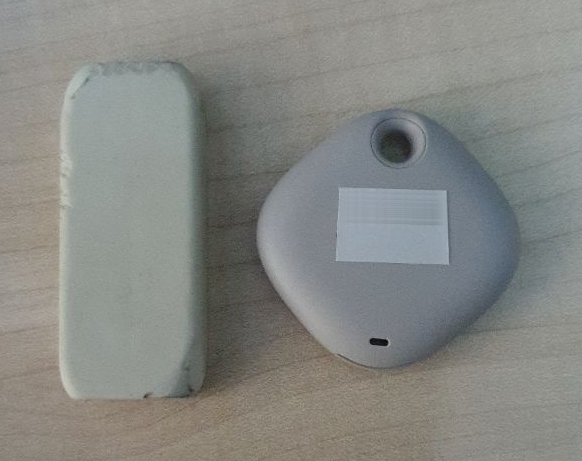

Si alguna vez has estado en algún sitio grande o con mucha gente, habrás tenido la necesidad de tener localizado a tu hijo/hija.

Existen rastreadores GPS como este <https://s.click.aliexpress.com/e/_EzNxPB3> que permiten hacer el seguimiento, pero necesitan una tarjeta SIM, con tarifa de datos y al igual que con los teléfonos, necesitas cargarlo cada cierto tiempo porque tanto GPS como el uso de los datos consume batería.

En el caso de este dispositivo, se puede consultar la ubicación en la web <http://www.365gps.net/> entrando con el IMEI del GPS.

La web, aunque esté en chino es bastante intuitiva, e informa del estado del dispositivo (carga de batería, última vez activo, etc).

Para otros usos, a cambio de ser menos preciso y no depender de un smartphone, están los `Smart Tags`.

Tanto Apple como Samsung tienen los suyos:

- [Apple Air Tag](https://www.amazon.es/dp/B09364K56M?tag=redken-21)
- [Samsung Smart Tag](https://www.amazon.es/dp/B08P94RML3?tag=redken-21)

La batería, en cambio dura mucho más, alrededor de un año, por lo que es ideal para llevarlo de llavero, en la mochila del portátil, etc.

¿Cómo puede informar de la ubicación y durar tanto la batería?

Pues, a diferencia del GPS como el anterior, estos dispositivos se comunican por bluetooth y su potencia radica en que los teléfonos cercanos al detectarlos (de forma transparente para los usuarios), informan de dónde lo han visto por última vez.

Es, gracias a la cantidad de dispositivos de Apple o de Samsung, que, al pasar cerca del radio de detección, que su usuarios, de forma inadvertida informan de los dispositivos encontrados y la ubicación, permitiendo localizar con bastante exactitud la posición. Este funcionamiento permite que se gaste menos batería y que el tag funcione mejor en lugares donde pase mucha gente (al ser más probable que lleven un teléfono compatible).

El `Smart tag` tiene también un botón que se puede utilizar a la inversa, es decir, que teniendo el `tag` sea capaz de hacer sonar nuestro teléfono (por si lo tienes cerca pero no sabes dónde lo has dejado).

El `Tag` tiene también un altavoz para poder pitar cuando desde el teléfono activamos la opción y así poder localizarlo cuando ya estemos suficientemente cerca (recordemos que la precisión no es tan exacta como con un GPS).

Al `Tag` al menos, los de Samsung, se les puede activar una 'alarma' que te manda una única notificación cuando ha sido encontrado (por ejemplo si has perdido algo y no sabes donde está y no quieres ir mirando la aplicación.

Respecto al tamaño, no son demasiado grandes, unos 3x3 centímetros, y no demasiado pesados por lo que no se van a hacer demasiado incómodos para llevar junto con las llaves, o en una mochila.


