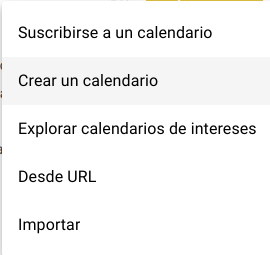
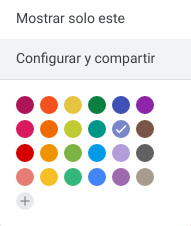
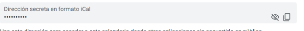
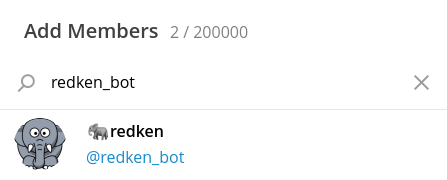
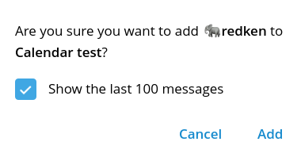
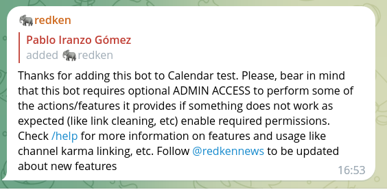
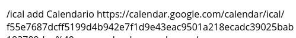
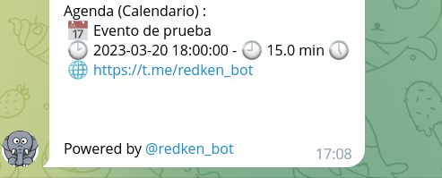

If you've a Telegram group, it might be interesting the ability of <https://t.me/redken_bot> for adding a calendar `ical` that automates publishing each day the events in the agenda for the day.

If you did read [Python and iCalendar ICS processing](), part of the basis in that article are part of the bot and are easily used:

For configuring, only a few simple steps are required:

- Have a calendar ICS/webcal accessible (for example a public Google Calendar one)
- Have a Telegram group where we do want to publish the events
- Add `@redken_bot` to the group
- Specify the URL del calendar and the name

Let's see some screenshoots of the process for you to check how easily it can be achieved.

## Creation of a calendar for publishing

First, we'll create a calendar in Google Calendar (or use an existing one in any service that provides an URL that requires no authentication):

- Create the calendar:
  

- View options of an existing one:
  

The part we're interested in, once created, is this: the private URL that appears in the options:

If we click on copy, we'll get the URL to the clipboard. This URL gives access to all events, both private and public, so if you want to create a calendar for a group, it's recommended to start from a new one instead of sharing by mistake your personal one.

## Add @redken_bot to the Telegram group

As easy as adding new members and searching for `@redken_bot` in the field:

Sometimes, it might ask if we can also forward old messages:

After a while, we'll get the welcome message:

Don't worry about language, the bot will automatically detect the language used in the group and, if unconfigured, after 24 hours will set it automatically to the most used one.

## Add the calendar to @redken_bot

In the chat, write the command `/ical add <name> <URL>` :

[@Redken_bot](https://t.me/redken_bot) will answer with a message like:

From that day, every morning [@Redken_bot](https://t.me/redken_bot) will send a reminder of the events for the day with location, name and how long does it last:

This calendar can be managed by several members (in Google Calendar case), so it's an ideal way for a team to work on adding events or reminders of the events that will get published every day.


