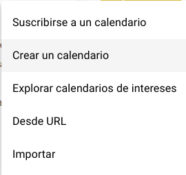
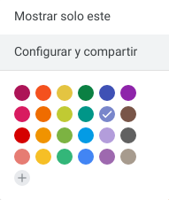
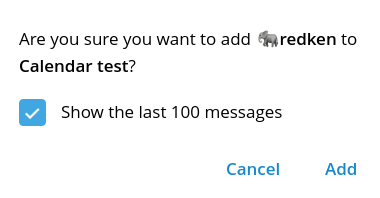
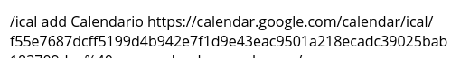
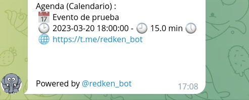

Si tienes un grupo de Telegram puede resultarte interesante la característica de <https://t.me/redken_bot> que permite añadir un calendario `ical` y que automatiza mostrar cada día las entradas de la agenda para el día.

Si leíste la entrada [Python and iCalendar ICS processing](), parte de las bases ahí indicadas están integradas en el bot y son facilmente utilizables:

Para configurarlo sólo se necesitan unos simples pasos:

- Tener un calendario ICS/webcal accesible (por ejemplo un calendario público de Google Calendar)
- Tener un grupo de telegram donde queramos mostrarlo
- Añadir a `@redken_bot` al grupo
- Especificar la URL del calendario y el nombre

A continuación, mostraré unas capturas del proceso para que veas lo sencillo que es.

## Creación de un calendario para publicar

Primero, crearemos un calendario en Google Ccalendar (o bien usaremos alguno existente en cualquier servicio que nos proporcione una URL que no necesite autentificación):

- Crear un calendario:
  

- Ver las opciones de uno existente:
  

La parte que nos interesa, una vez creado es esta, la dirección privada que aparece en las opciones:

Si damos al botón de copiar, se copiará la URL al portapapeles. Ten en cuenta que esta URL da acceso a todos los eventos, tanto privados como públicos que crees, por lo que si vas a crear un calendario para un grupo, es recomendable hacerlo a partir de uno nuevo, no que compartas por error uno privado.

## Añadir @redken_bot al grupo de Telegram

Tan fácil como añadir miembros y buscar a `@redken_bot` en el listado:

A veces, nos preguntará si queremos mandar mensajes antiguos:

Al cabo de un rato, nos mostrará el mensaje de bienvenida:

No te preocupes por el idioma, el bot autodetecta el idioma si no se configura pasadas 24 horas en base al idioma utilizado en el grupo.

## Añadir el calendario a @redken_bot

En el chat, escribe el comando `/ical add <nombre> <URL>` en telegram:

[@Redken_bot](https://t.me/redken_bot) te contestará con un mensaje como:

A partir de ese día, cada mañana, [@Redken_bot](https://t.me/redken_bot) te mandará un recordatorio de eventos con ubicación, nombre y duración:

Este calendario se puede gestionar entre varias personas (en el caso de Google Calendar), por lo que es ideal para que varias personas de una organización puedan añadir eventos o recordatorios que se publicarán cada día.

Espero que te haya resultado útil!
