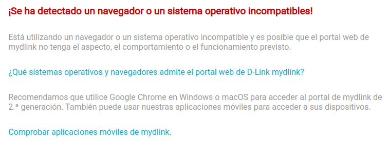
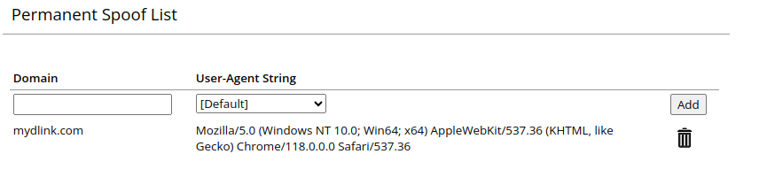

---
author:
  - Pablo Iranzo Gómez
title: mydlink Website from Linux
tags:
  - Linux
  - Chrome
  - Dlink
date: 2023-11-05 00:00:00 +0200
categories:
  - tech
lastmod: 2024-01-31T09:38:06.697Z
---

Hi had the chance to buy a Dlink camera, waterproof, with magnetic base and rated for exteriors for a really great price a while ago [D-Link DCS 8600LH 🛒#ad](https://www.amazon.es/dp/B07KTT14BH?tag=redken-21) and later a camera with pan and tilt from Dlink too [D-Link DCS-6500LH 🛒#ad](https://www.amazon.es/dp/B08VNL3NHL?tag=redken-21)

The camera, of course has an application for configuration, viewing the image, etc named 'mydlink' which has a web counterpart at <https://mydlink.com/>, but unfortunately, when you try to access the website, there's little you can do:

Which translates to:

>

    An incompatible browser or operating system has been detected!
    You are using an incompatible browser or operating system and the mydlink web portal may not look, behave or function as intended.
    What operating systems and browsers does the D-Link mydlink web portal support?
    We recommend that you use Google Chrome on Windows or macOS to access the mydlink 2nd generation portal. You can also use our mobile apps to access your devices.
    Check mydlink mobile apps.

Since the old days of ActiveX and other plugins, most of the websites should be compatible, specially when Flash disappeared... so this was sounding more like an excuse rather than a technical reason, so I did reach to DLink support about this with little cooperation rather than getting the same played message from their support representative saying that there are other models for cameras with an extra letter that are compatible.

Funny thing, is that using a browser extension like [user agent switcher](https://chromewebstore.google.com/detail/user-agent-switcher-for-c/djflhoibgkdhkhhcedjiklpkjnoahfmg?pli=1), you can instruct the browser (Chrome in this case) a different user agent, which I changed to: `Mozilla/5.0 (Windows NT 10.0; Win64; x64) AppleWebKit/537.36 (KHTML, like Gecko) Chrome/118.0.0.0 Safari/537.36`... and guess what happened?

Right, the website started working fine... so for making it into a permanent solution for an introduced 'false' problem by dLink, I created a rule:

With this, every time I visit mydlink website... the extension uses the user agent for Chrome for Windows... and the website works the way it should.

Yes, not only seeing camera names, but also being able to watch the feeds, etc from any browser... no need to use your mobile device for everything when you've bigger screens at you.


