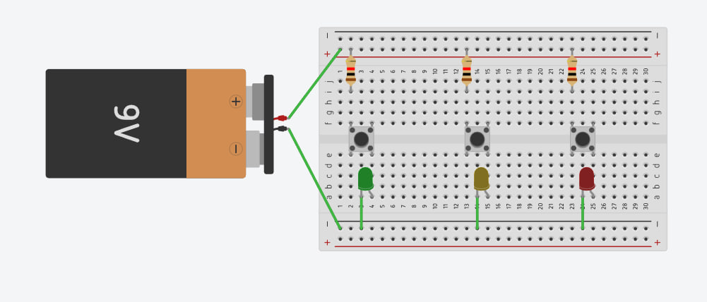

Red Hat has a program named Co.Lab which [provides kits](https://www.sparkfun.com/search/results?term=co.lab) under request that employees can use to guide a STEM session on schools to perform different range of activities.

We performed 2 sessions this year, one for the "We Are Red Hat Week" (`WARHW`), which happens every year around Halloween, when the first official release was launched back in 31st October 1994 (['Halloween Release'](https://www.redhat.com/en/blog/spooktacular-tale-red-hats-halloween-release)).

For the one at the office in Valencia, the range of ages was a bit wider so we did different kits and the parents were in charge of directing the lab for the kids.

Later, we performed one at a primary school where 7 years-old kids were constructing a ['Conversation Machine'](https://www.sparkfun.com/products/18089).

We followed this [presentation](https://docs.google.com/presentation/d/1-YGDIAoXfy_3mnYdGEpn_GmV_zYsJZM-Yhsf5XGoGuE/) to provide some guidance and introduction based on the work by my colleagues from Barcelona as well as the [video](https://www.youtube.com/watch?v=VVfTXKDm9aE) that explains the kit.

The kit itself contained everything we needed: some instructions about the program, some LEDs, resistors, battery, breadboard, switches and the breadboard to assemble everything.







Of course... doing it for almost 50 kids required a bigger box:







Again, all of this was provided thanks to Red Hat.

The activity was carried with the help of several parents that got an early kit to start practicing at home to be ready to help the students during the experience and finally a simplified version of the circuit was agreed:

With this one, we reduced the wiring, so they had more room to place the components so that we also upgraded to use 4 switches and 4 LEDs instead of the original plan which was aiming for just 3.

To be honest, the guidance from the parents during the construction made it a very pleasant experience, not a lot of frustration from the kids, as they were able to progress on their own (it was funny to see how they were eager to start opening the boxes for the kits before listening to the explanation) and how they were trying to get it done as soon as possible, but in the end, more or less everyone finished at the same time so we were ready for the last step....









Playing with it!

We decided to take advantage of the 4th led (red, yellow, green and blue) and play a 'hot-cold' game where one teacher or adult left the classroom, the students agreed on someone, and when joining back, the adult should guess who was the selected person to be found...

Using the led lights the kids were indicating how 'hot, warm, cold, or frozen' we were in terms of distance.

They really enjoyed a lot the assembling and the game and everyone wanted to be the next one selected for being found by others!




