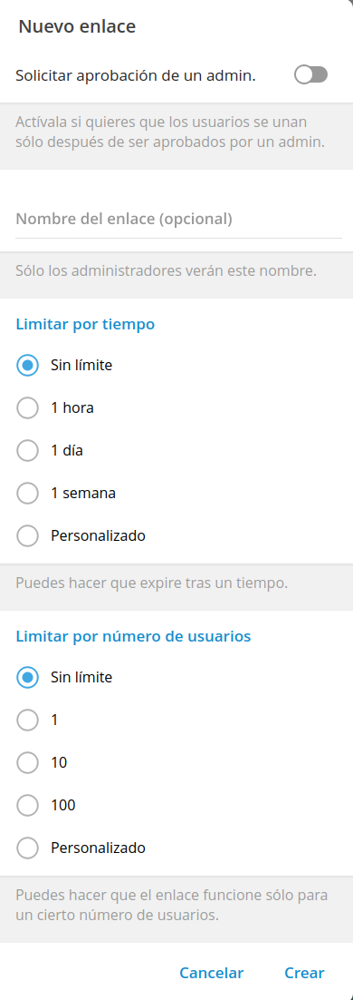

Telegram is being used frequently at schools for allowing an easy communication flow using the 'channels', where teachers can send information to families without sharing their personal contact details so that they can't be contacted outside of the official tools.

This comfort, came, probably because of not knowing the problems/dangers that were not taken into consideration.

For making it easier for parents to join the channel of the class, many times, public channels are created... this allows to use a shorter 'alias' but that everyone else can search and find... and here is the problem... 'everyone' it's not just parents or other teachers... if you do the test by searching for `clase de` or `classe dels` you'll find lot of groups:

Those groups, apart from general information, can also contain pictures or videos from the class that shouldn't be available publicly for everyone else in Internet.

# Advices

## Use Telegram instead of Whatsapp

- Bigger control in group, channel creation with options, permissions, etc.
- No need to share your phone number
- Ability to share channels for information sharing without your number being public
- If a device is reinstalled or replaced, when account is configured, all attachments, media, etc are still available.

## Don't create channels or public groups

It will make it harder to provide access via the link, but it's not that hard to create a QR or share with some parents so that they can share between them, but in the other hand, no external members, nor internet search engines, etc. will be able to find them (and will not be able to see the content without joining).

When a channel or group is public, without being a member, messages can be seen as well as group members, etc.

## Do not forward messages

When you forward a message, depending on the configuration from the person who sent the initial message, their name and even a link to their profile to start a conversation can be shared... for example, your partner records a video that you want send to the group, and when you forward it to your group... people in the group can click on `message forward from` and end up sending messages to your partner, to another teacher, etc.

Instead, download the content, then re-upload it to the group.

## Use invitation links with limit of users or expiration date

When you create an invitation link to a group or channel, by default, the link is valid forever:

Click on `Create a new link` and setup some limits:

For example, for a school group, it might make sense to make it valid for joining for 1 or 2 months, and being used maximum by 50 users (2 parents/kid), so, in this way, we can avoid that if the join link gets exposed, many people could join the group with unwanted users.

If you think that a link has been exposed, using the '3 dots' menu, you can cancel it, remove it, so that no one else could use until a new one is created.

## Validate group members

As you've the phones of the parents from the data they filled, add them to your agenda, add the name of the parent, the kid, so that when you check the list of members you can find out names that shouldn't be there.

## Use pinned messages

It's very easy to send loads of information, together with pictures, material to bring for arts&crafts, etc... it's good to make use of pineed messages (one or more) with general information or relevant for a period like:

- Meeting days and schedule
- Time table
- Official center communication channels
- Official calendar (bank holidays, etc.)
- Library or other services information.
- Rules for behaviour

And others, that can be pinned when it's needed to bring materials, an authorization for a trip, etc... in this way, it's easy to 'browse' between important ones, while other stuff stays in between in the message flow.

## Set groups and channels to be time bound

If a group is used during one school year, once it finishes, it makes sense to keep it for a little longer to allow parents to download materials, pictures as a memory or even to share the link for the new group for the next school year... but after some period (for example another year)... delete the group/channel... leaving them forever will not be very useful unless you want to reuse materials, and, in that case, better to keep it in another group for 'archival' purposes.

Send a reminder (and set it as pinned) explaining when the group will be removed and once again in one month before that day.

### Automatic deletion

In the same line, you can establish in the channels that messages are deleted automatically, allowing this cleanup to happen by itself:

Period of time:

Once it's enabled, it appears indicated in the lower part when sending new messages:

In this case, it's set for `1d` (1 day).

## Chats or groups instead of channels

If for whatever reason (I wouldn't recommend), you want to create a chat where users could participate, consider seriously to enable the 'anonymous' permission:

In this way, even if you're in the group with everyone else, whenever you write, the group name will appear instead of yours, blocking in that way that people could contact you directly via private messages but still interact via the group.

As a user they'll see:

When you write, they'll see:

But you'll still be able to see everyone:

So, in this way, you can participate, provide information, etc. but without being contacted on your personal contact.

## 1 to 1 messages

Within telegram you can also send private messages and get answers in private without sharing your phone number.

Only if you add the contact and choose to `share number` the other person will be able to see it and call you outside the Telegram application.

## Think about hiding members list

If anyone can see members of groups, it's possible to have users receiving spam... a way to avoid it is to make that only administrators can see the members list.

## Pictures in low and high resolution

When a picture is sent, sending them compressed is nice to see them, but for keeping those as memories, it's better to send them in full size as 'file'... many times it's sad not to be able to keep those memories in full resolution as, by default, those are sent reduced.

Once uploaded in high resolution you can even remove them from your phone, as they'll be available in the channel and you can download them if is ever needed.

## Use scheduled messages

Telegram allows to write messages and program the date/hour those are being sent:

Once selected, choose the moment:

This allows us to, whenever we've the time, program a message or messages with reminders (materials, trips, special activities, etc.) without depending on writing them on that very same moment those are happening, giving us a lot more flexibility for information delivery planning and when it's going to better to send it:

- Have a little period of time and sending 20 messages in that moment will just cause confusion and make some messages to be unseen by recipients.
- Using that time to schedule messages at the best timing for each one, will make them that recipients will pay attention to each message and the information is not lost between other messages.

## Use text instead of images

If you add text when you're adding an image, you can use later the search function to locate it, but if you just put images... you'll have to check one by one to find the information. You can combine both and put the picture with the caption to get best of both options!

## Use polls

Telegram allows you to create polls to ask about information/feedback based on the vote responses... take an advantage out of it!

## Use a calendar for publishing events

If you've read [Showing calendar events in Telegram
]() you'll know that you can use bots that will take care of publishing events in channels or groups... take an advantage so that in the same moment you manage your agenda, you can plan events that could be interesting for families.
