First published at <https://cloud.redhat.com/blog/scale-testing-kernel-module-management>

# Introduction

Kernel Module Management (KMM) Operator manages, builds, signs and deploys out-of-tree kernel modules and device plugins on OpenShift Container Platform clusters.

KMM adds, for the HUB/Spoke scenario, a new ManagedClusterModule which describes an out-of-tree kernel module and its associated device plugin. You can use ManagedClusterModule resources to configure how to load the module, define [ModuleLoader](https://kmm.sigs.k8s.io/documentation/module_loader_image/) images for kernel versions, and include instructions for building and signing modules for specific kernel versions.

KMM is designed to accommodate multiple kernel versions at once for any kernel module, allowing for seamless node upgrades and reduced application downtime.

For more information about it, refer to the product documentation available at [Kernel Module Management Operator | Specialized hardware and driver enablement | OpenShift Container Platform 4.12](https://docs.openshift.com/container-platform/4.12/hardware_enablement/kmm-kernel-module-management.html)

Don't forget that also KMM is a community project at [kubernetes-sigs/kernel-module-management](https://github.com/kubernetes-sigs/kernel-module-management) and that it can be tested on upstream Kubernetes and has a slack community channel at [Kubernetes Slack](https://kubernetes.slack.com/archives/C037RE58RED).

# Vocabulary

In order to make it easier, we're going to use some acronyms and products along this text, find here the most common ones:

| Term      | Definition                                                                                                                                             |
| --------- | ------------------------------------------------------------------------------------------------------------------------------------------------------ |
| KMM       | Kernel Module Management                                                                                                                               |
| ACM       | Advance Cluster Management                                                                                                                             |
| OpenShift | Red Hat's Kubernetes-based product                                                                                                                     |
| HUB       | Central management Cluster that via ACM manages some Spokes                                                                                            |
| Spoke     | Cluster managed via ACM from a management cluster referred to as Hub                                                                                   |
| SNO       | Single-Node OpenShift                                                                                                                                  |
| CRD       | Custom Resource Definition                                                                                                                             |
| EDGE      | Relevant to Telco 5G and other use cases, refers to systems that are placed close to the end user making use of the services to get better performance |
| OOT       | Out-of-tree, referred to Kernel Module                                                                                                                 |

# The test goal

One of the new features coming in KMM 1.1 is the ability to work in Hub-Spoke architectures, by leveraging Advanced Cluster Management capabilities, deploying KMM in this hub-spoke architecture is like a walk in the park.

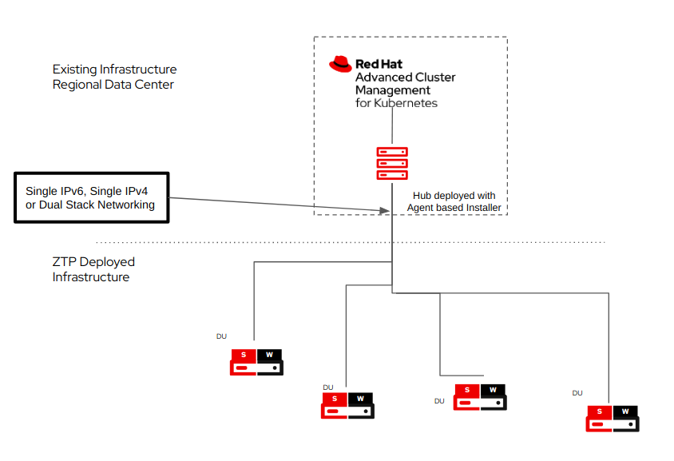

This kind of setup is very common at the EDGE, where data centers have a more resourceful set of servers, while EDGE devices are more resource-constrained, and everything that can be saved, can be used to provide a better experience to the closest users.

In this mode, KMM is able to build new kernel drivers for specific releases on the hub cluster, and then, deliver the built images to the spokes clusters, which, using fewer resources can still benefit from hardware enablement which automatically gets updated for each kernel when a newer OpenShift version image gets released.

The KMM team wanted to perform these tests and grab metrics on the behavior in a large-scale environment that allowed them to evaluate the action points on the HUB-Spoke scenario.

The goal for this test is to reach 1000 nodes deployed with the KMM module and monitor the actual resource utilization for the whole process.

# Test environment

We reached out to the ScaleLab team at [https://scalelab.redhat.com/](https://scalelab.redhat.com/) to explain our use case and to request a loan of machines we could use for our testing.

The team provided 69 systems in total, all equal, and with the following specifications:

- Dell R650 with 512Gb of RAM, 3TB NVME, 2*1.8Tb SSD + 1* 447GB SSD, powered by the Intel(R) Xeon(R) Gold 6330 CPU @ 2.00GHz processor reported as 112 CPU's (dual processor, 56 cores, 112 threads).

In order to set up the environment, we used 4 hosts for base infrastructure, designed to become:

- 1 Bastion for deploying other hosts and interacting with the environment (Ansible playbook execution, mirror registry, etc.).
- 3 nodes for creating an OpenShift Baremetal Compact cluster that will hold the hub cluster.

The remaining 65 hosts were configured as hypervisors for running virtual machines with KVM to be used as Single Node OpenShift (SNO) clusters.

| Node           | Hardware    | CPU | RAM(GiB) | Disk(GiB)                          | Count      |
| -------------- | ----------- | --- | -------- | ---------------------------------- | ---------- |
| Bastion        | Dell R650   | 112 | 512      | 446 SSD / 2x1.8TB SSD / 2.9TB NVMe | 1          |
| Hub BM Cluster | Dell R650   | 112 | 512      | 446 SSD / 2x1.8TB SSD / 2.9TB NVMe | 3          |
| SNO HV         | Dell R650   | 112 | 512      | 446 SSD / 2x1.8TB SSD / 2.9TB NVMe | 65         |
| SNO VM         | Libvirt KVM | 8   | 18       | 120                                | 1755 (max) |

It might sound easy to achieve, but in reality, there are several things to take into account in order to set up the whole environment:

- Configure all the relevant hosts and get access to them using Ansible.
- Enable the required packages and services for virtualization.
- Define the network cards for the VM's to be interconnected and able to reach the hub.
- Have proper sizing and placing of the VM's so that the faster hard drives are used for holding the VM disks and avoid extra workload because of VM density causing disk pressure on the same drive.

Most of this logic is already present in the scripts at [https://github.com/redhat-performance/jetlag/](https://github.com/redhat-performance/jetlag/) repository, which is pretty tied to the SCALELAB environment that we were going to use for this setup to prepare and configure the relevant resources for this task.

In total we got 27 VMs per host, getting to a total of 1755 potential SNOs. Note the word potential here… we're setting up the infrastructure to mimic real hardware:

- Remotely power on and off the VMs (using [sushy-tools](https://github.com/openstack/sushy-tools) to interact with libvirt).
- KVM for running the VMs.
- Etc.

Each SNO is configured with [8 VCPU and 18Gb of RAM](https://github.com/redhat-performance/jetlag/blob/main/ansible/roles/hv-vm-create/templates/kvm-def.xml.j2), which is in line with the bare minimum requirements to get OpenShift deployed.

For example, we had to alter the limits for the KMM deployment in order to allow it to use more memory during the module build, which was initially limited to 128Mb of RAM and was not enough for the compilation of the module.

We were pretty lucky and after the whole process of deployment in this restricted scenario, configuration, ACM deployment, and provisioning of the clusters, only one cluster failed ‘sno01412’, out of 1755 SNOs in total.

Note that some other spokes will be discarded in the next paragraphs.

For this setup, and to avoid external issues, we decided to do the installation following the disconnected IPv6 approach, that is, the bastion is running an internal registry which is later configured in all clusters via a CatalogSource:

```yaml
apiVersion: operators.coreos.com/v1alpha1
kind: CatalogSource
metadata:
  name: rh-du-operators
  namespace: openshift-marketplace
spec:
  displayName: disconnected-redhat-operators
  image: d20-h01-000-r650:5000/olm-mirror/redhat-operator-index:v4.12
  publisher: Red Hat
  sourceType: grpc
  updateStrategy:
  registryPoll:
  interval: 1h
```

This process is performed automatically as part of the scripts used to deploy the environment, but we wanted to validate and fix some hosts that failed to apply the policy that automatically was configuring it.

In order to prepare the setup, we also had to mirror into our registry the KMM Operator, and for the reporting, we also added the Grafana operator.

As a side issue, we ran out of disk space in the bastion, as we were only using the 500 GB SSD, so we've noted this to automatically set additional space on /var/lib/containers on the bastion using extra disks.

Also, as we switched from IPv4 to IPv6, we were required to perform some manual cleanup of leftovers that could have caused some of the instabilities we saw in previous attempts.

# The Grafana instance

OpenShift already includes a Grafana dashboard, together with ACM, that can show some information about the bare-metal cluster we will use for management.

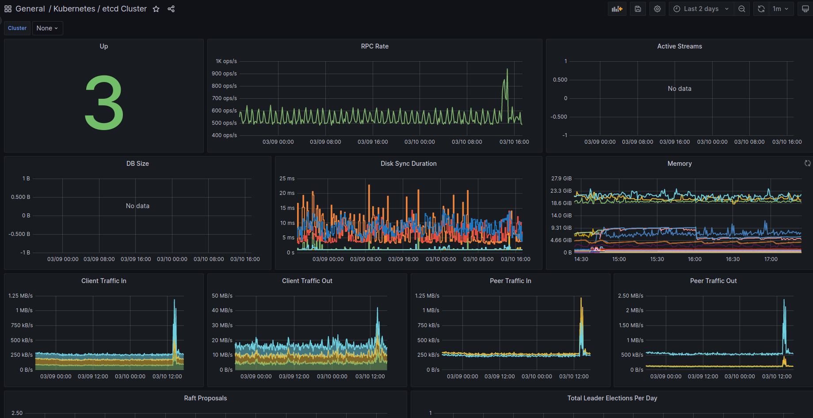

However, in order to be able to customize the dashboard, we are required to install a custom instance. This custom instance is what we'll show in the next screenshots to highlight the behavior of the cluster and the numbers obtained.

# Our results

As a briefing, we've 1754 valid possible SNOs (deployed and in operation).

Out of those, 6 spokes were removed, as they failed in different steps (test upgrade of OpenShift, operators in a non-working state, etc).

So 1748, is the real number of spokes available for deploying KMM

## KMM installation

For deploying KMM we used the operator, to get it added on the Hub.

Using ACM, we defined a policy to also add it to the managed clusters, so that's what we'll be seeing in the next graphs.

First, the KMM Hub installation started at 11:42, and we can see some data on the following graph:

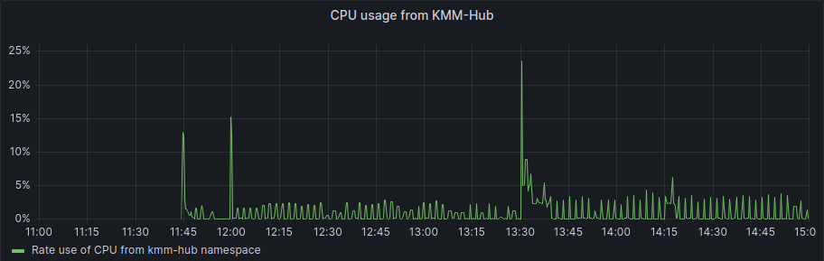

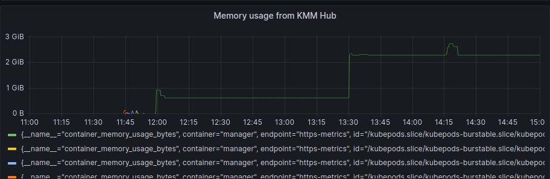

As we started the spokes installation in the period between 12:17 and 12:23 we can also see that after the initial setup of the hub and some activity during the spokes installation, the usage of resources is more or less steady, we can see a bump to a new level around 13:30, but this was once all the activity for deployment has finished.

We can compare this pattern as well with the SNO's resources usage:

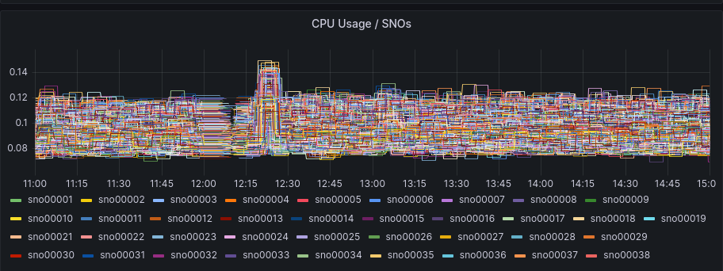

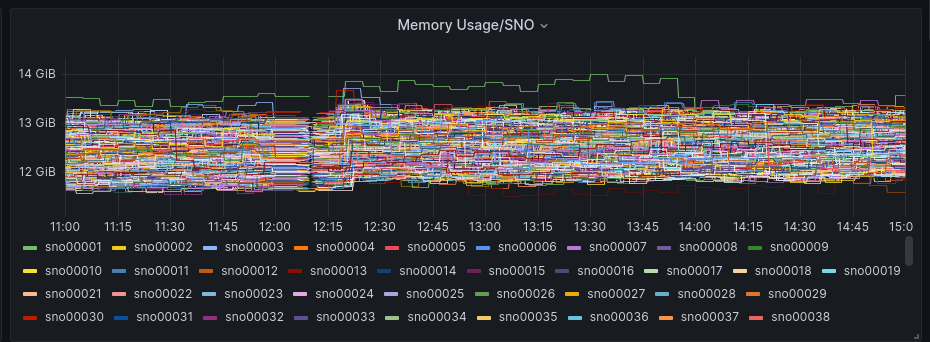

The SNOs were already active but without too much load in RAM or CPU, as a big part of the installation is just deploying the required components in the clusters.

If we focus on the average graphs to avoid the spikes of regular activity we can see some patterns:

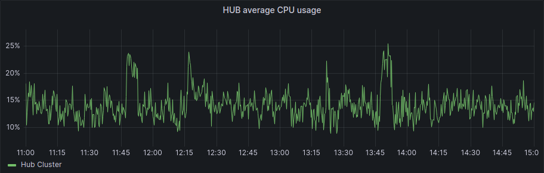

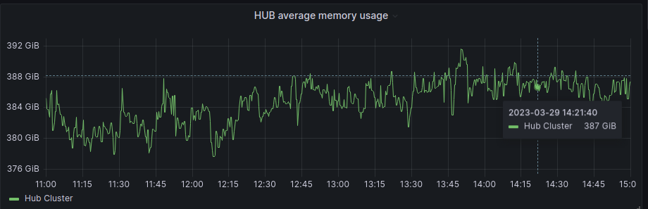

And for the spokes:

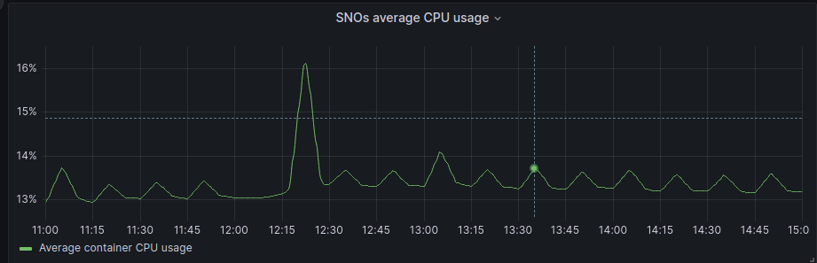

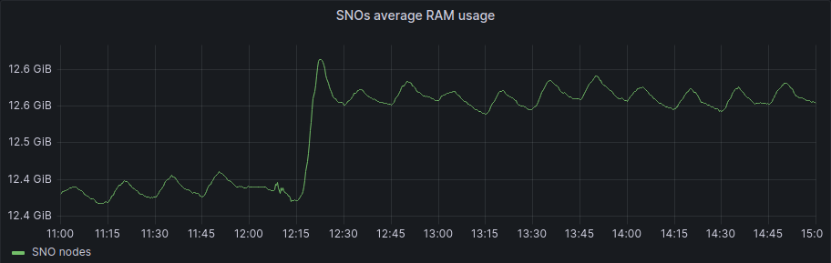

In general, Hub has been unaffected, and in the SNOs, we have a bit more activity in average and RAM usage, but if we check the numbers it's around 200Mb of RAM usage in difference, so not a big deal in terms of resource consumption.

In terms of KMM controllers, we can see it really clearly here:

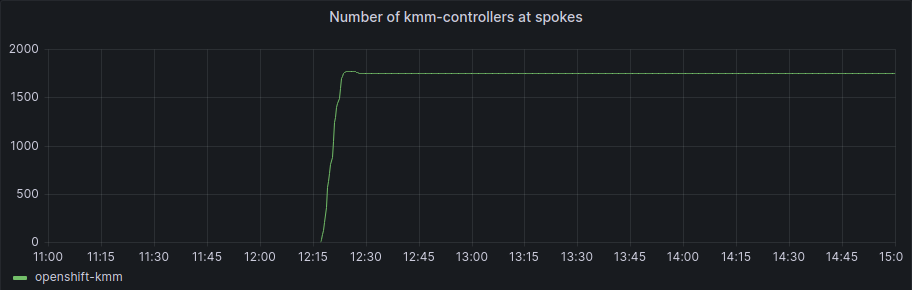

The number of KMM controllers increased in a really short period of time and got to the total number of operative SNOs

## Module installation

Now that KMM has been installed, we need to actually deploy a module, this will cause KMM to compile it, and prepare the relevant images that the Spokes will consume.

The module used for this test is a really simple module called [kmm-kmod](https://github.com/rh-ecosystem-edge/kernel-module-management/tree/main/ci/kmm-kmod) which is part of the KMM project. It just prints a “Hello World” and a “Goodbye World” message to the kernel log but it is suitable for testing building and loading kernel modules with KMM like any other ‘production’ module would be.

In our case, we first got the module compiled and installed prior to our testing so that we can compare the workload increase when the module is already prepared in the hub and ready for distribution.

In this case, the container that was already working in the HUB started to be deployed and we can check the count change here:

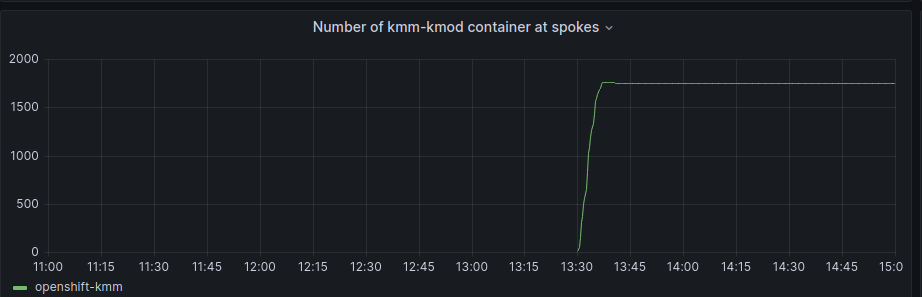

Around 13:30, all SNOs got the module container up and running and
repeated the graphs provided earlier for the whole period, we can see
that hub increased memory usage


And for the spokes:


As we can see that once KMM was installed, a bump in the memory (under 200Mb) happened, but no appreciable change once the module was loaded.

Note that in this situation, the hub creates the module (compilation, etc), builds the image, and then ACM does the deployment to the spokes.

From the numbers, we see that 100% of the operative SNOs deployed the KMM controller and loaded the module within a really short timeframe with no noticeable impact.

## Module upgrade

One of the tests we wanted to perform was to get SNOs to do a kernel upgrade, in this way, we can test KMM by doing the new module compilation itself and then, delivering the updated kernel module to the spoke clusters.

This, of course, has an implication… a way to get a newer kernel on the SNO nodes… is by actually upgrading OpenShift itself.

This, which might sound easy, means having to mirror the required images for the newer OpenShift release, apply an ICSP to all the SNOs, as well as adding the signatures for validating the new image, and of course, launch the upgrade itself.

The Hub started the upgrade at 16:20, moving from a starting OpenShift version 4.12.3 to the final version 4.12.6 which was previously mirrored, with the relevant signatures added, etc.

The upgrade took around 90 minutes in total for the Hub, and once the Hub moved to 4.12.6, it recompiled the Kernel module.

In our tests, we tested manually on the first SNO (sno0001), and once validated, this was launched for all the remaining and active nodes.

The timing was the following:

- 18:22 First SNO (sno0001) and others start applying YAML for version signatures and for ICSP (just missing the upgrade itself).
- 18:24 script to launch all the upgrades in parallel started.
- 19:38: 1500 updated, 249 in progress.
- 19:49: 4 nodes failed the OpenShift Upgrade.
- 22:51: all SNOs, including the failing ones, are upgraded to 4.12.6.

Out of the total count, 4 nodes didn't come back (API not responding), a manual reboot of the SNO's got them into API responding, and apparently good progress towards finishing the upgrade to the 4.12.6 release.

The upgrade itself, as it took time, caused no appreciable load on the Hub itself, but as highlighted, several SNO hosts did not perform the upgrade properly.

Finally as just a confirmation about what we were expecting:

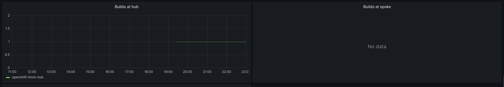

The Hub did perform a build once the first SNO required the new kernel, but the spokes did no builds at all (which is the exact use case of HUB-Spoke architecture)

# Summary

## Milestones

Check the graphs and milestones for the whole process

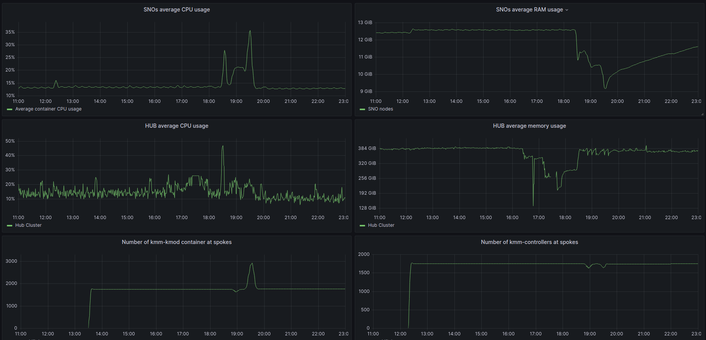

- 11:42 KMM installation at HUB.
- 12:17-12:23 KMM installation at SNOs (controller).
- 13:30 KMM KMOD added and deployed to all SNOs.
- 16:20 HUB OpenShift upgrade from 4.12.3 to 4.12.6.
- 17:50 Hub upgrade finished.
- 18:22 First SNO (sno0001) and others start applying YAML for version signatures and for ICSP (just missing the upgrade itself).
- 18:24 script to launch all the upgrades in parallel started.
- 19:38: 1500 updated, 249 in progress.
- 19:49: 4 nodes failed the OpenShift Upgrade.
- 22:51: all SNOs, including the failing ones, are upgraded to 4.12.6.

Metrics about spokes

| Metric                      | Spokes # |
| --------------------------- | -------- |
| Potential                   | 1755     |
| Spokes not working properly | 7        |
| Operative                   | 1748     |
| KMM installed               | 1748     |
| KMOD deployed               | 1748     |
| KMOD updated                | 1748     |

## Results

**For KMM Operator deployment at Hub, OperatorHub via UI has been used and a Policy has been applied with oc client in order to deploy the controller at spokes:**

| KMM DEPLOYMENT | Deployment time | CPU utilization post-deployment | MEM utilization post-deployment |
| -------------- | --------------- | ------------------------------- | ------------------------------- |
| Hub            | <1min           | 1.5%                            | 627 MB                          |
| Peak           |                 | 3%                              | 200 Mb                          |
| During         |                 | 0.4%                            | 200 MB                          |
| After          | < 7 min         | negligible                      | 200 MB                          |

**For KMM-KMOD deployment a ManagedClusterModule has been applied so the image is built on Hub and then deployed to all spokes:**

| KMM KMOD Deployment | Build time | Deployment time     | CPU utilization | MEM utilization                    |
| ------------------- | ---------- | ------------------- | --------------- | ---------------------------------- |
| Hub                 | <2min      | N/A                 | 30% peak        |
| Spoke (per)         | N/A        | < 1 min after build |
| Spoke (avg.         | ) N/A      | < 1min              | 0.08%           | 80Mb                               |
| Spoke (total)       | N/A        | 11 mins             | 0.2%            | No appreciable change in RAM usage |

**For the KMM-KMOD upgrade, we used the [different kernel versions](https://releases-rhcos-art.apps.ocp-virt.prod.psi.redhat.com/diff.html?arch=x86_64&first_release=412.86.202302091419-0&first_stream=prod%2Fstreams%2F4.12&second_release=412.86.202302282003-0&second_stream=prod%2Fstreams%2F4.12) between RHCOS shipped on OCP 4.12.3 and 4.12.6. Both Hub and Spokes were upgraded to 4.12.6 so the new kernel version was detected by KMM and a new KMM-KMOD was built at Hub and automatically deployed to all spokes:**

Note that some values are reported as N/A for the spokes as the operation came as part of the OpenShift Upgrade itself.

| KMM KMOD Upgrade | Build time | Deployment time | CPU utilization                                                      | MEM utilization                        |
| ---------------- | ---------- | --------------- | -------------------------------------------------------------------- | -------------------------------------- |
| Hub              | <2.5 mins  | N/A             | Peak of 60% (one host, one core) for a brief time during compilation | Peak of 4.3Gb and stabilizing on 3.3Gb |
| Spoke (per)      | N/A        | N/A             | N/A                                                                  | N/A                                    |
| Spoke (avg.)     | N/A        | N/A             | N/A                                                                  | N/A                                    |
| Spoke (total)    | N/A        | N/A             | N/A                                                                  | N/A                                    |

# Lessons learned

As highlighted in the previous paragraphs this test has been affected by several infrastructure issues:

- OpenShift deployment (SNO installation) by ACM.
- OpenShift Upgrades (SNOs failing in the upgrade and requiring manual intervention).

Also, some other difficulties played in this:

- The infrastructure uses a dense number of VMs to simulate the clusters and this can cause:
- Bottlenecks on the network during the installation of SNOs.
- Netmask requiring adjustment when using IPv4, or using IPv6.
- Using IPv6 requires using a disconnected environment, which requires extra work for ‘simple' things like:
- Mirroring the images.
- Deploying new operators (like the custom Grafana for customizing the dashboard).

We've contributed back some of the found issues to the jetlag repository to reduce some of the problems found, but still, there were a lot of manual tasks required for setting up the environment itself.

In the end, the KMM test was very smooth and the results were along the expected lines: little to no impact at all on the clusters, but all the preparation work involved in the setup, and troubleshooting everything else involved, took most of the time.

It's worth considering investing extra time in shaping those scripts and setups to make them more straightforward when a team is going to scale test a product and avoid the hassle of dealing with all the nits and picks from the environment itself which could be considered as infrastructure and not really a part of the test itself.

# Thanks

We want to give special thanks to the following who helped contribute to the success of this endeavor:

- Scale Lab team
- Alex Krzos
- Edge Pillar, Partner Accelerator team
