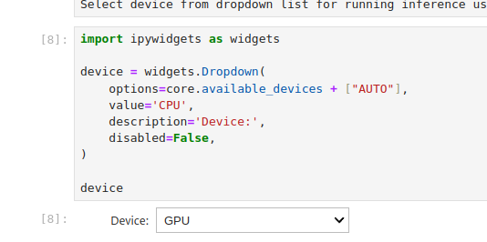
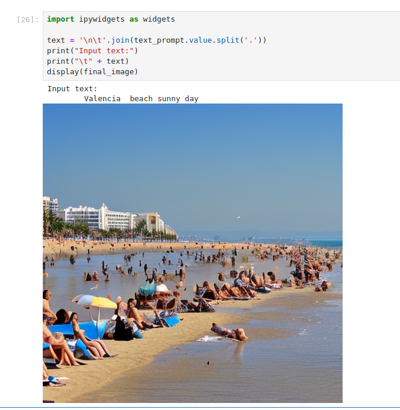
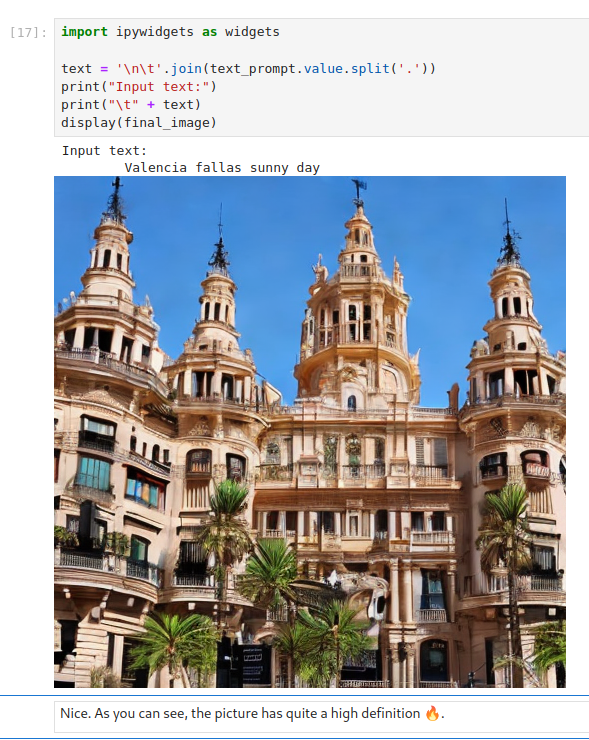
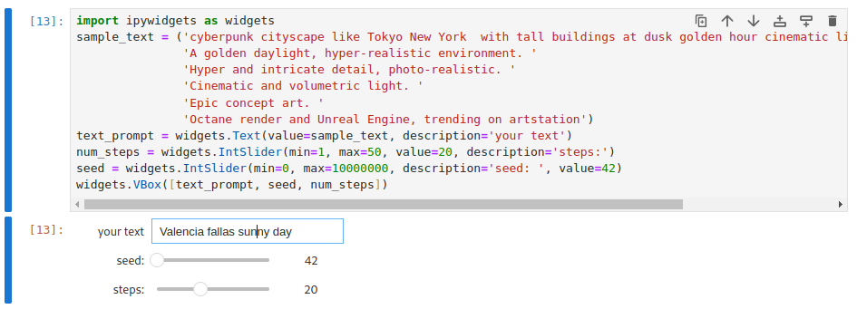


This post was originally published on Red Hat Developer, the community to learn, code, and share faster. To read the original post, [click here](https://developers.redhat.com/articles/2024/04/05/enable-gpu-acceleration-kernel-module-management-operator).


[Check the video version for Red Hat TV](https://tv.redhat.com/detail/6352250333112/enable-gpu-acceleration-with-the-kernel-module-management-operator)

In this article we cover the required steps to configure Kernel Module Management Operator (KMM) and use it to deploy an out-of-tree (OOT) kernel module, as well as leveraging other related technologies to build a toolset for hardware enablement. To illustrate that process, we'll leverage the [Intel Data Center GPU Flex 140](https://www.intel.com/content/www/us/en/products/sku/230020/intel-data-center-gpu-flex-140/specifications.html).

## What is the Kernel Module Management Operator?

The Kernel Module Management Operator manages, builds, signs, and deploys out-of-tree (OOT) kernel modules and device plug-ins on [Red Hat OpenShift Container Platform](https://developers.redhat.com/products/openshift/overview) clusters.

Before KMM, cluster admins had to manually install drivers to multiple nodes. Upgrades were painful and prone to errors from incompatible drivers. Furthermore, workloads might get scheduled to a node with broken drivers causing scheduling issues or missing hardware. KMM solves all of these problems, as we'll see.

KMM is designed to accommodate multiple kernel versions at once for any kernel module, allowing for seamless node upgrades and reduced application downtime. For more information, refer to the [Kernel Module Management Operator product documentation](https://docs.openshift.com/container-platform/latest/hardware_enablement/kmm-kernel-module-management.html).

KMM is also a [community project](https://github.com/kubernetes-sigs/kernel-module-management), which you can test on upstream Kubernetes, and there is a [Slack community channel](https://kubernetes.slack.com/archives/C037RE58RED).

## Prerequisites

For this scenario, we'll require an already working OpenShift environment as we will use it to deploy the different tools on top. Check [the documentation](https://docs.openshift.com/container-platform/4.14/installing/index.html") for instructions.

KMM will require a registry to push images to. If you've installed on bare metal, ensure the internal registry is enabled and configured (refer to [Installing a user-provisioned cluster on bare metal](https://docs.openshift.com/container-platform/4.14/installing/installing_bare_metal/installing-bare-metal.html#installation-registry-storage-config_installing-bare-metal")).

Additionally, this tutorial references data available from Intel at the following locations:

- [Intel Data Center GPU Driver for OpenShift](https://github.com/intel/intel-data-center-gpu-driver-for-openshift)
- [Intel Technology Enabling for OpenShift](https://github.com/intel/intel-technology-enabling-for-openshift)

## Set up Node Feature Discovery Operator

Node Feature Discovery (NFD) detects hardware features available on nodes and advertises those features using nodes labels, so that they can later be used as selector for scheduling decisions.

The NFD Operator automatically adds labels to the nodes that present some characteristics, including if the node has a GPU and which GPU it has.

It's an ideal way to identify which nodes require a kernel module to be enabled for the specific node(s) and later use it to instruct KMM to build it only for those.

We can install it via the following YAML:

```yaml
---
apiVersion: v1
kind: Namespace
metadata:
  name: openshift-nfd
---
apiVersion: operators.coreos.com/v1
kind: OperatorGroup
metadata:
  name: openshift-nfd
  namespace: openshift-nfd
spec:
  targetNamespaces:
    - openshift-nfd
---
apiVersion: operators.coreos.com/v1alpha1
kind: Subscription
metadata:
  name: nfd
  namespace: openshift-nfd
spec:
  channel: "stable"
  installPlanApproval: Automatic
  name: nfd
  source: redhat-operators
  sourceNamespace: openshift-marketplace
```

Once installed, we can create a CRD as described in the [NFD Operator documentation](https://docs.openshift.com/container-platform/latest/hardware_enablement/psap-node-feature-discovery-operator.html#create-cd-cli_node-feature-discovery-operator") to start.

Create a file named `nfdcr.yaml` with the following contents:

```yaml
apiVersion: nfd.openshift.io/v1
kind: NodeFeatureDiscovery
metadata:
  name: nfd-instance
  namespace: openshift-nfd
spec:
  operand:
    image: quay.io/openshift/origin-node-feature-discovery:4.14
    imagePullPolicy: Always
    servicePort: 12000
  workerConfig:
    configData: |
```

Then apply it with:

```bash
oc apply -f nfdcr.yaml
```

Additionally, create a [nodefeaturerule.yaml](https://github.com/intel/intel-technology-enabling-for-openshift/blob/main/nfd/node-feature-rules-openshift.yaml"):

```yaml
apiVersion: nfd.openshift.io/v1alpha1
kind: NodeFeatureRule
metadata:
  name: intel-dp-devices
spec:
  rules:
    - name: "intel.gpu"
      labels:
        "intel.feature.node.kubernetes.io/gpu": "true"
      matchFeatures:
        - feature: pci.device
          matchExpressions:
            vendor: { op: In, value: ["8086"] }
            class: { op: In, value: ["0300", "0380"] }
```

And once it has been applied, `oc describe node` displays the labels applied. Below is a partial output of the labels that NFD applies:

```console
Labels:             beta.kubernetes.io/arch=amd64
                    beta.kubernetes.io/os=linux
                    feature.node.kubernetes.io/cpu-cpuid.ADX=true
                    feature.node.kubernetes.io/cpu-cpuid.AESNI=true
                    feature.node.kubernetes.io/cpu-cpuid.AMXINT8=true
                    feature.node.kubernetes.io/cpu-cpuid.AMXTILE=true
                    feature.node.kubernetes.io/cpu-cpuid.AVX=true
                    feature.node.kubernetes.io/cpu-cpuid.AVX2=true
…
```

As we can see, it starts showing some of the CPU flags among other values as labels in our system. We can then grep for Intel-specific GPU labels with:

```sh
$ oc describe node rhvp-intel-01|grep intel.feature
intel.feature.node.kubernetes.io/gpu=true
```

...where we can see that NFD has detected the GPU.

At this point, NFD will take care of our node's HW detection and labeling, which can later be used as node selectors for KMM to deploy the required modules.

## Advanced node labeling

For this use case, the Intel Data Center GPU Driver for OpenShift (i915) driver is only available and tested for [some kernel versions](https://github.com/intel/intel-data-center-gpu-driver-for-openshift/tree/main/release#intel-data-center-gpu-driver-container-images-for-openshift-release").

Using NFD labels, we can target specific custom kernel versions for our module deployment and enablement so that only hosts with the required kernel and the required hardware are enabled for driver activation. This ensures that only compatible drivers are installed on nodes with a supported kernel, which is what makes KMM so valuable.

In this case, we'll be using nodes that contain the `intel.feature.node.kubernetes.io/gpu` tag.

Let's move on to the next steps in our journey, installing KMM and building the kernel module with Driver Toolkit (DTK). DTK is a [container](https://developers.redhat.com/topics/containers") image used as a base image where drivers can be built, as it includes kernel packages, some tools, etc.

## Set up Kernel Module Management Operator

Install KMM using OperatorHub in our OpenShift Console or the following `kmm.yaml`:

```yaml
---
apiVersion: v1
kind: Namespace
metadata:
  name: openshift-kmm
---
apiVersion: operators.coreos.com/v1
kind: OperatorGroup
metadata:
  name: kernel-module-management
  namespace: openshift-kmm
---
apiVersion: operators.coreos.com/v1alpha1
kind: Subscription
metadata:
  name: kernel-module-management
  namespace: openshift-kmm
spec:
  channel: "stable"
  installPlanApproval: Automatic
  name: kernel-module-management
  source: redhat-operators
  sourceNamespace: openshift-marketplace
```

With:

```sh
oc apply -f kmm.yaml
```

Once it's done, we can switch to the openshift-kmm project:

```sh
oc project openshift-kmm
```

## Create a kernel module

As mentioned previously, KMM can perform the compilation and installation of kernel module drivers for our hardware.

A kernel module can:

- Have dependencies
- Replace an existing driver

Let's explore the use cases in the next sections of this article.

### Integration with NFD via CRDs

KMM uses a kmod (kernel module) image to define which kernel modules to load, which is an OCI image that contains the `.ko` files.

In `.spec.selector`, we can define which nodes should be selected and as we showcased earlier, we can target one specific label added by NFD, so that only those nodes are targeted for loading the module for the hardware installed.

### KMM dependencies

Adding a module might have additional module dependencies, that is, extra modules that need to be already loaded in the kernel.

We can use the Custom Resource Definition (CRD) field `.spec.moduleLoader.container.modprobe.modulesLoadingOrder` to identify the order for module loading starting with upmost module, then the module it depends on, and so on.

### Replace an in-tree module with an out-of-tree module

Similar to dependencies, sometimes the module being loaded conflicts with an already loaded kernel module.

In this case, we need to have KMM first remove the conflicting module via the `.spec.moduleLoader.container.inTreeModuleToRemove` field of the CRD. KMM will then proceed and load the newer OOT module.

For the Intel Data Center GPU Flex series, the `intel_vsec` and `i915` drivers will have to be removed which will be discussed later in this article.

### Configure the Driver Toolkit for image building

The [Driver Toolkit](https://github.com/openshift/driver-toolkit)) provides a base image with required kernel development packages that are used to build specific drivers for our platform, which match the kernel version used on each node where the accelerators exist.

By using a specially crafted Containerfile containing a reference to `DTK_AUTO` as shown below:

```Dockerfile
ARG DTK_AUTO
FROM ${DTK_AUTO}
RUN gcc \... |
```

The KMM Operator will replace the required variables as well as pull and build the image for the driver.

And that's all. Easy, right?

### Manage heterogeneous nodes in the cluster

As we're using labels for selecting specific nodes in our cluster, we can keep a mix of nodes with or without the hardware in our cluster. KMM will take care of loading the required modules on the matching nodes, leaving the other ones without the specific accelerator.

In our case we're using `intel.feature.node.kubernetes.io/gpu=true` as the label to match our intended nodes, leaving other nodes without the GPU affected.

## Enable the Intel Data Center GPU Flex 140

We're going to explore the step-by-step the process for detecting, configuring, and enabling an Intel GPU in our OpenShift environment.

One of our workers has the accelerator installed, as reported by `lspci | egrep 'Graphic|Display`:

```console
02:00.0 VGA compatible controller: ASPEED Technology, Inc. ASPEED Graphics Family (rev 52)
a0:00.0 Display controller: Intel Corporation Data Center GPU Flex 140 (rev 05)
```

Let's create a `MachineConfigPool` (MCP) to apply the configuration in our environment:

```yaml
apiVersion: machineconfiguration.openshift.io/v1
kind: MachineConfigPool
metadata:
  name: intel-dgpu
spec:
  machineConfigSelector:
    matchExpressions:
      - {
          key: machineconfiguration.openshift.io/role,
          operator: In,
          values: [worker, intel-dgpu, master],
        }
  nodeSelector:
    matchLabels:
      intel.feature.node.kubernetes.io/gpu: "true"
```


If you're using single node OpenShift for this test, remember that the YAMLs must be adapted so that the configuration via MCO applies to the primary MCP; that is, using the selector `machineconfiguration.openshift.io/role: master`.


Using a machine configuration, we can define new parameters, like for example disable the built-in drivers with this YAML:

```yaml
apiVersion: machineconfiguration.openshift.io/v1
kind: MachineConfig
metadata:
  labels:
    machineconfiguration.openshift.io/role: intel-dgpu
  name: 100-intel-dgpu-machine-config-disable-i915
spec:
  config:
    ignition:
      version: 3.2.0
    storage:
      files:
        - contents:
            source: data:,blacklist%20i915
          mode: 0644
          overwrite: true
          path: /etc/modprobe.d/blacklist-i915.conf
        - contents:
            source: data:,blacklist%20intel_vsec
          mode: 0644
          overwrite: true
          path: /etc/modprobe.d/blacklist-intel-vsec.conf
```

After this YAML is applied, we can check that there are no modules applied via `oc debug node/rhvp-intel-01` (NOTE: if you see `intel_vsec` or `i915` in the output, verify that the `MachineConfig` defined was correctly applied):

```sh
$ lsmod|egrep 'i915|vsec'
```

Now, we need to define the path to find the firmware for the module, and for this, there are two approaches; the first one is an MCO that patches the kernel command line (and will cause a reboot of the node) as configured with the following YAML:

```yaml
apiVersion: machineconfiguration.openshift.io/v1
kind: MachineConfig
metadata:
  labels:
    machineconfiguration.openshift.io/role: master
  name: 100-alternative-fw-path-for-master-nodes
spec:
  config:
    ignition:
      version: 3.2.0
  kernelArguments:
    - firmware_class.path=/var/lib/firmware
```

And for validating, we can check on the hosts via `oc debug node/rhvp-intel-01` that the new parameter has been enabled:

```sh
$ cat /proc/cmdline
BOOT_IMAGE=(hd5,gpt3)/ostree/rhcos-085fdd39288474060c9d5bd7a88fabe8d218fcc960186712834c5e4ab319cb1d/vmlinuz-5.14.0-284.52.1.el9_2.x86_64 ignition.platform.id=metal ostree=/ostree/boot.0/rhcos/085fdd39288474060c9d5bd7a88fabe8d218fcc960186712834c5e4ab319cb1d/0 ip=ens801f0:dhcp,dhcp6 root=UUID=bf0c9edf-4aab-48a8-9549-5005fff7890e rw rootflags=prjquota boot=UUID=282ee60b-3053-4c2e-8f92-612af621e245 firmware_class.path=/var/lib/firmware systemd.unified_cgroup_hierarchy=1 cgroup_no_v1=all psi=1
```

The other approach is to patch the configuration for the KMM operator.

Alternatively, we can modify the `configmap` by setting the path for the firmware which doesn't cause a reboot, which is useful in single node OpenShift installations:

```sh
$ oc patch configmap kmm-operator-manager-config -n openshift-kmm --type='json' -p='[{"op": "add", "path": "/data/controller_config.yaml", "value": "healthProbeBindAddress: :8081\nmetricsBindAddress: 127.0.0.1:8080\nleaderElection:\n enabled: true\n resourceID: kmm.sigs.x-k8s.io\nwebhook:\n disableHTTP2: true\n port: 9443\nworker:\n runAsUser: 0\n seLinuxType: spc_t\n setFirmwareClassPath: /var/lib/firmware"}]'
```

If you follow this approach, the KMM pod must be deleted so that the new configuration is taken into effect as soon as the operator recreates it, so that the systems get it applied during the loading of the modules.

### Intel Data Center GPU Flex 140 kernel module

The Intel GPU kernel module deployment might be a bit tricky because it's a [driver](https://github.com/intel-gpu/intel-gpu-i915-backports.git") and it has more ties to the specific kernel version being used that we'll be setting in the commands for the build process, as we'll see in the Containerfile used for the build.

#### Using prebuilt drivers

In this approach, we use KMM to deploy the built and certified drivers already created by Intel which provides the container for each kernel version via a CI/CD pipeline. End users can directly consume that container via this [Module](https://raw.githubusercontent.com/intel/intel-technology-enabling-for-openshift/main/kmmo/intel-dgpu.yaml") definition:

```yaml
apiVersion: kmm.sigs.x-k8s.io/v1beta1
kind: Module
metadata:
  name: intel-dgpu
  namespace: openshift-kmm
spec:
  moduleLoader:
    container:
      modprobe:
        moduleName: i915
        firmwarePath: /firmware
      kernelMappings:
        - regexp: '^.*\.x86_64$'
          containerImage: registry.connect.redhat.com/intel/intel-data-center-gpu-driver-container:2.2.0-$KERNEL_FULL_VERSION
  selector:
    intel.feature.node.kubernetes.io/gpu: "true"
```

#### Compiling your own driver

For the sake of demonstration, here we'll be building our own driver image using in-cluster builds.

For building the kernel module, we can use the following Containerfile based on the [upstream instructions](https://github.com/intel/intel-data-center-gpu-driver-for-openshift/blob/main/docker/intel-dgpu-driver.Dockerfile") that we're already defining as configmap:

```yaml
apiVersion: v1
kind: ConfigMap
metadata:
  name: intel-dgpu-dockerfile-configmap
  namespace: openshift-kmm
data:
  dockerfile: |-
    # Intel Data Center GPU driver components combinations.
    ARG I915_RELEASE=I915_23WW51.5_682.48_23.6.42_230425.56
    ARG FIRMWARE_RELEASE=23WW49.5_682.48

    # Intel Data Center GPU Driver for OpenShift version.
    ARG DRIVER_VERSION=2.2.0

    # RHCOS Kernel version supported by the above driver version.
    ARG KERNEL_FULL_VERSION

    # Red Hat DTK image is used as builder image to build kernel driver modules.
    # Appropriate DTK image is provided with the OCP release, to guarantee compatibility
    # between the built kernel modules and the OCP version's RHCOS kernel.
    # DTK_AUTO is populated automatically with the appropriate DTK image by KMM operator.
    ARG DTK_AUTO

    FROM ${DTK_AUTO} as builder

    ARG I915_RELEASE
    ARG FIRMWARE_RELEASE
    ARG KERNEL_FULL_VERSION

    WORKDIR /build

    # Building i915 driver
    RUN git clone -b ${I915_RELEASE} --single-branch https://github.com/intel-gpu/intel-gpu-i915-backports.git \
        &amp;&amp; cd intel-gpu-i915-backports \
        &amp;&amp; install -D COPYING /licenses/i915/COPYING \
        &amp;&amp; export LEX=flex; export YACC=bison \
        &amp;&amp; export OS_TYPE=rhel_9 &amp;&amp; export OS_VERSION="9.2" \
        &amp;&amp; cp defconfigs/i915 .config \
        &amp;&amp; make olddefconfig &amp;&amp; make modules -j $(nproc) &amp;&amp; make modules_install

    # Copy out-of-tree drivers to /opt/lib/modules/${KERNEL_FULL_VERSION}/
    RUN for file in $(find /lib/modules/${KERNEL_FULL_VERSION}/updates/ -name "*.ko"); do \
        cp $file /opt --parents; done

    # Create the symbolic link for in-tree dependencies
    RUN ln -s /lib/modules/${KERNEL_FULL_VERSION} /opt/lib/modules/${KERNEL_FULL_VERSION}/host

    RUN depmod -b /opt ${KERNEL_FULL_VERSION}

    # Firmware
    RUN git clone -b ${FIRMWARE_RELEASE} --single-branch https://github.com/intel-gpu/intel-gpu-firmware.git \
        &amp;&amp; install -D /build/intel-gpu-firmware/COPYRIGHT /licenses/firmware/COPYRIGHT \
        &amp;&amp; install -D /build/intel-gpu-firmware/COPYRIGHT /build/firmware/license/COPYRIGHT \
        &amp;&amp; install -D /build/intel-gpu-firmware/firmware/dg2* /build/firmware/ \
        &amp;&amp; install -D /build/intel-gpu-firmware/firmware/pvc* /build/firmware/

    # Packaging Intel GPU driver components in the base UBI image for certification
    FROM registry.redhat.io/ubi9/ubi-minimal:9.2
    ARG DRIVER_VERSION
    ARG KERNEL_FULL_VERSION
    ARG I915_RELEASE
    ARG FIRMWARE_RELEASE

    # Required labels for the image metadata
    LABEL vendor="Intel®"
    LABEL version="${DRIVER_VERSION}"
    LABEL release="${KERNEL_FULL_VERSION}"
    LABEL name="intel-data-center-gpu-driver-container"
    LABEL summary="Intel® Data Center GPU Driver Container Image"
    LABEL description="Intel® Data Center GPU Driver container image designed for Red Hat OpenShift Container Platform. \
    The driver container is based on Intel Data Center GPU driver components - i915 driver release:${I915_RELEASE}, \
    and Firmware release:${FIRMWARE_RELEASE}. This driver container image is supported for RHOCP 4.14 RHCOS kernel version: ${KERNEL_FULL_VERSION}."

    RUN microdnf update -y &amp;&amp; rm -rf /var/cache/yum
    RUN microdnf -y install kmod findutils &amp;&amp; microdnf clean all
    COPY --from=builder /licenses/ /licenses/
    COPY --from=builder /opt/lib/modules/${KERNEL_FULL_VERSION}/ /opt/lib/modules/${KERNEL_FULL_VERSION}/
    COPY --from=builder /build/firmware/ /firmware/i915/
```

Let's also define the `imagestream` for storing the generated driver image:

```yaml
apiVersion: image.openshift.io/v1
kind: ImageStream
metadata:
  labels:
    app: intel-dgpu-driver-container-kmmo
  name: intel-dgpu-driver-container-kmmo
  namespace: openshift-kmm
spec: {}
```

Reference this Containerfile in the following YAML:

```yaml
---
apiVersion: kmm.sigs.x-k8s.io/v1beta1
kind: Module
metadata:
  name: intel-dgpu-on-premise
  namespace: openshift-kmm
spec:
  moduleLoader:
    container:
      imagePullPolicy: Always
      modprobe:
        moduleName: i915
        firmwarePath: /firmware
      kernelMappings:
        - regexp: '^.*\.x86_64$'
          containerImage: image-registry.openshift-image-registry.svc:5000/openshift-kmm/intel-dgpu-driver-container-kmmo:$KERNEL_FULL_VERSION
          build:
            dockerfileConfigMap:
              name: intel-dgpu-dockerfile-configmap
  selector:
    intel.feature.node.kubernetes.io/gpu: "true"
```

This file will use the above Containerfile to build the module and store the image in the repository. Note the `selector` field. It has been modified to use NFD for discovery and only load the kernel module where needed.

We can check that the kernel module has been loaded by connecting to the node and checking the status:

```sh
sh-5.1# lsmod|grep i915
i915                 3977216  0
intel_vsec             20480  1 i915
compat                 24576  2 intel_vsec,i915
video                  61440  1 i915
drm_display_helper    172032  2 compat,i915
cec                    61440  2 drm_display_helper,i915
i2c_algo_bit           16384  2 ast,i915
drm_kms_helper        192512  5 ast,drm_display_helper,i915
drm                   581632  7 drm_kms_helper,compat,ast,drm_shmem_helper,drm_display_helper,i915
```

Alternatively, we can check the label added by KMM on the nodes:

```sh
$ oc describe node |grep kmm
kmm.node.kubernetes.io/openshift-kmm.intel-dgpu-on-premise.ready=
```

Once the kernel module is deployed, use an application to verify HW acceleration is provided by the GPU.


Here we're directly using the `/dev` filesystem for accessing the GPU. The recommended way is to use the [Intel Device Plugins Operator](https://catalog.redhat.com/software/container-stacks/detail/61e9f2d7b9cdd99018fc5736") and then add a CR to expose gpu.intel.com/i915 to the kubelet for workload consumption as described in the [repository](https://github.com/intel/intel-technology-enabling-for-openshift/tree/main").


### Verify the deployment

#### Simple approach

We'll be using `clinfo` to get information from our card. To do so, we'll create the image and the namespace and then run the utility inside a privileged pod similar to the application that we can use as a more complex approach.

Let's create the `BuildConfiguration` and `ImageStream` based [on this one](https://github.com/intel/intel-technology-enabling-for-openshift/blob/main/tests/l2/dgpu/clinfo_build.yaml") by creating a `clinfobuild.yaml`:

```yaml
apiVersion: image.openshift.io/v1
kind: ImageStream
metadata:
  name: intel-dgpu-clinfo
  namespace: openshift-kmm
spec: {}
---
apiVersion: build.openshift.io/v1
kind: BuildConfig
metadata:
  name: intel-dgpu-clinfo
  namespace: openshift-kmm
spec:
  output:
    to:
      kind: ImageStreamTag
      name: intel-dgpu-clinfo:latest
  runPolicy: Serial
  source:
    dockerfile:
      "ARG BUILDER=registry.access.redhat.com/ubi9-minimal:latest \nFROM
      ${BUILDER}  \n\nARG OCL_ICD_VERSION=ocl-icd-2.2.13-4.el9.x86_64\nARG CLINFO_VERSION=clinfo-3.0.21.02.21-4.el9.x86_64\n\nRUN
      microdnf install -y \\\n  glibc \\\n  yum-utils \n\n# install intel-opencl,
      ocl-icd and clinfo\nRUN dnf install -y 'dnf-command(config-manager)' &amp;&amp; \\\n
      \ dnf config-manager --add-repo https://repositories.intel.com/gpu/rhel/9.0/lts/2350/unified/intel-gpu-9.0.repo
      &amp;&amp; \\\n  dnf install -y intel-opencl  \\\n  https://mirror.stream.centos.org/9-stream/AppStream/x86_64/os/Packages/$OCL_ICD_VERSION.rpm
      \ \\\n  https://dl.fedoraproject.org/pub/epel/9/Everything/x86_64/Packages/c/$CLINFO_VERSION.rpm
      &amp;&amp; \\\n  dnf clean all &amp;&amp; dnf autoremove &amp;&amp; rm -rf /var/lib/dnf/lists/* &amp;&amp; \\\n
      \     rm -rf /etc/yum.repos.d/intel-graphics.repo     \n"
    type: Dockerfile
  strategy:
    dockerStrategy:
      buildArgs:
        - name: BUILDER
          value: registry.access.redhat.com/ubi9-minimal:latest
        - name: OCL_ICD_VERSION
          value: ocl-icd-2.2.13-4.el9.x86_64
        - name: CLINFO_VERSION
          value: clinfo-3.0.21.02.21-4.el9.x86_64
    type: Docker
  triggers:
    - type: ConfigChange
```

Let's apply it with:

```sh
$ oc create -f clinfobuild.yaml
```

And then define the privileged pod that will run the tool with this pod defined by `job.yaml`:

```yaml
apiVersion: v1
kind: Pod
metadata:
  name: intel-dgpu-clinfo
spec:
  containers:
    - name: clinfo-pod
      image: image-registry.openshift-image-registry.svc:5000/openshift-kmm/intel-dgpu-clinfo:latest
      command: ["clinfo"]
      resources:
      securityContext:
        privileged: true
        runAsUser: 0
        runAsGroup: 110
      volumeMounts:
        - name: dev
          mountPath: /dev
  volumes:
    - name: dev
      hostPath:
        path: /dev
```

Let's create the pod with:

```sh
$ oc create -f job.yaml
```

And then examine the output of the pod by running:

```sh
$ oc logs pod intel-dgpu-clinfo
Number of platforms                               1
  Platform Name                                   Intel(R) OpenCL HD Graphics
  Platform Vendor                                 Intel(R) Corporation
  Platform Version                                OpenCL 3.0
  Platform Profile                                FULL_PROFILE
...
...
  Platform Name                                   Intel(R) OpenCL HD Graphics
Number of devices                                 1
  Device Name                                     Intel(R) Data Center GPU Flex Series 140 [0x56c1]
  Device Vendor                                   Intel(R) Corporation
  Device Vendor ID                                0x8086
  Device Version                                  OpenCL 3.0 NEO
...
...
    Platform Name                                 Intel(R) OpenCL HD Graphics
    Device Name                                   Intel(R) Data Center GPU Flex Series 140 [0x56c1]

ICD loader properties
  ICD loader Name                                 OpenCL ICD Loader
  ICD loader Vendor                               OCL Icd free software
  ICD loader Version                              2.2.12
  ICD loader Profile                              OpenCL 2.2
    NOTE:   your OpenCL library only supports OpenCL 2.2,
        but some installed platforms support OpenCL 3.0.
        Programs using 3.0 features may crash
        or behave unexpectedly
```

#### Using OpenVINO application for image text to image with stable diffusion

An application using Intel's OpenVINO software will be used to showcase the functionality of the GPU acceleration in the processing that will use some keywords introduced to generate images.

##### Requirements

In the following paragraphs we'll be covering the requirements that we'll be preparing for the final step of validating the proper setup of our driver.

###### ImageStream

We need to define an ImageStream to store our container with this YAML:

```yaml
apiVersion: image.openshift.io/v1
kind: ImageStream
metadata:
  labels:
    app: jupyter-demo
  name: jupyter-demo
  namespace: openshift-kmm
spec: {}
```

###### Containerfile

First prepare the container image containing all the required bits and pieces for storing in a registry for later use with this BuildConfig:

```yaml
kind: BuildConfig
apiVersion: build.openshift.io/v1
metadata:
  name: "jupyter-demo"
spec:
  source:
    dockerfile: |
      FROM quay.io/jupyter/base-notebook
      USER root
      RUN apt update &amp;&amp; \
        apt install -y gpg-agent git wget &amp;&amp; \
        apt clean

      RUN wget -qO - https://repositories.intel.com/gpu/intel-graphics.key | gpg --dearmor --output /usr/share/keyrings/intel-graphics.gpg
      RUN echo "deb [arch=amd64 signed-by=/usr/share/keyrings/intel-graphics.gpg] https://repositories.intel.com/gpu/ubuntu jammy/production/2328 unified" &gt; /etc/apt/sources.list.d/intel-gpu-jammy.list
      RUN apt update &amp;&amp; \
        apt install -y \
        intel-opencl-icd intel-level-zero-gpu level-zero \
        intel-media-va-driver-non-free libmfx1 libmfxgen1 libvpl2 \
        libegl-mesa0 libegl1-mesa libegl1-mesa-dev libgbm1 libgl1-mesa-dev libgl1-mesa-dri \
        libglapi-mesa libgles2-mesa-dev libglx-mesa0 libigdgmm12 libxatracker2 mesa-va-drivers \
        mesa-vdpau-drivers mesa-vulkan-drivers va-driver-all vainfo hwinfo clinfo \
        libglib2.0-0 &amp;&amp; \
        apt clean

      USER jovyan
      RUN pip install --no-cache-dir "diffusers&gt;=0.14.0" "openvino&gt;=2023.3.0" "transformers &gt;= 4.31" accelerate "urllib3==1.26.15" ipywidgets opencv-python scipy
      RUN mkdir -p /home/jovyan/.cache/huggingface

  strategy:
    type: Docker

  output:
    to:
      kind: ImageStreamTag
      name: jupyter-demo:latest
```


In the above `BuildConfig`, there might be newer versions of the software installed by pip. It may be necessary to update and use a newer version. We're going to use [OpenVINO project notebooks](https://github.com/openvinotoolkit/openvino_notebooks), which already execute some pip commands to install required libraries in any case.


Let's now start the build of the image with:

```sh
$ oc start-build jupyter-demo
```

And once it's finished, we can check that the image appears with:

```sh
$ oc get is
NAME           IMAGE REPOSITORY                                                              TAGS     UPDATED
jupyter-demo   image-registry.openshift-image-registry.svc:5000/openshift-kmm/jupyter-demo   latest   2 minutes ago
```

If we want to check the builds with `oc logs -f build/&lt;&lt;buildname&gt;`, we'll see an output similar to this one:

```sh
$ oc logs -f  build/jupyter-demo-1
time="2024-03-13T12:50:47Z" level=info msg="Not using native diff for overlay, this may cause degraded performance for building images: kernel has CONFIG_OVERLAY_FS_REDIRECT_DIR enabled"
I0313 12:50:47.551349       1 defaults.go:112] Defaulting to storage driver "overlay" with options [mountopt=metacopy=on].
Caching blobs under "/var/cache/blobs".

Pulling image quay.io/jupyter/base-notebook ...
Trying to pull quay.io/jupyter/base-notebook:latest...
Getting image source signatures
...
...
STEP 9/11: RUN mkdir -p /home/jovyan/.cache/huggingface
--&gt; 284cd3e642a7
STEP 10/11: ENV "OPENSHIFT_BUILD_NAME"="jupyter-demo-1" "OPENSHIFT_BUILD_NAMESPACE"="openshift-kmm"
--&gt; 9bba674b8144
STEP 11/11: LABEL "io.openshift.build.name"="jupyter-demo-1" "io.openshift.build.namespace"="openshift-kmm"
COMMIT temp.builder.openshift.io/openshift-kmm/jupyter-demo-1:d93bad68
--&gt; c738f8d15e38
Successfully tagged temp.builder.openshift.io/openshift-kmm/jupyter-demo-1:d93bad68
c738f8d15e38ea41f9a17082a435b4e8badf2e7d0569f34c332cf09102b0992d

Pushing image image-registry.openshift-image-registry.svc:5000/openshift-kmm/jupyter-demo:latest ...
Getting image source signatures
Copying blob sha256:c37f7a4129892837c4258c045d773d933f9307d7dcf6801d80a2903c38e7936c
...
...
sha256:59ebd409476f3946cadfccbea9e851574c50b8ef6959f62bdfa2dd708423da30
Copying config sha256:c738f8d15e38ea41f9a17082a435b4e8badf2e7d0569f34c332cf09102b0992d
Writing manifest to image destination
Successfully pushed image-registry.openshift-image-registry.svc:5000/openshift-kmm/jupyter-demo@sha256:f9ee5ae8fa9db556e90908b278c7ebb2d2ad271e11da82cfad44620d65834bf8
Push successful
```

We need to define a StorageClass to use an LVM for the underlying storage. Then, a volume creation with persistent storage (PVC) is registered so that the space is allocated and prepared for our application and a secondary one for the cache of the application.

We'll use that space later on to download the Jupyter notebooks that we'll be using for the GPU demonstration.

For the following items, apply each one with:

```sh
$ oc apply -f &lt;file.yaml&gt;
```

###### StorageClass

Let's create a file with the following contents defining our Storage Class named `sc.yaml`

```yaml
allowVolumeExpansion: true
apiVersion: storage.k8s.io/v1
kind: StorageClass
metadata:
  name: lvms-vg1
parameters:
  csi.storage.k8s.io/fstype: xfs
  topolvm.io/device-class: vg1
provisioner: topolvm.io
reclaimPolicy: Delete
volumeBindingMode: WaitForFirstConsumer
```

###### Persistent Volume Claim

Similarly, we need to create a file for registering the storage that we'll be naming `pvc.yaml` with the following contents:

```yaml
apiVersion: v1
kind: PersistentVolumeClaim
metadata:
  name: pvc
spec:
  storageClassName: lvms-vg1
  accessModes:
    - ReadWriteOnce
  resources:
    requests:
      storage: 20Gi
```

###### PVC for cache

Finally, the application uses some cache, so another PVC will be created using a file named `cache.yaml` with the following contents:

```yaml
apiVersion: v1
kind: PersistentVolumeClaim
metadata:
  name: huggingface-cache
spec:
  storageClassName: lvms-vg1
  accessModes:
    - ReadWriteOnce
  resources:
    requests:
      storage: 20Gi
```

Make sure you've applied the above files as instructed before following from this point.

At this point, we've created the Build, ImageStream, StorageClass, PVC, and PVC for Cache; because we launched the build, we will also have the ImageStream populated, so we're ready to run the application.

##### Running the application

A Jupyter notebook is an interactive workbook where commands, outputs like visualizations, etc., can be shown alongside the code.

It's commonly used in data science analysis as it allows you to quickly edit and amend the commands and refresh the output with the new values.

Using the image generated in the previous Containerfile and the previous storage PVCs, we can create a pod with this YAML:

```yaml
apiVersion: v1
kind: Pod
metadata:
  name: kmm-demo-jupyter
spec:
  containers:
    - name: kmm-demo-jupyter
      image: image-registry.openshift-image-registry.svc:5000/openshift-kmm/jupyter-demo
      args:
        # Password is paella in case you want to reuse
        - start-notebook.py
        - --PasswordIdentityProvider.hashed_password='argon2:$argon2id$v=19$m=10240,t=10,p=8$00Ynt8+Jk4sMtJUM+7Us5Q$ycb5PzmA7IH9yfOPAIfUjMNvDzXHKiMXPvM6+R5nucQ'
      env:
        - name: GRANT_SUDO
          value: "yes"
        - name: NB_GID
          value: "110"
      ports:
        - containerPort: 8888
          hostPort: 8888
      resources:
        limits:
          cpu: "20"
          memory: "64Gi"
      securityContext:
        privileged: true
        runAsUser: 0
        runAsGroup: 110
      volumeMounts:
        - name: dev
          mountPath: /dev
        - name: huggingface-cache
          mountPath: /home/jovyan/.cache/huggingface
        - name: work
          mountPath: /home/jovyan/work
  volumes:
    - name: dev
      hostPath:
        path: /dev
    - name: huggingface-cache
      persistentVolumeClaim:
        claimName: huggingface-cache
    - name: work
      persistentVolumeClaim:
        claimName: pvc
```

Once the app is ready we can forward a local port (for example, to reach the application), but first we'll prepare the examples we'll be using with the [Jupyter notebooks from the OpenVINO project](https://github.com/openvinotoolkit/openvino_notebooks") by getting inside our pod with:

```sh
$ oc rsh kmm-demo-jupyter
```

...then, once we're inside the pod:

```sh
$ pwd
/home/jovyan
$ ls
work
$ git clone https://github.com/openvinotoolkit/openvino_notebooks
chown -R jovyan:users openvino_notebooks
```


If you don't specify an authentication method on the pod, a token will be printed on the pod logs, that should be used when reaching the Jupyter interface.


Using the following command, we'll be forwarding a port from your computer to the pod itself so it will be easier to interact with the Jupyter notebook running there:

```sh
$ oc port-forward kmm-demo-jupyter 8888:8888
```

Once done, on your local computer browser open `http://localhost:8888` to access the notebook.

In the example above, the hashed password is `paella`, and it's the one we'll be using to access the Jupyter notebook.

From within the browser, you can access the previous URL, navigate the notebooks, and select `225-stable-diffusion-text-to-image` so that the final URL is:

`http://localhost:8888/lab/tree/openvino_notebooks/notebooks/225-stable-diffusion-text-to-image/225-stable-diffusion-text-to-image.ipynb`

Skip over the explanation steps and navigate to the area with the GPU selection drop-down (Figure 1).

_Figure 1: GPU selection dropdown_

...and later, the keyword section (Figure 2).

_Figure 2: keyword selection for imput_

In this section, you can describe what kind of image should be generated. This is where the real magic happens. In this case, we will use the prompt `Valencia fallas sunny day` and see what kind of image is generated. See Figure 3.

_*Figure 3: Output of the pipeline for the initial set of words*_
Of course, you can go back, edit the input keywords, and try new ones (Figure 4)

_*Figure 4: Output of the pipeline for the additional set of words*_

## Wrap up

We hope that you've enjoyed this read and realize how KMM, NFD, and DTK make managing custom drivers across many nodes across a cluster much easier than having to log into each node individually to install drivers.

We hope that you've enjoyed this read and realize how quick and convenient it is to use KMM, NFD, and DTK to enable support for accelerators in your OpenShift infrastructure.

## But I do still want to upgrade my cluster!

Don't worry, KMM automatically will check the modules configured for your hosts and the kernel they are running—if you're using the prebuilt images, KMM will download and enable the prebuilt image and if you're using a custom build, a new build process will happen so that the new image is available... and using the labels added by KMM you can schedule your workloads on the nodes that have the driver ready for consumption.

It's still recommended to do a staggered upgrade, so only a few nodes are updated before moving into others to avoid, for example, a new kernel having some issues with the build process or [no prebuilt driver being available](https://github.com/intel/intel-data-center-gpu-driver-for-openshift/tree/main/release#intel-data-center-gpu-driver-container-images-for-openshift-release) because it is still under the certification and validation process... rendering workloads requiring a specific device driver to become unschedulable.

Once you've checked that the driver is available at the preceding link and checked the official documentation on the [OpenShift Upgrade](https://access.redhat.com/solutions/4606811)</a> process, be ready!


