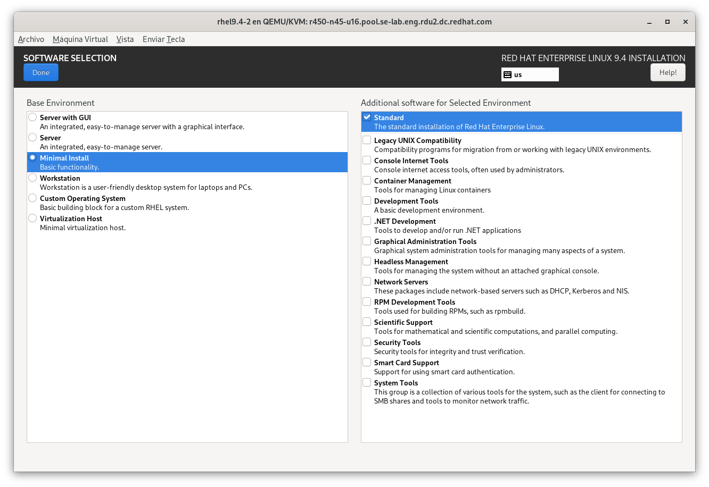

As we introduced in [RHEL Bootable Containers](), we can use Image-Mode in RHEL to build system images that we can write to disk.

First step towards having a minimal system, of course, is minimization and it can touch different approaches and methods, depending on how aggressive space reclaim we want to achieve.


Please note that many of the listed methods below are making changes to a system that could make it harder to debug, be aware that removing files installed from packages will lead to package integrity verification, and, although it might not affect the system, will have to be accounted in case of integrity verification.


## Usual suspects

On a regular RHEL system we usually target several paths:

- Installation customization
  - Custom partitioning to efficiently use the space
  - Reduced package set
  - Remove extra dependencies
- Post installation customization
  - Adjust number of kernels to keep installed
  - Remove leftover files
  - Configure system logging to rotate and compress logs
  - Remove unneeded locales
  - Remove unused documentation (`/usr/share/doc`, `/usr/share/man/`, etc.)
- Enforcement of above change:
  - Custom RPM's with %post scripts that for each upgrade in other packages, reapply the cleanup performed on docs, etc
  - Ansible playbook execution

This of course it's only targeting on the disk requirements, but if we also target for low RAM use we need to play with additional items:

- Reduce running services
  - Stop unused daemons
  - Tune requirements: we might want a Graphical User Interface, but it doesn't need to be GNOME and can use something lighter or even something locked down to just allow running some applications.
  - Disable autostart of daemons on hotplug of devices
  - Use static networking to disable NetworkManager, etc.

Where we do leverage Anaconda's 'Minimal install' as starting point:

You can learn about this on this article published on Red Hat Developer: [Minimizing RHEL for Edge and IOT deployment](https://developers.redhat.com/articles/2025/07/23/optimize-rhel-edge-and-iot-deployments).

## Containers

How is this achieved when we're using containers?

For containers there are also other concepts involved, as containers are made up with different filesystem layers that sit on top of each other, and for example, one layer might add a file that is removed at a later point, using disk space which, in the end, will be freed (but the container will have it referenced inside).

For containers the recommendation is to reduce the number of layers to avoid this, but on the other side, having atomic layers allows us to reuse already existing ones, so when we're downloading an updated container, all the layers that we had downloaded, are reused and only new ones are added.

Some tools allow to compact the container layers, reclaiming the space that was used and later freed, but this is against the reutilization of layers mentioned above, so they might require additional download for the modified layers

We'll speak about this and leveraging FAB tool for assembling bootable containers in the next article.


