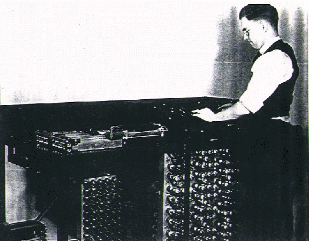

# Introducción

---

## Historia (Antigüedad-1973)

- Siglo XI Astrolabio
- 1598 Compás Geométrico con su modificación posterior: Compás con
  Cuadrante
- 1882 Ingenio de diferencias de Charles Babbage (Computadora
  mecánica) (primera calculadora automática conocida)
- 1937-1942 Computador del Dr. Atanasoff (1º en utilizar la
  electrónica (válvulas termoiónicas), condensadores para hacer de
  memoria y lector de tarjetas perforadas)
- 1942-1973 ENIAC (Electronic Numerical Integrator and Computer)

---

## Ingenio de diferencias

---

## ABC

---

## ABC

---

## ABC

---

## ENIAC

---

## ENIAC

---

## Historia 1957-1969

- 1957 Besys (Utilizado por Bell Labs para controlar sus ordenadores
  para ejecutar varios procesos por lotes)
- 1965 Para su tercera generación de ordenadores (AT&T) y decidió
  unirse al MIT y a General Electric para crear Multics (Multiplexed
  Information and Computing Service)
- 1969 (Abril) AT&T Decide abandonar Multics y comenzar a utilizar
  GECOS. Denis Ritchie y Ken Thompson deben reescribir un sistema
  operativo para ejecutar Space Travel en un ordenador más pequeño
  (DEC PDP-7) (Programed Data Processor, 4 Kb para programas de
  usuario). En lugar de hacer un sistema operativo que hiciese muchas
  cosas (Multics) intentaron hacer uno que hiciese menos pero bien
  (Uniplexed Information and Computing Service) UNICS
- 1969 (Verano) Lanzamiento de UNIX

---

## Historia 1970-1973

- 1970 Primer microprocesador (Intel y Texas)
- 1971 Primera edición del manual de programadores UNIX (por sus
  creadores) (unos 60 comandos "b" (compilador del lenguaje "B"),
  "boot" (reiniciar sistema), "cat" (Concatenar archivos), "chdir"
  (Cambiar de directorio)...
- 1972 Denis Ritchie reescribe "B" y lanza el lenguaje de programación
  "C"
- 1972 Paso a la historia de la regla de cálculo: HP-35
- 1972 Segunda edición de UNIX
- 1973 CP/M (uno de los S.O. más extendidos) (Control Program/Monitor)
- 1973 Cuarta edición de UNIX
- 1973 Tercera edición de UNIX

---

## HP 35

---

## Historia 1974-1979

- 1974 Quinta edición de UNIX
- 1975 Fundación de Apple Computer (Wozniak, Jobs)
- 1975 Primeros microordenadores
- 1975 Sexta edición de UNIX
- 1977 Apple II primer ordenador personal con gráficos color
- 1977 BSD: Berkeley Software Distribution
- 1978 La disquetera de 5 ¼ se convierte en el estándar
- 1979 Atari introduce una versión a base de monedas de Asteroides

---

## Historia 1979-1982

- 1979 Primer MODEM HAYES
- 1980 BSD 4
- 198x ZX-80, ZX81, Spectrum (Sinclair) (fueron tales las ventas que le fue concedido el título de Sir a Clive Sinclair, su promotor por las exportaciones británicas del producto)
- 1981 IBM PC (una o dos unidades de disco flexible de 5 ¼ a una cara, sin capacidad gráfica, monitor monocromo (precio superior a un millón de pesetas de la época), el sistema operativo que era una adaptación del CP/M fue encargado a una pequeña empresa de programación: Microsoft
- 1982 Peter Norton crea las Norton Utilities
- 1982 Silicon Introduce IRIX
- 1982 WordPerfect

---

## Historia 1983-1987

- 1983 MS-DOS 2.0
- 1983 SCO (SantaCruz Operation) lanza el primer sistema UNIX para PC: SCO XENIX System V para 8086 y 8088
- 1984 "¿Por qué 1984 nunca será como 1984?" Apple Macintosh
- 1984 EGA
- 1984 Ultrix
- 1985 Amiga 1000 primer ordenador multitarea, sonido estéreo y gráficos en alta resolución
- 1985 IBM y Microsoft se alían para lanzar la tercera versión de OS/2
- 1985 Windows 1.0 (con su Executive (listado de ficheros para poder ejecutar, etc))
- 1986 HP-UX
- 1987 OS/2 1.0

---

## Historia 1987-1991

- 1987 Se funda Apogee (1er juego shareware)
- 1987 Acuerdo entre Sun y AT&T para desarrollar UNIX System V Release 4
- 1988 Apple archiva una demanda contra Microsoft y HP por sus respectivos productos Windows y New Wave por copia de su sistema operativo
- 1988 Primera Soundblaster
- 1990 IBM Lanza AIX (Advanced Interactive eXecutive)
- 1991 MS-DOS 5
- 1991 Solaris

---

## Historia 1991: Linux

- 1991 Un estudiante de Finlandia llamado Linux Torwalds escribe en un
  grupo de news (comp.os.minix newsgroup) el siguiente texto:

> "Hello everybody out there using minix -- I'm doing a (free) operating system (just a hobby, won't be big and professional like gnu) for 386(486) AT clones"

> Hola a todos los que utilicen minix -- Estoy haciendo un sistema operativo (gratuito) (sólo por afición no será grande y profesional como gnu) para clónicos 386(486)

---

## Historia 1991-1994

- 1992 Windows 3.1
- 1992 Aparece la Tecnología sin un nombre interesante (Technology Without An Interesting Name)
- 1993 FreeBSD
- 1993 Se conocen 50 servidores WWW
- 1993 MS-DOS 6, Office 4.0, Windows NT 3.1 , Windows for Workgroups 3.11
- 1993 Mosaic
- 1993 Doom por ID Software
- 1994 OS/2 Warp 3.0
- 1994 Fallo de cálculo en los Pentium
- 1994 Red Hat
- 1994 Caldera es fundada

---

## 1995-2002

- 1995 Windows 95
- 1996 Deep Blue vence a Kasparov
- 1996 Se anuncia US. Robotics PILOT
- 1996 Windows CE 1.0
- 1998 Solaris 7
- 1998 El color llega al mundo de la informática: Apple IMAC
- 1999 Windows ME
- 2000 FreeBSD 4
- 2000 Windows 2000
- 2001 MaxOS X
- 2001 Windows XP

---

## Evolución Histórica sistemas

- Mainframes
- Ordenadores personales
- Comienzo del trabajo en red
- Bifurcación hacia los sistemas PC, mientras se vuelve hacia los mainframes

---

# Administración de Sistemas

---

## Figura de Administrador

- Con los primeros sistemas un "operador" era el encargado de
  codificar los programas y ponerlos en el ordenador.
- Con el aumento de la complejidad se restringe el uso a una persona o
  grupo con el fin de llevar a cabo una serie de tareas

---

## Tareas Administrativas

- Instalar el Sistema Operativo
- Instalar nuevo hardware
- Instalar y configurar los servicios
- Instalar software para el uso por parte de los usuarios
- Implantar las políticas adecuadas de seguridad, uso, etc
- Intentar que todo funcione lo mejor posible

---

## El lado oscuro del Administrador

- Suele ser el enemigo de los usuarios si tiene unas buenas políticas de seguridad, control, etc.
- Suele ser el enemigo del departamento de administración porque las inversiones que pide suelen ser caras
- Si algo falla es su culpa
- Si algo va bien no ha sido gracias a él.

---

## Administración

- Planificar bien las cosas ahorra mucho tiempo en el futuro y por lo tanto dinero: la principal tarea de un administrador es planificar e intentar preveer todo lo que pueda ocurrir para saber como reaccionar y estar preparado.
- (Redes, Usuarios, Grupos, etc)

---

## Ubicación de los servidores

- Seguridad Física: salas no accesibles
- Protección contra incendios.
- Inundaciones
- Climatización
- Copias de seguridad en distintos lugares en cajas blindadas ignífugas.

---

## Planificación de las Redes

- Diseño
- Cableado
- RJ45/UTP
- BNC/Coaxial
- Protocolos
- NetBIOS / NetBEUI
- IPX/SPX
- TCP/IP
- Routers
- Pasarelas

---

## Solución de problemas con equipos

- Una de las tareas del administrador es la solución que se produzcan
  con los equipos con la mayor celeridad.

---

## Secuencia de Arranque

- BIOS
- POST
- MBR
- Partición Activa
- Cargador del S.O.
- Rutinas propias del S.O.

---

## BIOS

- Es la encargada de proporcionar las rutinas básicas que permitan
  comprobar que el equipo esté en buen estado y comenzar el proceso de
  carga del Sistema Operativo

---

## POST: Power ON Self Test

---

## Tipos de Servidor

- Ficheros (SMB, NFS, etc)
- Impresoras (SMB, LPR)
- Backup
- Email
- Web/Intranet
- Router / NAT
- Proxy
- Firewall
- VPN

---

## Tareas más comunes

- Administración Usuarios
- Administración Grupos
- Permisos
- Servicios
- Impresoras
- Software
- Copias de Seguridad
- Compilación
- Monitorización (Rendimiento, Cuotas: Disco, Cuotas: CPU)
- Conectividad

---

## Conectividad

- Una de las características más utilizadas hoy en día es la conectividad mediante redes de área local.
- Tendremos una serie de requisitos para poder trabajar en red:
  - Nombre de equipo
  - Grupo de trabajo
  - Usuario
  - Protocolo de red
  - Servicios

---

## Monitorización: Multi Router Traffic Grapher

---

## WebAlizer

---

## Herramientas de administración

- Gráficas
  - Management Console (NT)
  - Webmin
  - Linuxconf
  - YaST2
- Consola
  - Linuxconf
  - YaST2

---

## Apache-FrontPage

---

## YaST2: Yet Another Setup Tool

---

## LinuxConf

---

## LinuxConf

---

## Webmin

---

## Management Console

---

## Otros programas útiles...

- MailScanner: Antivirus para email
- SpamAssassin: Marca los mensajes publicitarios para que el usuario pueda filtrarlos fácilmente
- VMWare: Crea equipos virtuales
- Dosemu: Emula un entorno DOS en Linux
- Wine: Emula un entorno Windows en Linux

---

## Vmware

---

## Dosemu

---

# Seguridad

---

## Seguridad: Introducción

- Es una de las tareas más importantes de la administración
- Siempre se debe intentar que la seguridad sea la máxima
- Nunca hay un sistema seguro, simplemente hay sistemas menos
  inseguros que otros

---

## Hechos que comprometen la seguridad:

- Ataques
- Fallos en programación
  - Desbordamiento
- D.O.S.
- Usuarios
- Fugas de información
- "Accidentes"
- Troyanos
- Virus
- Ingeniería social
- Sniffers
- TEMPEST

---

## Fallos / Soluciones:

- Ficheros de passwords: SHADOW
- Privilegios de ejecución SETUID
- Herramientas comprobación/soluciones:
- Actualizaciones
- SATAN (Security Administrator's Tool for Analyzing Networks)
- Crack
- Tripwire
- TCP Wrappers
- Firewall
- Antivirus
- PortSentry

---

## Cifrado

- PGP / GPG (Pretty Good Privacy / GNU Privacy Guard)
- Steganography (Marcas de agua)
- Cuántica

---

## Secure Shell Host

---

## SCP: FTP Seguro

---

# Enlaces/Bibliografía

---

## Enlaces

- Charles Babbage (<http://ei.cs.vt.edu/~history/Babbage.html>)
- Atanasoff-Berry Computer
  (<http://www.scl.ameslab.gov/ABC/Progress.html>)
- ENIAC (<http://www.computer.org/history/photos/toc.htm>)
- HP35 (<http://www.hpmuseum.org/hp35.htm>)
- Historia de UNIX (<http://www.computerhope.com/history/unix.htm>)
- Maximum Security (<http://www.ods.com.ua/win/eng/security/Max_Security/>)

---

## Bibliografía

- Máquinas de Cómputo, Temas 4, Investigación y Ciencia
- Practical Unix and Internet Security (Simson Garfinkel, Gene Spafford) O'Reilly
- Unix System Administration Handbook (Evi Nemeth, Garth Snyder, Scott Seebass, Trent R. Hein) Prentice Hall
- Essential System Administration (Aelen Frisch) O'Reilly
- Unix sin fronteras (Harley Hahn) Mc Graw Hill
- Unix Internals: The New Frontiers (Uresh Vahalia) Prentice Hall
- Maximum Security: A Hacker's guide to protecting your internet site
  and network (McMillan) (pero lo encontré en la web)

---

