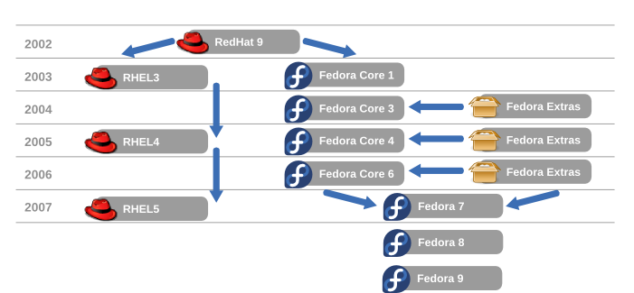

## ¿Qué es Fedora?

- Fedora es un sistema operativo basado en Linux que integra las últimas novedades en software libre y abierto
- Fedora es y será siempre libre para su uso, modificación y distribución
- Está construida por gente de todo el mundo que trabaja conjuntamente como una comunidad: El Proyecto Fedora

---

## Orígenes

Los comienzos: Red Hat Linux 1994 -> 2003

- Versiones cada 6 meses
- Versiones más estables (.2) cada 18 meses
- Dificultad de soportar a largo plazo
- Modelo de ventas complicado
- Part. comunidad:Upstream/BZ

---

## La separación

- Objetivos irreconciliables
- Estabilidad y rápida innovación
- Red Hat Enterprise Linux
- Soporte durante 7+ años
- Modelo de subscripciones
- Libre
- Fedora
- Versiones nuevas cada 6 meses
- Patrocinada por Red Hat
- Free as in freedom / Free as in beer

---

## El árbol genealógico

---

## ¿Dónde?

- Wiki: <http://fedoraproject.org/wiki>
- Lista de correo: <http://fedoraproject.org/wiki/Communicate#ML>
- IRC:
  - <http://fedoraproject.org/wiki/Communicate#IRC>
  - <http://freenode.org> (#fedora\*)

---

## ¿Qué hace la comunidad?

- Documentación
- Traducciones
- Marketing
- Ambassadors
- Diseños art.
- Infraestructura
- Webs
- Live CD
- Distribución
- Mentors

---

## Cuenta Fedora: Ventajas

- Acceso ssh a las máquinas
- Acceso CVS
- Acceso a los diversos tracs (tickets,wiki,etc)
- Página personal
- Alias email:<cuenta@fedoraproject.org>
- Planet

---

## ¿Fedora?

- Robusta y segura
- Base de unas 70 distribuciones derivadas
- Soporte para x86, x86_64, PowerPC y versiones 'no oficiales' para Alpha y Sparc (aurora)
- Filosofía: Release Early, Release Often
- UPSTREAM
- Fedora DS, SpaceWalk, Cobbler, Func, Pulp, Virtmanager, libvirt, PackageKit, oVirt, etc

---

## Fedora? (cont)

- Últimas versiones de paquetes
- Ciclos rápidos
- Mejoras y novedades que llegan antes a los usuarios
- Actualizaciones sencillas (yum)
- Multitud de paquetes hechos por la comunidad
- Herramientas gráficas de gestión
- Anaconda: instalador con GUI y TUI 'scriptable'

---

## RHL vs Fedora vs RHEL

- Fedora es la continuación de RHL
- Fedora está formada por miles de proyectos de Software Libre
- Fedora inicia multitud de proyectos de software libre (subproyectos)
- Fedora es el proyecto base en el que se basa RHEL
- Red Hat proporciona subscripciones de soporte, actualización (RHN), así como servicios de formación, consultoría, etc

---

## Contribuciones de RH al FOSS

<http://fedoraproject.org/wiki/RedHatContributions>

Kernel, Xorg, GFS, LVM, ext3, Netscape Directory Server, Netscape Certificate System, MetaMatrix, Liberation fonts, Pulp, Virt Manager, GTK en Firefox, partes de GNOME, etc. 'upstream' de software libre (subproyectos)
Emerging Technologies Group

---

## ¿Quién?

- La comunidad
- Traducciones
- Subproyectos
- Bugs
- Desarrollos
- Cada Ingeniero de Red Hat
- Influye en I+D
- Rápido desarrollo y correcciones de bugs
- Millones de usuarios
- Prueban últimas tecnologías
- Colaboran con traducciones, bugs, etc

---

# Fedora Guía de Instalación

---

## Instalación

- DVD
  - Isolinux
    - Kernel e initrd (parámetros)
  - Init
    - Stage1 anaconda
    - Stage2 anaconda
  - Reinicio
  - Firstboot
- Kickstart

---

## Características

- LVM Cifrado
- SELinux
- Network Manager
- PackageKit
- OpenJDK
- Online Desktop / Mugshot
- Smolt // Kerneloops
- LiveCD Tools // Revisor...
- FUSE

---

## Multimedia / Escritorio

- Software libre
  - Fedora sólo incluye software libre
    - Evince (PDF), Libswfdec (Flash), IcedTea (Java)
    - Ofrece enlaces a empresas que desarrollan codecs, etc para comprar una licencia de uso y mensajes 'informativos' de los problemas de lo privativo.
- Software privativo
  - Existen repositorios 'alternativos' no oficiales que proporcionan software privativo
    - Flash, Adobe, Códecs multimedia, Controladores (ati, nvidia, wifi, etc)

---

# Preguntas

- Fedora / Red Hat

  - <http://fedoraproject.org/>
  - <http://et.redhat.com>

- VALUX

  - <http://www.valux.org>
  - <mailto:Valux-list@valux.org>

- Pablo Iranzo Gómez (<http://Alufis35.uv.es/~iranzo>)
