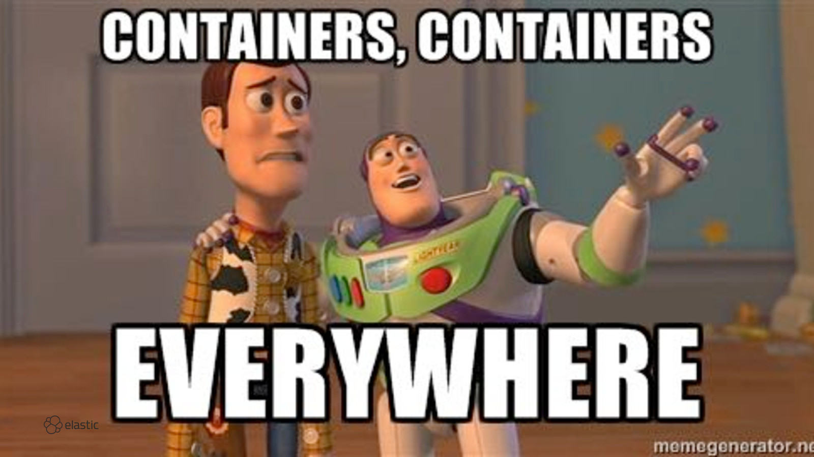
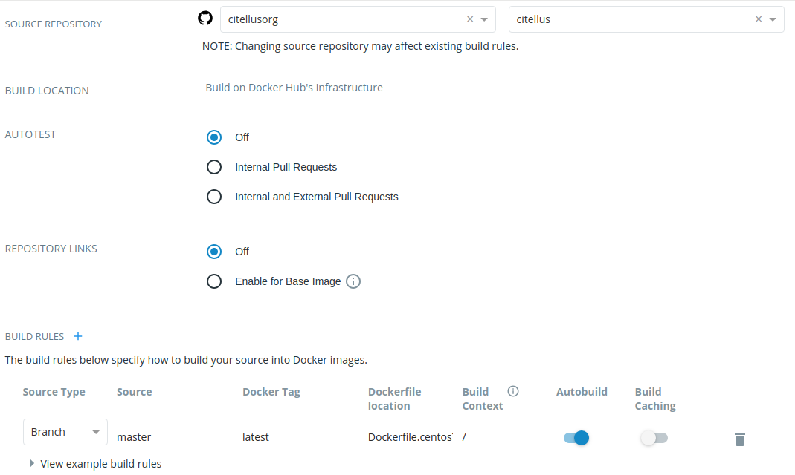

## Project hosting and automation

/me: Pablo Iranzo Gómez ( <https://iranzo.io> )

---

## You got a shinny new project? What now?

- Code usually also requires a webpage
  - Documentation, General Information, Developer information, etc

- Web costs money
  - Hosting, Domain, Maintenance, etc

---

## [Some Philosophy](https://www.youtube.com/watch?v=cJMwBwFj5nQ)

> Empty your mind, be shapeless, formless, like water.
> Now you put water in a cup, it becomes the cup, you put water into a bottle, it becomes the bottle
> You put water in a teacup, it becomes the teapot
> Now water can flow or it can crash.
> Be water my friend

Note:
Automation: Be lazy, have someone else doing it for you.

---

## GitHub / Gitlab

- Lot of source code is hosted at Github, Gitlab or other services, but it's a code repository.
- We want a website!!

---

## Pages come to play

- GitHub provides a service called [GitHub Pages](https://pages.github.com/)
- Gitlab provides [Gitlab pages](https://about.gitlab.com/product/pages/)

Both provide a 'static' Webserver to be used for your projects **for free**.

G(H/L) serve from a branch in your repo (usually `yourusername.github.io` repo)

You can buy a domain and point it to your website.

---

## Static doesn't mean end of fun

There are many 'static' content generators that provide rich features:

- styles
- links
- image resizing
- even 'search'

---

## Some static generators

Importance of language is for developing 'plugins', not content.

- Jekyll (Ruby)
- Pelican (Python)

They 'render' markdown into html

---

## There's even more fun

- Github provides Jekyll support
- Github, Gitlab, etc allow to plug in third-party CI

Think about endless possibilities!!!

---

## Some food for thought

- Repositories have branches
- Repositories can have automation
- External automation like Travis CI can do things for you

Note:
We've all the pieces to push a new markdown file and have it triggering a website update and publish

---

## Is a static webpage ugly?

- There are lot of templates <http://www.pelicanthemes.com>
- Each theme have different feature set
- Choose wisely! (Small screens, html5, etc)
  - If not, changing themes is quite easy: update, and 'render' using new one.

---

** DEMO on Pelican + Theme **

---

## Travis-ci.org

Automation for projects:

- Free for Open Source projects
- Configured via `.travis.yml`
- Some other settings via Web Interface (environment variables, etc)

---

Example (setup environment)

```yml
language: python
dist: trusty
sudo: required

python:
  - "3.5"

before_install:
  - pip install -U pip
  - pip install -U setuptools
  - pip install -r tests/requirements.txt
  - pip install -r tests/test-requirements.txt
  - pip install peru
  - mkdir -p tests/themes/elegant
  - mv templates tests/themes/elegant/
  - mv static tests/themes/elegant/
  - cd tests && peru sync
```

---

## Example continuation (actions!)

```yaml
before_script:
  - npm install travis-ci

script:
  - pelican content/ -o output/

after_success:
  - node trigger-build.js
```

---

## Publish to remote repo

```yaml
after_success:
  - rm -rf .git/
  - git init
  - git config user.name "Travis CI"
  - git config user.email "travis@domain.com"
  - git config --global push.default simple
  - git remote add origin https://${GITHUB_TOKEN}@github.com/Pelican-Elegant/pelican-elegant.github.io.git
  - make github
```

---

## Fancy things

- Build one repo and deploy to another branch/repo
- Upload `pypi` package
- Call triggers
- etc

---

## Real world use cases

- Run 'tox' for UT's
- Test latest theme and plugins render
- Render documentation website on docs update
- Render latest CV
- Build and publish container

---

## Wrap up

Ok, automation is ready, our project validates commits, PR's, website generation...

What else?

---

## Containers!!



---

## Container creation - Quay

DockerHub and Quay allow to automate build on branch commit


---

## Docker Hub

On each commit, a new container will be built


---

## You said to be water...

Yes!

Try <https://github.com/iranzo/blog-o-matic/>

Fork to your repo and get:

- minimal setup steps (Github token, `travis-ci` activation)
- Automated setup of Pelican + Elegant theme via `travis-ci` job that builds on each commit.
- Ready to be submitted to search engines via `sitemap`, and web claiming

---

## Questions?

Pablo.Iranzo@gmail.com
<https://iranzo.io>
