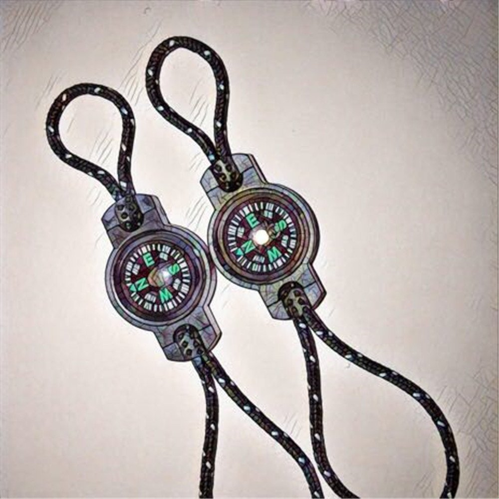
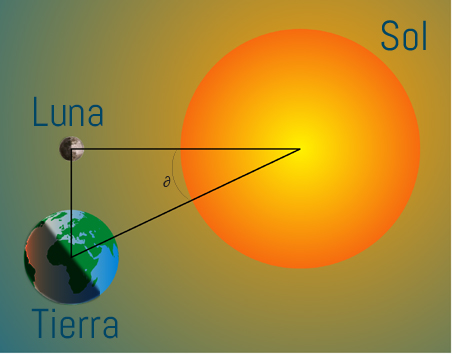
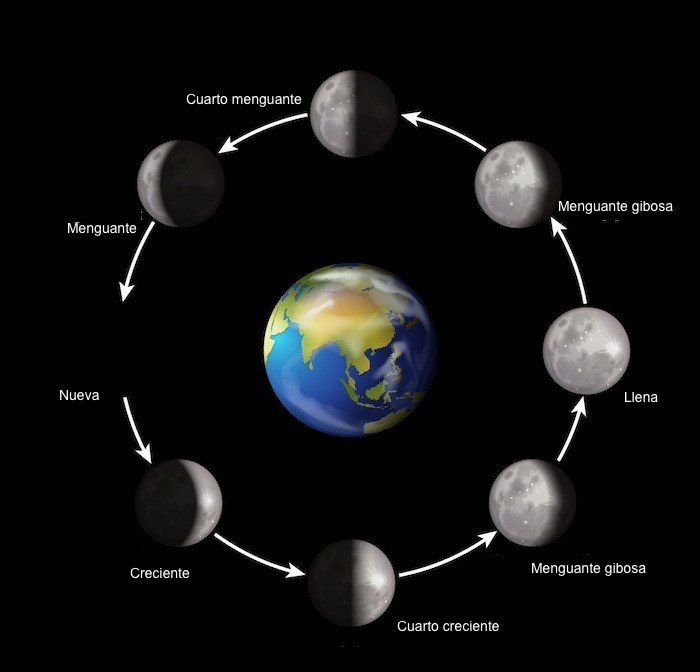
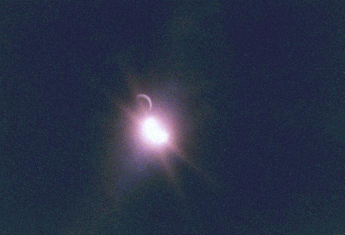
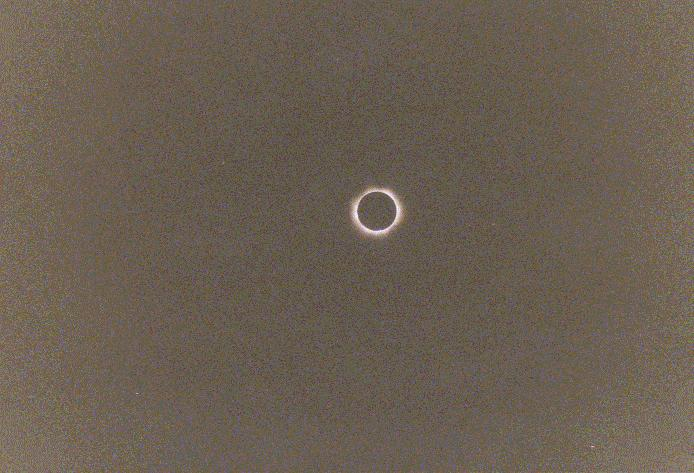
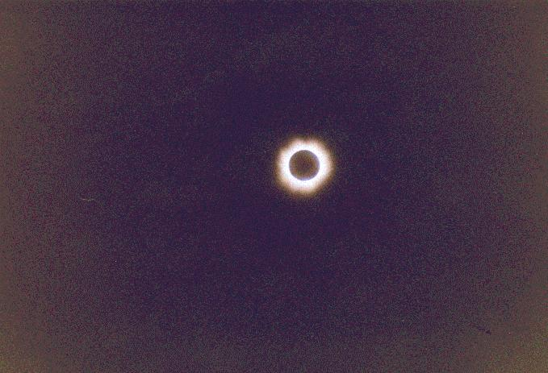
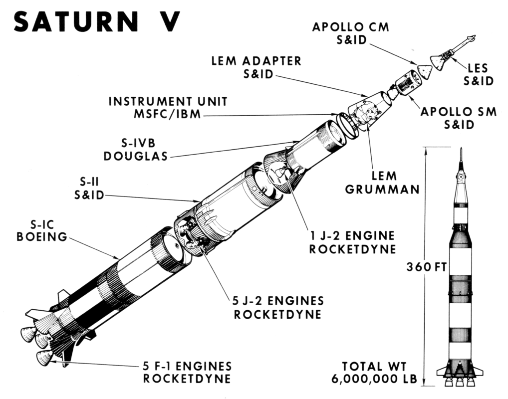
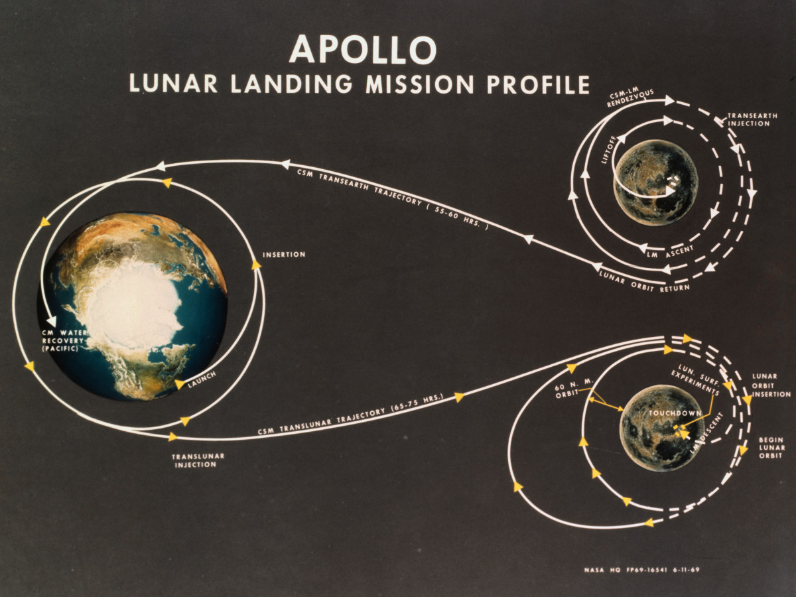

## Disclaimer

- Charla sencilla orientada para niños de 4 años
- Vídeos, etc recortados de los originales (Créditos en bibliografía)

---

## Campo Magnético, Auroras, Fases Lunares, Eclipses y Cohetes

Pablo Iranzo Gómez <https://iranzo.github.io>

<small>Jueves 13 Febrero 2020</small>

---

## Introducción

- Campo magnético
  - Auroras
- Movimiento Sol-Tierra-Luna
  - Fases Lunares
  - Eclipses
- Cohetes
- Fin

---

## Campo magnético

El campo magnético es algo que nos rodea, que es invisible pero que podemos
detectar y medir.

La forma más sencilla es con una brújula.

Note: Usar imanes y brújulas.

---

### Ver el campo magnético

Podemos verlo con limaduras de hierro y unos imanes.

Note: Usar imanes y limaduras hierro

---

#### Ver el campo magnético 2

---

### Origen

- La Tierra tiene metal que se mueve en su interior y genera campo magnético (polos)
- La Tierra es muy grande y genera un campo gravitatorio.

Note: Mencionar volcanes que tiran el interior de la Tierra.

---

### Tormentas solares, viento solar, llamaradas

El Sol a veces tiene tormentas y llegan partículas a la tierra con el
`viento solar`.

Note: Analogía 'agua'

---

### El escudo de la tierra

El campo magnético, es el escudo de la tierra.

Note: Analogía paraguas

---

### Auroras

Las auroras se producen cuando el viento solar llega a la tierra

---

### Auroras Video

[Video](https://youtu.be/BKGstlScAKA)

---

## Movimiento Sol-Tierra-Luna

La Tierra gira alrededor del Sol y la Luna alrededor de la Tierra.

Note: Usar a 3 niños para explicar el movimiento y 'taparse'

---

## Fases Lunares

Según dónde esté la Luna, el Sol ilumina una parte y provoca las fases que vemos desde la Tierra:

- Luna Nueva
- Cuarto Creciente
- Luna Llena
- Cuarto Menguante

Note: Cuando la Luna tiene forma de 'C', está menguando.

---

## Fases Lunares 2

---

## Eclipses

A veces, es la Luna quien se pone entre el Sol y la Tierra

- Hay eclipses parciales o totales

---

## Eclipse 2

Note: Destacar forma redonda de la Luna mientras se posiciona.

---

## Eclipse 3

---

## Eclipse 4

---

## Cohetes

Los cohetes luchan contra el otro 'campo' de la Tierra: la Gravedad.

La Gravedad de la Luna, provoca las Mareas

---

## Escapar de la Tierra

Para escapar de la tierra hace falta mucha velocidad (40.280 km/h).

Los cohetes se hacen con 'fases' para ser más ligeros y gastar menos energía.

---

## Saturn V

---

## Despegar

- [Shuttle](https://youtu.be/2zJlSUZLTms)
- [Falcon Heavy](https://youtu.be/Xh7-ns1LvTQ)

---

## El viaje a la luna

---

## Volver a la tierra

---

## Volver a la Tierra 2

[Shuttle](https://youtu.be/zh1NMzNHQ0Q)

---

## Bibliografía

- [Tormentas solares](https://www.xataka.com/espacio/tormentas-solares-los-efectos-directos-e-indirectos-sobre-la-tierra-de-las-llamaradas-solares-m)
- [Auroras: Magia en el cielo](https://iranzo.github.io/blog/2004/05/24/auroras-magia-en-el-cielo-es/)
- [Cómo empezaron las cosas](https://www.amazon.es/dp/B00IMJU4HK?tag=redken-21)

---

## Vídeos

Editados/Reducidos desde los originales:

- [Auroras](https://www.youtube.com/watch?v=O-_DbdhSSnI)
- [Shuttle Launch](https://www.youtube.com/watch?v=Tch8ef-y208)
- [Falcon Heavy](https://www.youtube.com/watch?v=wbSwFU6tY1c)
- [Shuttle Landing](https://www.youtube.com/watch?v=Xtfnl_KOuCM)

---

## ¡Fin!

¡Gracias!

Note: Repartir brújula y pegatinas

---

## Materiales

<small>

- [Brújulas](https://www.amazon.es/dp/B071474V6F?tag=redken-21)
- [Pegatinas](https://www.amazon.es/dp/B07NKBVNZ4?tag=redken-21)
- [Modelo eclipse](https://www.amazon.es/dp/B07S88VC45?tag=redken-21)
- [Limadura hierro](https://www.amazon.es/dp/B004S0H5I8?tag=redken-21)
- [Imanes](https://www.amazon.es/dp/B001RX0KFO?tag=redken-21)
- [Globos](https://www.amazon.es/dp/B0742DWHLK?tag=redken-21)
- [Pinzas](https://www.amazon.es/dp/B002LLN7U6?tag=redken-21)
- [Lana](https://www.amazon.es/dp/B07GTF4CDS?tag=redken-21)
- [Pajitas](https://www.amazon.es/dp/B07ZR28655?tag=redken-21)

</small>

---

## Actividades

- Imanes + brújulas
- Imanes + limadura hierro
- Modelo solar/luna para eclipses
- Globos con lana para cohete
- Paracaídas con plástico
