## Disclaimer

- Simple talk oriented to 4 y-o children
- Vídeos, etc have been reduced from the originals (credits in bibliography)

---

## Magnetic Field, Aurora, Moon Phases and Rockets

Pablo Iranzo Gómez <https://iranzo.github.io>

<small>Thursday 13th, February 2020</small>

---

## Introduction

- Magnetic field
  - Auroras
- Moon-Earth-Sun movement
  - Moon phases
  - Eclipses
- Rockets
- End

---

## Magnetic Field

Magnetic field surrounds us, but it's invisible although we can detect and
measure.

Easiest way to check it is to use a compass.

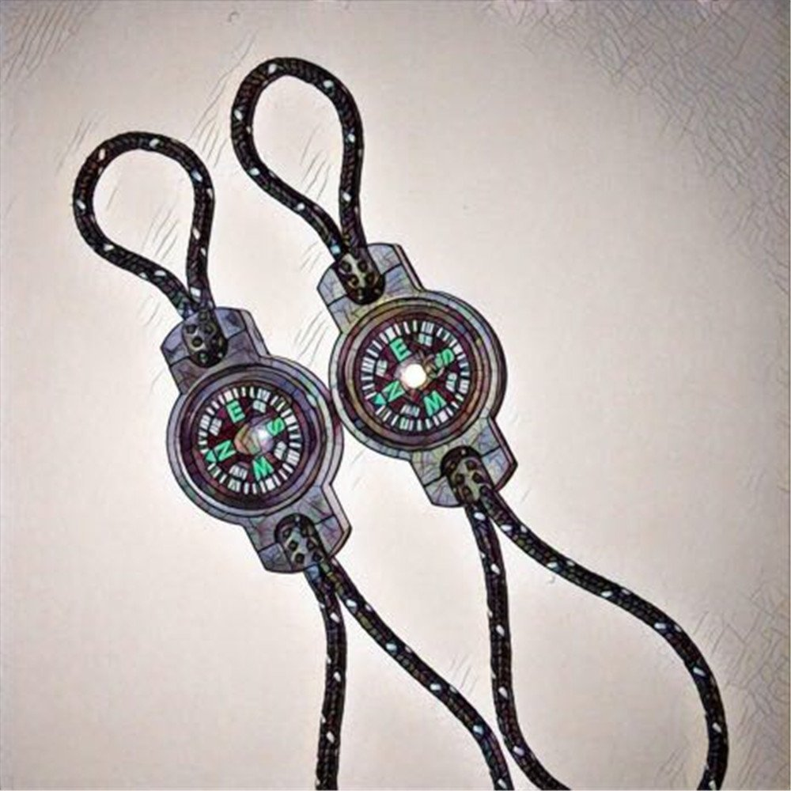

Note: Use magnets and compass

---

### 'See' the magnetic field

We can see it by using iron powder and magnets.

Note: Use magnets and iron powder

---

#### 'See' the magnetic field 2

---

### Origin

- Earth has metal inside that moves and generates the magnetic field (pole)
- Earht is also very big and generates gravity field.

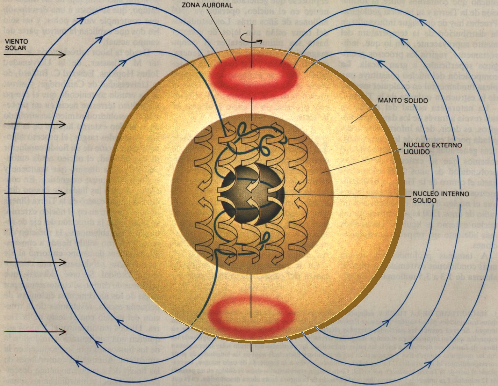

Note: Vulcanos spit that inner melted materials to the surface of Earth

---

### Solar storms, solar wind and flares

The Sun, sometines has storms and particles (debris) is launched towards earth and others with the `solar wind`.

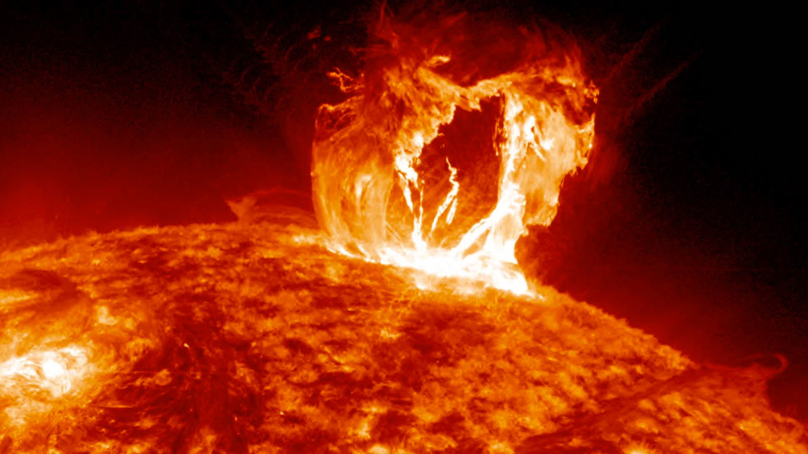

Note: Analogy with water and storm

---

### Earth's shield

Magnetic field is Earth's shield against solar wind.

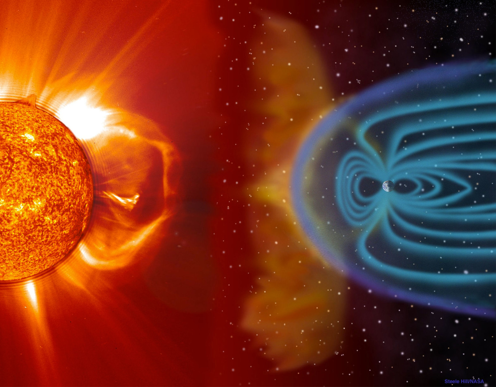

Note: Analogy with umbrella

---

### Auroras

Auroras are created when the solar wind arrives to earth

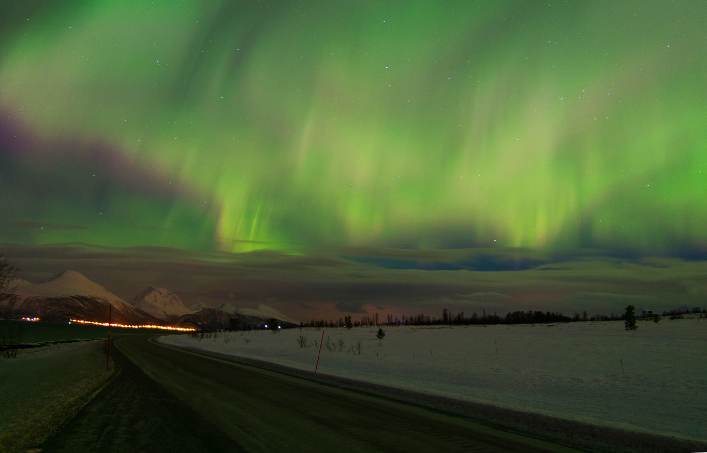

---

### Auroras Video

[Video](https://youtu.be/BKGstlScAKA)

---

## Moon-Earth-Sun movement

Earth turns around the Sun and Moon around Earth.

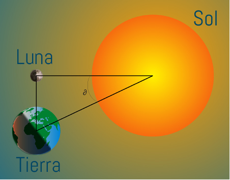

Note: Use 3 kids for explaining the movement and 'eclipse' between them

---

## Moon phases

Depending on Moon position relative to Earth and Sun, it illuminates different fractions of it causing the phases we see:

- New Moon
- Crescent Moon
- Full Moon
- Waning moon

Note: When the moon is 'C'-shaped, it's in Waning phase.

---

## Moon Phases 2

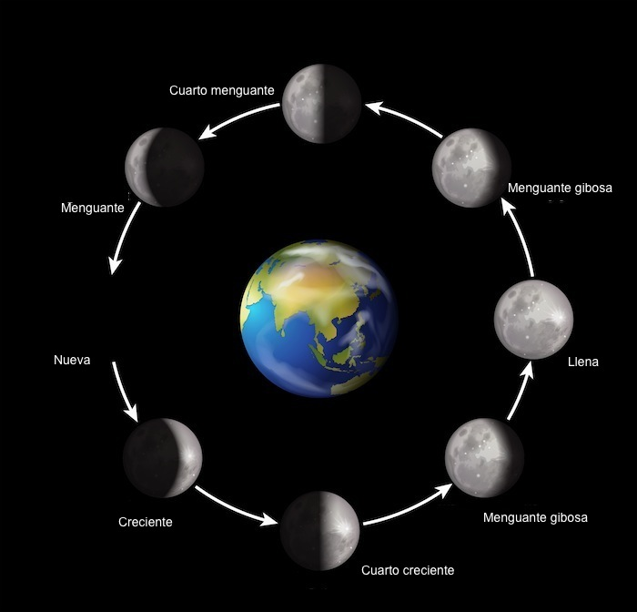

---

## Eclipses

Sometimes, the Moon is between Earth and Sun

- Eclipses can be total or partial

---

## Eclipse 2

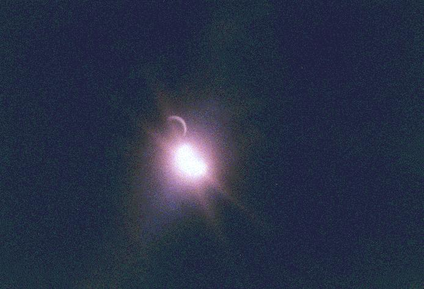

Note: Make a point on Moon round shape while it puts between Earth and Sun

---

## Eclipse 3

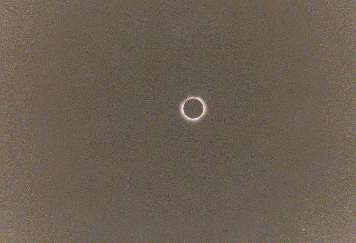

---

## Eclipse 4

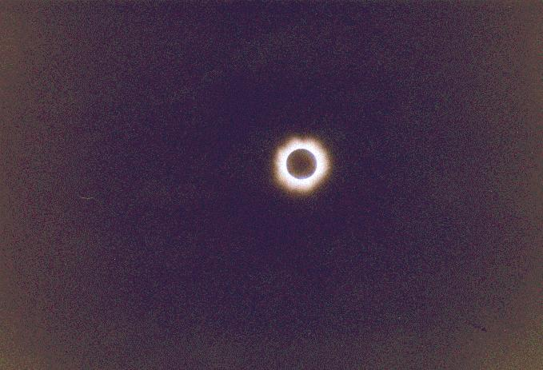

---

## Rockets

Rockets fight againsts the other Earth: 'gravity'

Moon's gravity causes tides on Earth

---

## Escaping Earth

In order to escape Earth, speed must be very high (40.280 km/h).

Rockets are made in 'sections' that can be dropped to be lighter and use less energy to lift off.

---

## Saturn V

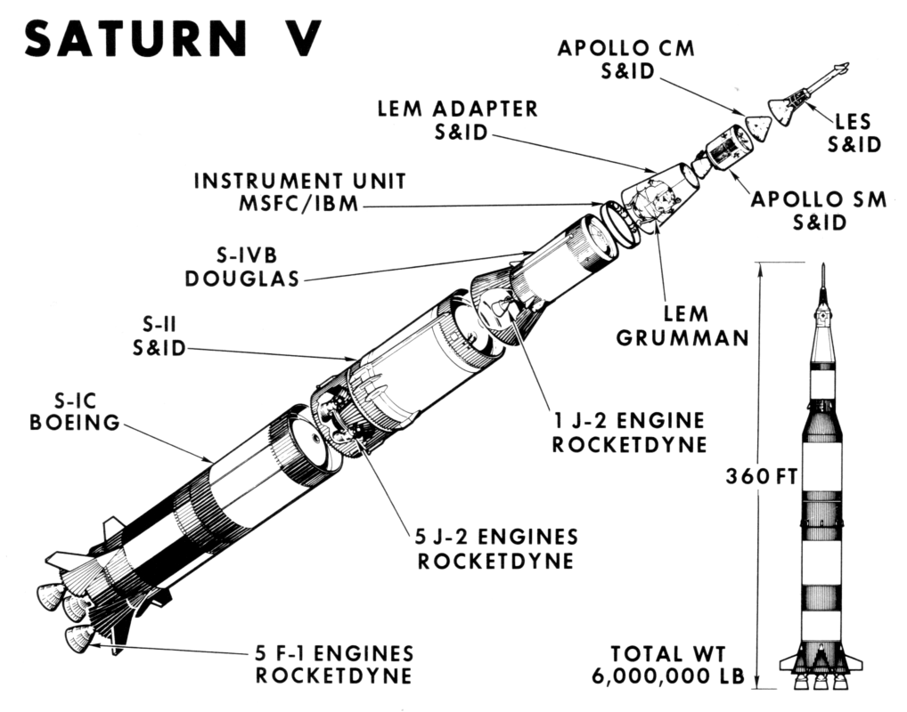

---

## Take off

- [Shuttle](https://youtu.be/2zJlSUZLTms)
- [Falcon Heavy](https://youtu.be/Xh7-ns1LvTQ)

---

## Trip to Moon

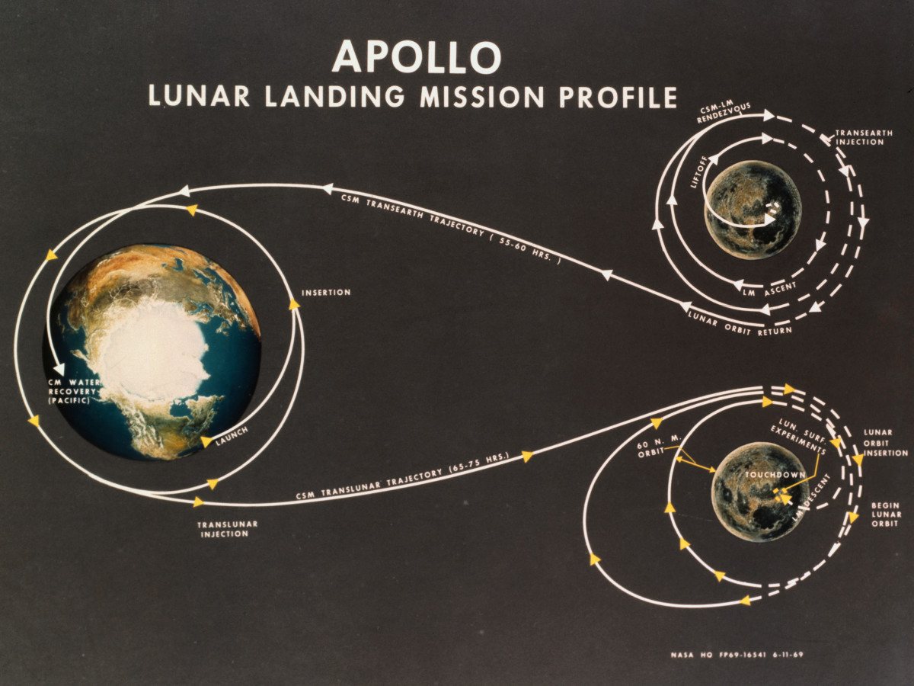

---

## Going back to Earth

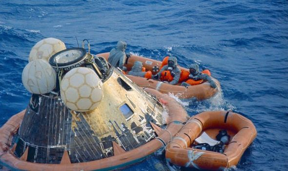

---

## Going back to Earth 2

[Shuttle](https://youtu.be/zh1NMzNHQ0Q)

---

## Bibliography

- [Solar storms](https://www.xataka.com/espacio/tormentas-solares-los-efectos-directos-e-indirectos-sobre-la-tierra-de-las-llamaradas-solares-m)
- [Auroras: Magic in the sky](https://iranzo.github.io/blog/2004/05/24/auroras-magia-en-el-cielo-es/)
- [How things started](https://www.amazon.es/dp/B00IMJU4HK?tag=redken-21)

---

## Videos

Edited/reduced from originals:

- [Auroras](https://www.youtube.com/watch?v=O-_DbdhSSnI)
- [Shuttle Launch](https://www.youtube.com/watch?v=Tch8ef-y208)
- [Falcon Heavy](https://www.youtube.com/watch?v=wbSwFU6tY1c)
- [Shuttle Landing](https://www.youtube.com/watch?v=Xtfnl_KOuCM)

---

## ¡End!

¡Thanks!

Note: Give away compass and stickers

---

## Materials

<small>

- [Compass](https://www.amazon.es/dp/B071474V6F?tag=redken-21)
- [Stickers](https://www.amazon.es/dp/B07NKBVNZ4?tag=redken-21)
- [Eclipse model](https://www.amazon.es/dp/B07S88VC45?tag=redken-21)
- [Iron powder](https://www.amazon.es/dp/B004S0H5I8?tag=redken-21)
- [Magnets](https://www.amazon.es/dp/B001RX0KFO?tag=redken-21)
- [Balloon](https://www.amazon.es/dp/B0742DWHLK?tag=redken-21)
- [Pegs](https://www.amazon.es/dp/B002LLN7U6?tag=redken-21)
- [Wool](https://www.amazon.es/dp/B07GTF4CDS?tag=redken-21)
- [Straws](https://www.amazon.es/dp/B07ZR28655?tag=redken-21)

</small>

---

## Activities

- Magnets + compass
- Magnets + iron powder
- Eclipse model
- Ballons with wool for rocket
- Plastic parachute
