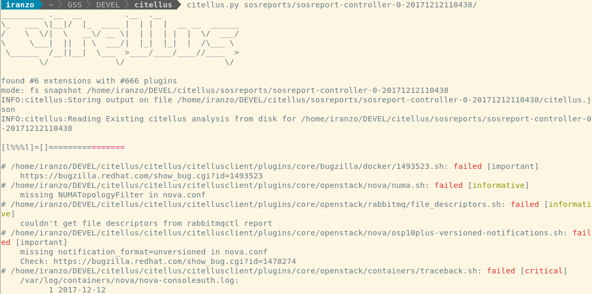
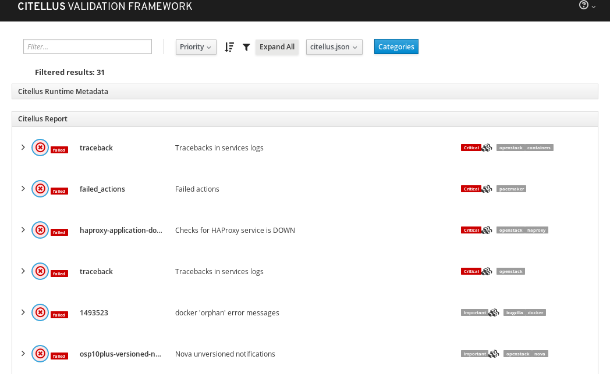

## [Citellus](https://risuorg.github.io):

### Citellus - Verifica tus sistemas!!


<https://risuorg.github.io>

Emerging Tech Valencia 2019: 30 Mayo

---

## 쯈uién soy?

<small>

- Pablo Iranzo Gómez (Pablo.Iranzo _AT_ gmail.com)
  - Senior Software Engineer - Solutions Engineering - Red Hat
    - RHCA Level V: #110-215-852 (RHC{A,SS,DS,VA,E,SA,SP,AOSP}, JBCAA)
- URLS
  - blog: <https://iranzo.github.io>
  - <https://linkedin.com/in/iranzo/>
  - <https://github.com/iranzo>
  - <https://twitter.com/iranzop>

Involucrado con Linux desde algo antes de comenzar los estudios universitarios y luego durante ellos, estando involucrado con las asociaciones LinUV y <Valux.org>.

Empecé a 'vivir' del software libre en 2004 y a trabajar en Red Hat en 2006 como Consultor, luego como Senior Technical Account Manager, posteriormente como Principal Software Maintenance Engineer y actualmente como Senior Software Engineer para el equipo de Solutions Engineering.

</small>

---

## 쯈ué es Citellus?

- Citellus es un framework acompañado de scripts creados por la comunidad, que automatizan la detección de problemas, incluyendo problemas de configuración, conflictos con paquetes de versiones instaladas, problemas de seguridad o configuraciones inseguras y mucho más.

---

## Historia: 쯖칩mo comenzó el proyecto?

<small>

- Un fin de semana de guardia revisando una y otra vez la mismas configuraciones en diversos equipos hicieron evidente la necesidad de automatizar.

- Unos scripts sencillos y un 'wrapper' en `bash` después, la herramienta fue tomando forma, poco después, se reescribió el 'wrapper' en python para proporcionarle características más avanzadas.

- En esos primeros momentos también se mantuvieron conversaciones con ingeniería y como resultado, un nuevo diseño de los tests más sencillo fue adoptado.

</small>

---

## 쯈ué puedo hacer con Citellus?

<small>

- Ejecutarlo contra un sistema o contra un sosreport.
- Resolver antes los problemas gracias a la información que proporciona.
- Utilizar los plugins para detectar problemas actuales o futuros (ciclo de vida, etc).
- Programar nuevos plugins en tu lenguaje de programación preferido (bash, python, ruby, etc.) para extender la funcionalidad.
  - Contribuir al proyecto esos nuevos plugins para beneficio de otros.
- Utilizar dicha información como parte de acciones proactivas en sus sistemas.

</small>

---

## 쮸lgún ejemplo de la vida real?

<small>

- Por ejemplo, con Citellus puedes detectar:
  - Borrados incorrectos de tokens de keystone
  - Parámetros faltantes para expirar y purgar datos de ceilometer que pueden llevar a llenar el disco duro.
  - NTP no sincronizado
  - paquetes obsoletos que están afectados por fallos críticos o de seguridad.
  - otros! (860+) complementos en este momento, con más de una comprobación por plugin en muchos de ellos
- Cualquier otra cosa que puedas imaginar o programar 😉

</small>

---

## Cambios derivados de ejemplos reales?

<small>

- Inicialmente trabajábamos con RHEL únicamente (6, 7 y 8) por ser las soportadas
- Dado que trabajamos con otros equipos internos como RHOS-OPS que utilizan por ejemplo [RDO project](https://www.rdoproject.org/), la versión upstream de Red Hat OpenStack, comenzamos a adaptar tests para funcionar en ambas.
- A mayores, empezamos a crear funciones adicionales para operar sobre sistemas Debian y un compañero estuvo también enviando propuestas para corregir algunos fallos sobre Arch Linux.
- Con la aparición de Spectre y Meltdown empezamos a añadir también comprobación de algunos paquetes y que no se hayan deshabilitado las opciones para proteger frente a dichos ataques.

</small>

---

## Algunos números sobre plugins:

<small>
<small>
- healthcheck : 79 []
- informative : 2 []
- negative : 3 ['system: 1', 'system/iscsi: 1']
- openshift : 5 []
- openstack : 4 ['rabbitmq: 1']
- ovirt-rhv : 1 []
- pacemaker : 2 []
- positive : 35 ['cluster/cman: 1', 'openstack: 16', 'openstack/ceilometer: 1', 'system: 1']
- rhinternal : 697 ['bugzilla/docker: 1', 'bugzilla/httpd: 1', 'bugzilla/openstack/ceilometer: 1', 'bugzilla/openstack/ceph: 1', 'bugzilla/openstack/cinder: 1', 'bugzilla/openstack/httpd: 1', 'bugzilla/openstack/keystone: 1', 'bugzilla/openstack/keystone/templates: 1', 'bugzilla/openstack/neutron: 5', 'bugzilla/openstack/nova: 4', 'bugzilla/openstack/swift: 1', 'bugzilla/openstack/tripleo: 2', 'bugzilla/systemd: 1', 'ceph: 4', 'cifs: 5', 'docker: 1', 'httpd: 1', 'launchpad/openstack/keystone: 1', 'launchpad/openstack/oslo.db: 1', 'network: 7', 'ocp-pssa/etcd: 1', 'ocp-pssa/master: 12', 'ocp-pssa/node: 14', 'openshift/cluster: 1', 'openshift/etcd: 2', 'openshift/node: 1', 'openshift/ocp-pssa/master: 2', 'openstack: 6', 'openstack/ceilometer: 2', 'openstack/ceph: 1', 'openstack/cinder: 5', 'openstack/containers: 4', 'openstack/containers/docker: 2', 'openstack/containers/rabbitmq: 1', 'openstack/crontab: 4', 'openstack/glance: 1', 'openstack/haproxy: 2', 'openstack/hardware: 1', 'openstack/iptables: 1', 'openstack/keystone: 3', 'openstack/mysql: 8', 'openstack/network: 6', 'openstack/neutron: 5', 'openstack/nova: 12', 'openstack/openvswitch: 3', 'openstack/pacemaker: 1', 'openstack/rabbitmq: 5', 'openstack/redis: 1', 'openstack/swift: 3', 'openstack/system: 4', 'openstack/systemd: 1', 'pacemaker: 10', 'satellite: 1', 'security: 3', 'security/meltdown: 2', 'security/spectre: 8', 'security/speculative-store-bypass: 8', 'storage: 1', 'sumsos/bugzilla: 11', 'sumsos/kbases: 426', 'supportability: 11', 'sysinfo: 2', 'system: 56', 'virtualization: 2']
- supportability : 3 ['openshift: 1']
- sysinfo : 18 ['lifecycle: 6', 'openshift: 4', 'openstack: 2']
- system : 12 ['iscsi: 1']
- virtualization : 1 []
-------
total : 862

</small>
</small>

---

## El Objetivo

- Hacer extremadamente sencillo escribir nuevos plugins.
- Permitir escribirlos en tu lenguaje de programación preferido.
- Que sea abierto para que cualquiera pueda contribuir.

---

## Cómo ejecutarlo?



---

## A destacar

<small>

- plugins en su lenguaje preferido
- Permite sacar la salida a un fichero json para ser procesada por otras herramientas.
  - Permite visualizar via html el json generado
- Soporte de playbooks ansible (en vivo y también contra un sosreport si se adaptan)
  - Las extensiones (core, ansible), permiten extender el tipo de plugins soportado fácilmente.
- Salvar/restaurar la configuración
- Instalar desde pip/pipsi si no quieres usar el git clone del repositorio o ejecutar desde un contenedor.

</small>

---

## Interfaz HTML

- Creado al usar --web, abriendo fichero `citellus.html` por http se visualiza.
  

---

## 쯇or qué upstream?

<small>

- Citellus es un proyecto de código abierto. Todos los plugins se envían al repositorio en github para compartirlos (es lo que queremos fomentar, reutilización del conocimiento).
  - Project on GitHub: <https://github.com/citellusorg/citellus/>
- Cada uno es experto en su área: queremos que todos contribuyan
- Utilizamos un acercamiento similar a otros proyectos de código abierto: usamos gerrit para revisar el código y UnitTesting para validar la funcionalidad básica.

</small>

---

## 쮺칩mo contribuir?

<small>

Actualmente hay una gran presencia de plugins de OpenStack, ya que es en ese área donde trabajamos diariamente, pero Citellus no está limitado a una tecnología o producto.

Por ejemplo, es fácil realizar comprobaciones acerca de si un sistema está configurado correctamente para recibir actualizaciones, comprobar versiones específicas con fallos (Meltdown/Spectre) y que no hayan sido deshabilitadas las protecciones, consumo excesivo de memoria por algún proceso, fallos de autentificación, etc.

Lea la guía del colaborador en: <https://github.com/citellusorg/citellus/blob/master/CONTRIBUTING.md> para más detalles.</small>

---

## Citellus vs otras herramientas

- XSOS: Proporciona información de datos del sistema (ram, red, etc), pero no analiza, a los efectos es un visor 'bonito' de información.

- TripleO-validations: se ejecuta solamente en sistemas 'en vivo', poco práctico para realizar auditorías o dar soporte.

---

## 쯇or qué no sosreports?

<small>

- No hay elección entre una u otra, SOS recoge datos del sistema, Citellus los analiza.
- Sosreport viene en los canales base de RHEL, Debian que hacen que esté ampliamente distribuido, pero también, dificulta el recibir actualizaciones frecuentes.
- Muchos de los datos para diagnóstico ya están en los sosreports, falta el análisis.
- Citellus se basa en fallos conocidos y es fácilmente extensible, necesita ciclos de desarrollo más cortos, estando más orientado a equipos de devops o de soporte.

</small>

---

## 쯈ué hay bajo el capó?

<small>

Filosofía sencilla:

- Citellus es el 'wrapper' que ejecuta.
- Permite especificar la carpeta con el sosreport
- Busca los plugins disponibles en el sistema
- Lanza los plugins contra cada sosreport y devuelve el estado.
- El framework de Citellus en python permite manejo de opciones, filtrado, ejecución paralela, etc.

</small>

---

## 쯏 los plugins?

<small>

Los plugins son aún más sencillos:

- En cualquier lenguaje que pueda ser ejecutado desde una shell.
- Mensajes de salida a 'stderr' (>&2)
- Si en bash se utilizan cadenas como $"cadena", se puede usar el soporte incluido de i18n para traducirlos al idioma que se quiera.
- Devuelve `$RC_OKAY` si el test es satisfactorio / `$RC_FAILED` para error / `$RC_SKIPPED` para los omitidos / Otro para fallos no esperados.

</small>

---

## 쯏 los plugins? (continuación)

<small>

- Heredan variables del entorno como la carpeta raíz para el sosreport (vacía en modo Live) (`CITELLUS_ROOT`) o si se está ejecutando en modo live (`CITELLUS_LIVE`). No se necesita introducir datos vía el teclado
- Por ejemplo los tests en 'vivo' pueden consultar valores en la base de datos y los basados en sosreport, limitarse a los logs existentes.

</small>

---

## Ejemplo de script

<small>

- Por ejemplo [Uso de disco](https://github.com/citellusorg/citellus/blob/master/citellus/plugins/system/disk_usage.sh):

```sh
#!/bin/bash

# Load common functions
[ -f "${CITELLUS_BASE}/common-functions.sh" ] && . "${CITELLUS_BASE}/common-functions.sh"

# description: error if disk usage is greater than $CITELLUS_DISK_MAX_PERCENT
: ${CITELLUS_DISK_MAX_PERCENT=75}

if [[ $CITELLUS_LIVE = 0 ]]; then
    is_required_file "${CITELLUS_ROOT}/df"
    DISK_USE_CMD="cat ${CITELLUS_ROOT}/df"
else
    DISK_USE_CMD="df -P"
fi

result=$($DISK_USE_CMD |awk -vdisk_max_percent=$CITELLUS_DISK_MAX_PERCENT '/^\/dev/ && substr($5, 0, length($5)-1) > disk_max_percent { print $6,$5 }')

if [ -n "$result" ]; then
    echo "${result}" >&2
    exit $RC_FAILED
else
    exit $RC_OKAY
fi
```

</small>

---

## 쯃istos para profundizar en los plugins?

- Cada plugin debe validar si debe o no ejecutarse y mostrar la salida a 'stderr', código de retorno.
- Citellus ejecutará e informará de los tests en base a los filtros usados.

---

## Requisitos:

<small>

- El código de retorno debe ser `$RC_OKAY` (ok), `$RC_FAILED` (fallo) or `$RC_SKIPPED` (omitido).
- Los mensajes impresos a stderr se muestran si el plugin falla o se omite (si se usa el modo detallado)
- Si se ejecuta contra un 'sosreport', la variable `CITELLUS_ROOT` tiene la ruta a la carpeta del sosreport indicada.
- `CITELLUS_LIVE` contiene `0` ó `1` si es una ejecución en vivo o no.

</small>

---

## 쮺칩mo empezar un nuevo plugin (por ejemplo)?

- Crea un script en `~/~/.../plugins/core/rhev/hosted-engine.sh`
- `chmod +x hosted-engine.sh`

---

## 쮺칩mo empezar un nuevo plugin (continuación)?

```sh
if [ "$CITELLUS_LIVE" = "0" ]; then
    grep -q ovirt-hosted-engine-ha $CITELLUS_ROOT/installed-rpms
    returncode=$?
    if [ "x$returncode" == "x0" ]; then
        exit $RC_OKAY
    else
        echo "ovirt-hosted-engine no instalado" >&2
        exit $RC_FAILED
    fi
else
    echo "No funciona en modo Live" >&2
    exit $RC_SKIPPED
fi
```

---

## 쮺칩mo empezar un nuevo plugin (con funciones)?

```sh
# Load common functions
[ -f "${CITELLUS_BASE}/common-functions.sh" ] && . "${CITELLUS_BASE}/common-functions.sh"

if is_rpm ovirt-hosted-engine-ha; then
    exit $RC_OKAY
else
    echo "ovirt-hosted-engine no instalado" >&2
    exit $RC_FAILED
fi
```

---

## 쮺칩mo probar un plugin?

<small>

- Use `tox` para ejecutar algunas pruebas UT (utf8, bashate, python 2.7, python 3)

- Diga a Citellus qué plugin utilizar:

```sh
[piranzo@host citellus]$ ~/citellus/citellus.py sosreport-20170724-175510/crta02 -i hosted-engine.sh -r
_________ .__  __         .__  .__
\_   ___ \|__|/  |_  ____ |  | |  |  __ __  ______
/    \  \/|  \   __\/ __ \|  | |  | |  |  \/  ___/
\     \___|  ||  | \  ___/|  |_|  |_|  |  /\___ \
 \______  /__||__|  \___  >____/____/____//____  >
        \/              \/                     \/
mode: fs snapshot sosreport-20170724-175510/crta02
# ~/~/.../plugins/core/rhev/hosted-engine.sh: failed
    "ovirt-hosted-engine no instalado"
```

</small>

---

## 쯈ué es Magui?

### Introducción

- Citellus trabaja a nivel de sosreport individual, pero algunos problemas se manifiestan entre conjuntos de equipos (clústeres, virtualización, granjas, etc)

<small>Por ejemplo, Galera debe comprobar el seqno entre los diversos miembros para ver cúal es el que contiene los datos más actualizados.</small>

---

### Qué hace M.a.g.u.i. ?

- Ejecuta citellus contra cada sosreport o sistema, obtiene los datos y los agrupa por plugin.
- Ejecuta sus propios plugins contra los datos obtenidos, destacando problemas que afectan al conjunto.
- Permite obtener datos de equipos remotos via ansible-playbook.

---

## 쯈ué aspecto tiene?

<small>

- Viene en el mismo repositorio que Citellus y se ejecuta especificando los diversos sosreports:

  ```sh
  [piranzo@collab-shell]$ ~/citellus/magui.py * -i seqno
      _
  _( )_  Magui:
  (_(ø)_)
  /(_)   Multiple Analisis Generic Unifier and Interpreter
  \|
  |/

  ....

  [piranzo@collab-shell]]$ cat magui.json:

  {'~/~/.../core/openstack/mysql/seqno.sh': {'controller0': {'err': u'2b65adb0-787e-11e7-81a8-26480628c14c:285019879\n',
                                                              'out': u'',
                                                              'rc': 10},
                                              'controller1': {'err': u'2b65adb0-787e-11e7-81a8-26480628c14c:285019879\n',
                                                              'out': u'',
                                                              'rc': 10},
                                              'controller2': {'err': u'2b65adb0-787e-11e7-81a8-26480628c14c:285019878\n',
                                                              'out': u'',
                                                              'rc': 10}}}
  ```

```

- En este ejemplo (UUID and SEQNO se muestra para cada controlador y vemos que el controller2 tiene una sequencia distinta y menos actualizada.

</small>

----

## Siguientes pasos con Magui?

<small>

- Dispone de algunos plugins en este momento:
    - Agregan data de citellus ordenada por plugin para comparar rápidamente
    - Muestra los datos de 'metadatos' de forma separada para contrastar valores
    - `pipeline-yaml`, `policy.json` y otros (asociados a OpenStack)
    - `seqno` de galera
    - `redhat-release` entre equipos
    - Faraday: compara ficheros que deban ser iguales o distintos entre equipos

</small>

---

## Siguientes pasos

<small>

- Más plugins!
- Dar a conocer la herramienta para entre todos, facilitar la resolución de problemas, detección de fallos de seguridad, configuraciones incorrectas, etc.
- Movimiento: Muchas herramientas mueren por tener un único desarrollador trabajando en sus ratos libres, tener contribuciones es básico para cualquier proyecto.
- Programar más tests en Magui para identificar más casos dónde los problemas aparecen a nivel de grupos de sistemas y no a nivel de sistema sindividuales.

</small>

---

## Otros recursos
Blog posts:

<small>

- Citellus tagged posts: <https://iranzo.github.io/blog/tag/citellus/>
- <http://iranzo.github.io/blog/2017/07/26/Citellus-framework-for-detecting-known-issues/>
- <https://iranzo.github.io/blog/2017/07/31/Magui-for-analysis-of-issues-across-several-hosts/>
- <https://iranzo.github.io/blog/2017/08/17/Jenkins-for-running-CI-tests/>
- <https://iranzo.github.io/blog/2017/10/26/i18n-and-bash8-in-bash/>
- <https://iranzo.github.io/blog/2018/01/16/recent-changes-in-magui-and-citellus/>
- DevConf.cz 2018 recording <https://www.youtube.com/watch?v=SDzzqrUdn5A>

</small>

---

### 쯇reguntas?

Gracias por asistir!!

Ven a #citellus en Freenode, <https://t.me/citellusUG> en Telegram o contacta con nosotros:

- <https://risuorg.github.io>
- citellus _AT_ googlegroups.com
    - <https://groups.google.com/forum/#!forum/citellus>
- Issue en github <https://github.com/citellusorg/citellus/issues>

---

Presentación disponible en:

<https://iranzo.github.io>


```
